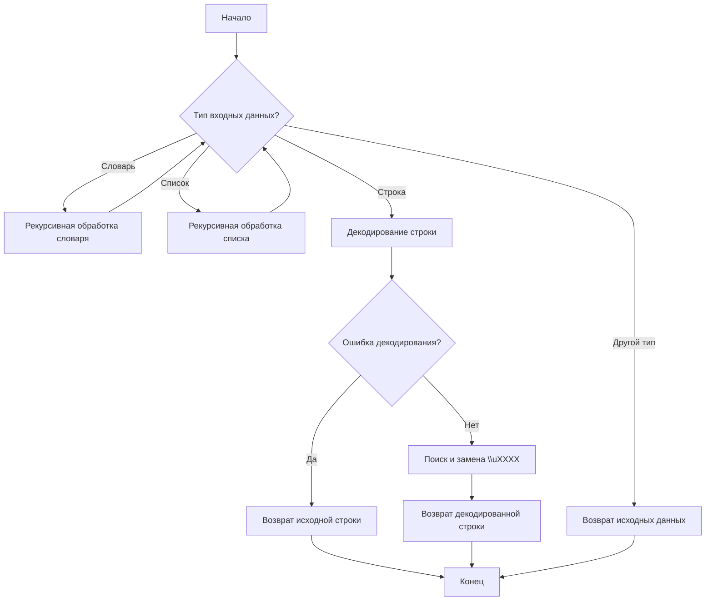

## Анализ кода `hypotez/src/utils/convertors/unicode.py`

### 1. <алгоритм>

Функция `decode_unicode_escape` предназначена для преобразования юникодных escape-последовательностей в читаемый текст. Она может принимать на вход словарь, список или строку.

1.  **Определение типа входных данных:**
    *   Если входные данные - словарь, функция рекурсивно проходит по всем элементам словаря и применяет к ним ту же функцию.
        *   Пример:
            ```python
            input_dict = {'key1': '\\u0041', 'key2': '\\u0042'}
            ```
            После обработки:
            ```python
            decoded_dict = {'key1': 'A', 'key2': 'B'}
            ```
    *   Если входные данные - список, функция рекурсивно проходит по всем элементам списка и применяет к ним ту же функцию.
        *   Пример:
            ```python
            input_list = ['\\u0041', '\\u0042']
            ```
            После обработки:
            ```python
            decoded_list = ['A', 'B']
            ```
    *   Если входные данные - строка, функция пытается декодировать escape-последовательности.
        *   Пример:
            ```python
            input_string = '\\u0041\\u0042'
            ```
            После обработки:
            ```python
            decoded_string = 'AB'
            ```
2.  **Декодирование строки:**
    *   Строка сначала кодируется в `utf-8`, а затем декодируется с использованием `unicode_escape`.
    *   Затем происходит поиск всех последовательностей `\\uXXXX` и их преобразование.
3.  **Обработка ошибок:**
    *   Если при декодировании строки возникает ошибка `UnicodeDecodeError`, строка возвращается без изменений.
4.  **Возврат результата:**
    *   Возвращаются преобразованные данные соответствующего типа (словарь, список или строка).
    *   Если тип данных не поддерживается, возвращаются исходные данные без изменений.

### 2. <mermaid>



**Объяснение:**

*   **A**: Начало выполнения функции.
*   **B**: Проверка типа входных данных (словарь, список, строка или другой тип).
*   **C**: Если входные данные - словарь, происходит рекурсивная обработка каждого элемента словаря.
*   **D**: Если входные данные - список, происходит рекурсивная обработка каждого элемента списка.
*   **E**: Если входные данные - строка, происходит попытка декодирования строки с использованием `unicode_escape`.
*   **F**: Проверка на наличие ошибки при декодировании строки.
*   **G**: Если произошла ошибка декодирования, возвращается исходная строка.
*   **H**: Поиск и замена всех последовательностей `\\uXXXX` на соответствующие юникодные символы.
*   **I**: Возврат декодированной строки.
*   **J**: Если тип входных данных не поддерживается, возвращаются исходные данные без изменений.
*   **K**: Конец выполнения функции.

### 3. <объяснение>

**Импорты:**

*   `re`: Модуль для работы с регулярными выражениями. Используется для поиска и замены escape-последовательностей Unicode в строке.
*   `typing.Dict`, `typing.Any`: Используются для аннотации типов. `Dict` указывает, что переменная является словарем, `Any` указывает, что значение может быть любого типа.

**Функция `decode_unicode_escape`:**

*   **Аргументы:**
    *   `input_data (Dict[str, Any] | list | str)`: Входные данные, которые могут быть словарем, списком или строкой.
*   **Возвращаемое значение:**
    *   `Dict[str, Any] | list | str`: Преобразованные данные того же типа, что и входные.
*   **Назначение:**
    Функция предназначена для декодирования юникодных escape-последовательностей в строках, списках и словарях. Она рекурсивно обрабатывает структуры данных, находя и преобразуя escape-последовательности в читаемые символы.

**Пример использования:**

```python
input_dict = {
    'product_name': r'\\u05de\\u05e7\\"\\u05d8 \\u05d9\\u05e6\\u05e8\\u05df\\nH510M K V2',
    'category': r'\\u05e2\\u05e8\\u05db\\u05ea \\u05e9\\u05d1\\u05d1\\u05d9\\u05dd',
    'price': 123.45
}

decoded_dict = decode_unicode_escape(input_dict)
print(decoded_dict)
# Expected output (пример): {'product_name': 'מ\\"קט יצרן\nH510M K V2', 'category': 'ערכת שבבים', 'price': 123.45}
```

**Потенциальные улучшения:**

*   Обработка других типов данных: В текущей реализации функция обрабатывает только строки, списки и словари. Можно расширить ее для поддержки других типов данных, если это необходимо.
*   Более эффективное декодирование: Возможно, существуют более эффективные способы декодирования юникодных escape-последовательностей, чем использование `encode` и `decode`.

**Взаимосвязь с другими частями проекта:**

Функция может использоваться в различных частях проекта `hypotez`, где требуется обработка данных, содержащих юникодные escape-последовательности. Например, она может быть использована для очистки данных, полученных из внешних источников, или для подготовки данных к отображению в пользовательском интерфейсе.