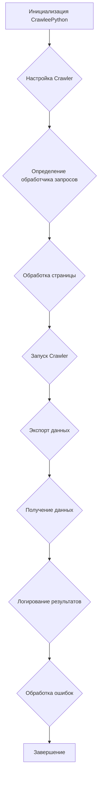

## \\file /src/webdriver/crawlee_python/crawlee_python.py

### **<алгоритм>**

1.  **Инициализация CrawleePython**:
    *   Создается экземпляр класса `CrawleePython` с параметрами `max_requests`, `headless`, `browser_type` и `options`.
        ```python
        crawler = CrawleePython(max_requests=5, headless=False, browser_type='firefox', options=["--headless"])
        ```
2.  **Настройка Crawler**:
    *   Вызывается метод `setup_crawler`, который инициализирует `PlaywrightCrawler` с заданными параметрами, включая максимальное количество запросов, headless-режим и тип браузера.
        ```python
        await self.setup_crawler()
        ```
3.  **Определение обработчика запросов**:
    *   Внутри `setup_crawler` определяется обработчик запросов `request_handler`, который будет выполняться для каждой страницы.
        ```python
        @self.crawler.router.default_handler
        async def request_handler(context: PlaywrightCrawlingContext) -> None:
            ...
        ```
4.  **Обработка страницы**:
    *   В `request_handler` извлекается информация о странице (URL, заголовок, контент), добавляются найденные ссылки в очередь и извлеченные данные сохраняются.
        ```python
        context.log.info(f'Processing {context.request.url} ...')
        await context.enqueue_links()
        data = {
            'url': context.request.url,
            'title': await context.page.title(),
            'content': (await context.page.content())[:100],
        }
        await context.push_data(data)
        ```
5.  **Запуск Crawler**:
    *   Вызывается метод `run_crawler` с списком URL-адресов, которые нужно обработать.
        ```python
        await self.run_crawler(urls)
        ```
6.  **Экспорт данных**:
    *   После завершения обхода вызывается метод `export_data` для сохранения извлеченных данных в JSON-файл.
        ```python
        await self.export_data(str(Path(gs.path.tmp / 'results.json')))
        ```
7.  **Получение данных**:
    *   Вызывается метод `get_data` для получения извлеченных данных.
        ```python
        data = await self.get_data()
        ```
8.  **Логирование результатов**:
    *   Извлеченные данные логируются.
        ```python
        logger.info(f'Extracted data: {data.items()}')
        ```
9.  **Обработка ошибок**:
    *   В случае возникновения ошибки во время обхода, она логируется.
        ```python
        except Exception as ex:
            logger.critical('Crawler failed with an error:', ex)
        ```

### **<mermaid>**



### **<объяснение>**

**Импорты**:

*   `pathlib.Path`: Используется для работы с путями файлов и каталогов.
*   `typing.Optional, typing.List, typing.Dict, typing.Any`: Используются для аннотации типов переменных и функций.
*   `src.gs`: Импортирует глобальные настройки проекта из модуля `src.gs`. Этот модуль вероятно содержит общие переменные и настройки, используемые во всем проекте.
*   `asyncio`: Используется для поддержки асинхронного программирования.
*   `crawlee.playwright_crawler.PlaywrightCrawler, crawlee.playwright_crawler.PlaywrightCrawlingContext`: Импортирует классы `PlaywrightCrawler` и `PlaywrightCrawlingContext` из библиотеки Crawlee для создания веб-пауков.
*   `src.logger.logger.logger`: Импортирует настроенный экземпляр логгера для записи информации, предупреждений и ошибок.
*   `src.utils.jjson.j_loads_ns`: Импортирует функцию для загрузки JSON-файлов.

**Класс `CrawleePython`**:

*   **Роль**: Класс `CrawleePython` предоставляет пользовательскую реализацию веб-паука на основе `PlaywrightCrawler` из библиотеки Crawlee. Он позволяет настраивать параметры браузера, обрабатывать запросы и извлекать данные с веб-страниц.
*   **Атрибуты**:
    *   `max_requests (int)`: Максимальное количество запросов, которые будут выполнены во время обхода.
    *   `headless (bool)`: Определяет, будет ли браузер работать в headless-режиме (без графического интерфейса).
    *   `browser_type (str)`: Тип используемого браузера ('chromium', 'firefox', 'webkit').
    *   `options (Optional[List[str]])`: Список дополнительных опций, передаваемых в браузер.
    *   `crawler (PlaywrightCrawler)`: Экземпляр класса `PlaywrightCrawler`.
*   **Методы**:
    *   `__init__(self, max_requests: int = 5, headless: bool = False, browser_type: str = 'firefox', options: Optional[List[str]] = None)`: Конструктор класса, инициализирует атрибуты класса.
    *   `async setup_crawler(self)`: Настраивает экземпляр `PlaywrightCrawler` с заданной конфигурацией, включая максимальное количество запросов, headless-режим и тип браузера.
    *   `async run_crawler(self, urls: List[str])`: Запускает обход веб-страниц, начиная с переданного списка URL-адресов.
    *   `async export_data(self, file_path: str)`: Экспортирует извлеченные данные в JSON-файл.
    *   `async get_data(self) -> Dict[str, Any]`: Получает извлеченные данные.
    *   `async run(self, urls: List[str])`: Главный метод, который настраивает, запускает обход и экспортирует данные.

**Функции**:

*   `__init__`:
    *   **Аргументы**: `max_requests` (максимальное количество запросов), `headless` (запуск без графического интерфейса), `browser_type` (тип браузера), `options` (дополнительные опции).
    *   **Возвращаемое значение**: None.
    *   **Назначение**: Инициализирует экземпляр класса `CrawleePython` с заданными параметрами.
*   `setup_crawler`:
    *   **Аргументы**: None.
    *   **Возвращаемое значение**: None.
    *   **Назначение**: Настраивает экземпляр `PlaywrightCrawler` с заданной конфигурацией, включая установку обработчика запросов `request_handler`.
*   `request_handler`:
    *   **Аргументы**: `context` (контекст обхода).
    *   **Возвращаемое значение**: None.
    *   **Назначение**: Обработчик запросов, который выполняется для каждой страницы. Извлекает информацию о странице (URL, заголовок, контент), добавляет найденные ссылки в очередь и сохраняет извлеченные данные.
*   `run_crawler`:
    *   **Аргументы**: `urls` (список URL-адресов для обхода).
    *   **Возвращаемое значение**: None.
    *   **Назначение**: Запускает обход веб-страниц, начиная с переданного списка URL-адресов.
*   `export_data`:
    *   **Аргументы**: `file_path` (путь к файлу для сохранения данных).
    *   **Возвращаемое значение**: None.
    *   **Назначение**: Экспортирует извлеченные данные в JSON-файл.
*   `get_data`:
    *   **Аргументы**: None.
    *   **Возвращаемое значение**: Словарь с извлеченными данными.
    *   **Назначение**: Возвращает извлеченные данные.
*   `run`:
    *   **Аргументы**: `urls` (список URL-адресов для обхода).
    *   **Возвращаемое значение**: None.
    *   **Назначение**: Главный метод, который настраивает, запускает обход и экспортирует данные.

**Переменные**:

*   `max_requests (int)`: Максимальное количество запросов для выполнения.
*   `headless (bool)`: Флаг, указывающий, запускать ли браузер в headless-режиме.
*   `browser_type (str)`: Тип используемого браузера.
*   `options (Optional[List[str]])`: Список дополнительных опций для запуска браузера.
*   `crawler (PlaywrightCrawler)`: Экземпляр класса `PlaywrightCrawler`.

**Потенциальные ошибки и области для улучшения**:

*   **Обработка ошибок**: В блоке `try...except` в методе `run` обрабатываются исключения, но сообщение об ошибке содержит только тип исключения и сообщение. Было бы полезно добавить больше информации об ошибке, например, трассировку стека, чтобы упростить отладку.
*   **Логирование**: В методе `run` логируются только извлеченные данные и ошибки. Добавление большего количества логов в другие методы может помочь в отслеживании хода выполнения программы и выявлении проблем.
*   **Конфигурация**: Параметры `max_requests`, `headless` и `browser_type` задаются непосредственно в коде. Было бы лучше вынести их в конфигурационный файл, чтобы можно было изменять их без изменения кода.

**Взаимосвязи с другими частями проекта**:

*   `src.gs`: Используется для получения пути к временной папке для сохранения результатов. Это позволяет централизованно управлять путями в проекте.
*   `src.logger.logger`: Используется для логирования информации, предупреждений и ошибок. Это обеспечивает централизованный механизм логирования для всего проекта.
*   `src.utils.jjson`: Используется для загрузки JSON-файлов.

```mermaid
flowchart TD
    Start --> A[<code>src.gs</code><br>Global settings]
    Start --> B[<code>src.logger.logger</code><br>Logger]
    Start --> C[<code>src.utils.jjson</code><br>JSON load]