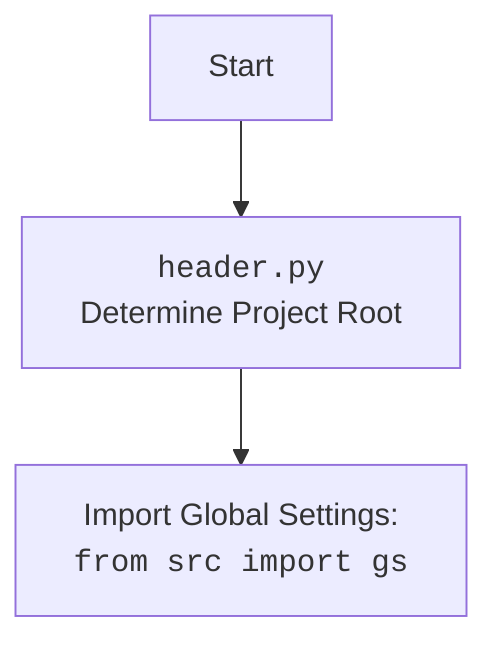

# Проект `hypotez`
# Роль `code explainer`
## ИНСТРУКЦИЯ  :

Анализируй предоставленный код подробно и объясни его функциональность. Ответ должен включать три раздела:  

1. **<алгоритм>**: Опиши рабочий процесс в виде пошаговой блок-схемы, включая примеры для каждого логического блока, и проиллюстрируй поток данных между функциями, классами или методами.  
2. **<mermaid>**: Напиши код для диаграммы в формате `mermaid`, проанализируй и объясни все зависимости, 
    которые импортируются при создании диаграммы. 
    **ВАЖНО!** Убедитесь, что все имена переменных, используемые в диаграмме `mermaid`, 
    имеют осмысленные и описательные имена. Имена переменных вроде `A`, `B`, `C`, и т.д., не допускаются!  
    
    **Дополнительно**: Если в коде есть импорт `import header`, добавьте блок `mermaid` flowchart, объясняющий `header.py`:\
    ```mermaid
    flowchart TD
        Start --> Header[<code>header.py</code><br> Determine Project Root]
    
        Header --> import[Import Global Settings: <br><code>from src import gs</code>] 
    ```

3. **<объяснение>**: Предоставь подробные объяснения:  
   - **Импорты**: Их назначение и взаимосвязь с другими пакетами `src.`.  
   - **Классы**: Их роль, атрибуты, методы и взаимодействие с другими компонентами проекта.  
   - **Функции**: Их аргументы, возвращаемые значения, назначение и примеры.  
   - **Переменные**: Их типы и использование.  
   - Выдели потенциальные ошибки или области для улучшения.  

Дополнительно, постройте цепочку взаимосвязей с другими частями проекта (если применимо).  

Это обеспечивает всесторонний и структурированный анализ кода.
## Формат ответа: `.md` (markdown)


## Твое поведение при анализе кода:
- всегда смотри системную инструкцию для обработки кода проекта `hypotez`;
- анализируй расположение файла в проекте. Это поможет понять его назначение и взаимосвязь с другими файлами. Расположение файла ты найдешь в самой превой строке кода, начинающейся с `## \\file /...`;
- запоминай предоставленный код и анализируй его связь с другими частями проекта `hypotez`;


**КОНЕЦ ИНСТРУКЦИИ**
```

## Анализ кода `hypotez/src/webdriver/driver.py`

### 1. <алгоритм>

#### Общая схема работы класса `Driver`

```mermaid
graph TD
    A[Начало: Инициализация Driver] --> B{Проверка webdriver_cls.get?};
    B -- Да --> C[Инициализация webdriver_cls];
    B -- Нет --> Exception[Выброс TypeError];
    C --> D[Определение языка страницы (locale)];
    D --> E{URL начинается с "file://"?};
    E -- Да --> F[Извлечение HTML из файла];
    E -- Нет --> G{URL начинается с "http(s)://"?};
    G -- Да --> H[Получение HTML с веб-страницы];
    G -- Нет --> I[Обработка неподдерживаемого протокола];
    H --> J[Сохранение cookies];
    J --> K[Завершение];
    F --> K;
    I --> K;
```

#### Подробное описание шагов и примеры

1. **Инициализация `Driver`**:
   - Создается экземпляр класса `Driver` с указанием класса веб-драйвера (например, `Chrome`) и его аргументов.
   ```python
   driver = Driver(Chrome, executable_path='/path/to/chromedriver')
   ```
   - Проверяется наличие метода `get` у переданного класса веб-драйвера. Если метод отсутствует, выбрасывается исключение `TypeError`.
   - Инициализируется драйвер `webdriver_cls(*args, **kwargs)`.

2. **Определение языка страницы (locale)**:
   - Метод `locale` пытается определить язык страницы, используя мета-теги или JavaScript.
   ```python
   lang = driver.locale
   print(lang)  # 'en' или None
   ```
   - Сначала ищется мета-тег `Content-Language`. Если он найден, возвращается его атрибут `content`.
   - Если мета-тег не найден, вызывается метод `get_page_lang()` для определения языка с помощью JavaScript.

3. **Извлечение HTML-контента**:
   - Метод `fetch_html` извлекает HTML-контент из файла или веб-страницы в зависимости от URL.
   ```python
   driver.fetch_html('file:///path/to/file.html')
   driver.fetch_html('https://www.example.com')
   ```
   - Если URL начинается с `file://`, извлекается HTML из локального файла.
   - Если URL начинается с `http://` или `https://`, извлекается HTML с веб-страницы.

4. **Получение HTML с веб-страницы**:
   - Метод `get_url` переходит по указанному URL и сохраняет текущий URL, предыдущий URL и куки.
   ```python
   driver.get_url('https://www.example.com')
   ```
   - Вызывается `self.driver.get(url)` для перехода по URL.
   - Ожидается завершение загрузки страницы.
   - Сохраняются куки с помощью `self._save_cookies_localy()`.

5. **Сохранение куки**:
   - Метод `_save_cookies_localy` сохраняет текущие куки веб-драйвера в локальный файл.
   ```python
   driver._save_cookies_localy()
   ```
   - Куки сохраняются с использованием модуля `pickle`.

### 2. <mermaid>

```mermaid
flowchart TD
    subgraph DriverClass
        A[__init__(webdriver_cls, *args, **kwargs)] --> B{hasattr(webdriver_cls, 'get')};
        B -- True --> C[self.driver = webdriver_cls(*args, **kwargs)];
        B -- False --> D[raise TypeError];
        E[__init_subclass__(cls, *, browser_name=None, **kwargs)] --> F{browser_name is None};
        F -- True --> G[raise ValueError];
        F -- False --> H[cls.browser_name = browser_name];
        I[__getattr__(item)] --> J[getattr(self.driver, item)];
        K[scroll(scrolls, frame_size, direction, delay)] --> L{direction == 'forward' or 'down'};
        L -- True --> M[carousel('', scrolls, frame_size, delay)];
        L -- False --> N{direction == 'backward' or 'up'};
        N -- True --> O[carousel('-', scrolls, frame_size, delay)];
        N -- False --> P{direction == 'both'};
        P -- True --> Q[carousel('', scrolls, frame_size, delay) and carousel('-', scrolls, frame_size, delay)];
        R[locale()] --> S[find_element(By.CSS_SELECTOR, "meta[http-equiv='Content-Language']")];
        S --> T[get_attribute('content')];
        S -- Exception --> U[get_page_lang()];
        V[get_url(url)] --> W[self.driver.get(url)];
        W --> X[self._save_cookies_localy()];
        Y[window_open(url)] --> Z[self.execute_script('window.open();')];
        Z --> AA[self.get(url)];
        BB[wait(delay)] --> CC[time.sleep(delay)];
        DD[_save_cookies_localy()] --> EE[pickle.dump(self.driver.get_cookies(), cookiesfile)];
        FF[fetch_html(url)] --> GG{url.startswith('file://')};
        GG -- True --> HH[Path(match.group(0))];
        GG -- False --> II{url.startswith('http://') or url.startswith('https://')};
        II -- True --> JJ[self.get_url(url)];
        JJ --> KK[self.html_content = self.page_source];
    end

    subgraph carousel
        M --> carousel_A[execute_script(f'window.scrollBy(0,{direction}{frame_size})')];
        carousel_A --> carousel_B[wait(delay)];
        O --> carousel_A;
        Q --> carousel_A;
    end
```

**Описание `mermaid` диаграммы:**

Диаграмма описывает структуру и взаимодействие методов внутри класса `Driver`.

-   `__init__`: Инициализирует класс `Driver`, проверяя наличие метода `get` у переданного класса `webdriver_cls`.
-   `__init_subclass__`: Автоматически вызывается при создании подкласса `Driver` и проверяет наличие аргумента `browser_name`.
-   `__getattr__`: Проксирует доступ к атрибутам драйвера.
-   `scroll`: Прокручивает страницу в указанном направлении, используя локальный метод `carousel`.
-   `locale`: Определяет язык страницы на основе мета-тегов или JavaScript.
-   `get_url`: Переходит по указанному URL и сохраняет куки.
-   `window_open`: Открывает новое окно или вкладку в браузере.
-   `wait`: Ожидает указанное количество времени.
-   `_save_cookies_localy`: Сохраняет текущие куки веб-драйвера в локальный файл.
-   `fetch_html`: Извлекает HTML-контент из файла или веб-страницы.

**Импорты и зависимости:**

Диаграмма показывает, как различные методы класса `Driver` взаимодействуют друг с другом и с внешними библиотеками, такими как `selenium`, `pickle`, `time`, `re` и `pathlib`.



### 3. <объяснение>

#### Импорты:

-   `copy`: Используется для создания копий объектов.
-   `pickle`: Используется для сериализации и десериализации объектов Python, что позволяет сохранять и загружать состояние драйвера (например, куки).
-   `time`: Используется для добавления задержек в процессе выполнения, например, при прокрутке страницы или ожидании загрузки контента.
-   `re`: Используется для работы с регулярными выражениями, например, при извлечении пути к файлу из URL.
-   `pathlib.Path`: Используется для работы с путями к файлам и директориям, упрощает операции с файловой системой.
-   `typing.Optional`: Используется для обозначения типов, которые могут быть `None`.
-   `selenium.webdriver.common.by.By`: Используется для определения стратегий поиска элементов на веб-странице (например, по CSS-селектору).
-   `selenium.common.exceptions`: Содержит исключения, которые могут быть вызваны при работе с `WebDriver`.
-   `header`: Кастомный модуль для определения корневой директории проекта.
-   `src.gs`: Глобальные настройки проекта.
-   `src.logger.logger`: Модуль для логирования событий и ошибок.
-   `src.logger.exceptions`: Кастомные исключения для логирования.

#### Классы:

-   `Driver`:
    -   Роль: Предоставляет унифицированный интерфейс для взаимодействия с веб-драйверами Selenium.
    -   Атрибуты:
        -   `driver`: Экземпляр Selenium WebDriver.
    -   Методы:
        -   `__init__`: Инициализирует экземпляр класса `Driver`.
        -   `__init_subclass__`: Автоматически вызывается при создании подкласса `Driver`.
        -   `__getattr__`: Прокси для доступа к атрибутам драйвера.
        -   `scroll`: Прокручивает страницу в указанном направлении.
        -   `locale`: Определяет язык страницы.
        -   `get_url`: Переходит по указанному URL.
        -   `window_open`: Открывает новое окно или вкладку в браузере.
        -   `wait`: Ожидает указанное количество времени.
        -   `_save_cookies_localy`: Сохраняет текущие куки веб-драйвера в локальный файл.
        -   `fetch_html`: Извлекает HTML-контент из файла или веб-страницы.

#### Функции:

-   `__init__(self, webdriver_cls, *args, **kwargs)`:
    -   Аргументы:
        -   `webdriver_cls`: Класс WebDriver (например, Chrome или Firefox).
        -   `*args`: Позиционные аргументы для драйвера.
        -   `**kwargs`: Ключевые аргументы для драйвера.
    -   Возвращаемое значение: `None`.
    -   Назначение: Инициализирует экземпляр класса `Driver`.
-   `scroll(self, scrolls: int = 1, frame_size: int = 600, direction: str = 'both', delay: float = .3) -> bool`:
    -   Аргументы:
        -   `scrolls`: Количество прокруток.
        -   `frame_size`: Размер прокрутки в пикселях.
        -   `direction`: Направление прокрутки.
        -   `delay`: Задержка между прокрутками.
    -   Возвращаемое значение: `True`, если успешно, иначе `False`.
    -   Назначение: Прокручивает страницу в указанном направлении.
-   `locale(self) -> Optional[str]`:
    -   Аргументы: `None`.
    -   Возвращаемое значение: Код языка, если найден, иначе `None`.
    -   Назначение: Определяет язык страницы на основе мета-тегов или JavaScript.
-   `get_url(self, url: str) -> bool`:
    -   Аргументы:
        -   `url`: URL для перехода.
    -   Возвращаемое значение: `True`, если переход успешен, `False` в противном случае.
    -   Назначение: Переходит по указанному URL и сохраняет куки.
-   `window_open(self, url: Optional[str] = None) -> None`:
    -   Аргументы:
        -   `url`: URL для открытия в новой вкладке.
    -   Возвращаемое значение: `None`.
    -   Назначение: Открывает новое окно или вкладку в браузере.
-   `wait(self, delay: float = .3) -> None`:
    -   Аргументы:
        -   `delay`: Время задержки в секундах.
    -   Возвращаемое значение: `None`.
    -   Назначение: Ожидает указанное количество времени.
-   `_save_cookies_localy(self) -> None`:
    -   Аргументы: `None`.
    -   Возвращаемое значение: `None`.
    -   Назначение: Сохраняет текущие куки веб-драйвера в локальный файл.
-   `fetch_html(self, url: str) -> Optional[bool]`:
    -   Аргументы:
        -   `url`: URL для извлечения HTML-контента.
    -   Возвращаемое значение: `True`, если контент успешно получен, иначе `False`.
    -   Назначение: Извлекает HTML-контент из файла или веб-страницы.

#### Переменные:

-   `driver`: Экземпляр Selenium WebDriver.
-   `browser_name`: Имя браузера.
-   `current_url`: Текущий URL страницы.
-   `previous_url`: Предыдущий URL страницы.
-   `html_content`: HTML-контент страницы.

#### Потенциальные ошибки и области для улучшения:

-   В методе `get_url` есть блок `while self.ready_state not in ('complete','interactive'):`, в котором уменьшается `attempts` на 5. Это выглядит нелогично, так как обычно уменьшают на 1.
-   Метод `_save_cookies_localy` содержит `return True # <- ~~~~~~~~~~~~~~~~~~~~~~~~~~~~~ debug`, что указывает на то, что функциональность сохранения куки временно отключена для отладки. Необходимо убрать `return True` и убедиться, что куки сохраняются корректно.
-   В методе `fetch_html` можно добавить обработку ошибок при чтении файла и получении HTML-контента с веб-страницы.
-   Можно добавить поддержку прокси-серверов для веб-драйвера.

#### Взаимосвязи с другими частями проекта:

-   Класс `Driver` использует модуль `src.logger.logger` для логирования событий и ошибок.
-   Класс `Driver` использует модуль `src.gs` для получения глобальных настроек проекта, таких как путь к файлу для сохранения куки.
-   Класс `Driver` использует модуль `header` для определения корневой директории проекта.