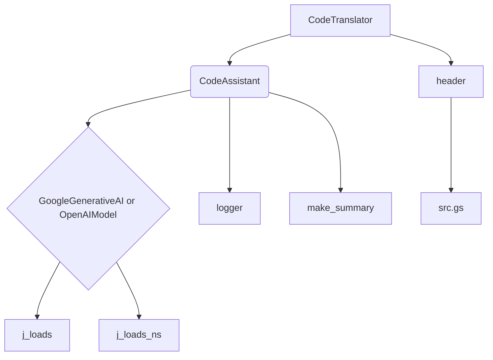
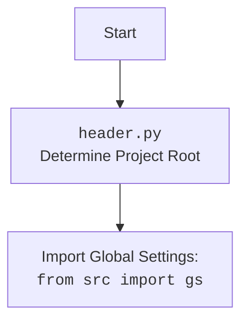

### **Анализ кода `code_translator.py`**

#### 1. **<алгоритм>**:

1.  **Инициализация**:
    *   Класс `CodeTranslator` наследуется от класса `CodeAssistant`.
    *   При инициализации `CodeTranslator` вызывается конструктор родительского класса `CodeAssistant` с передачей роли `code_translator`.

2.  **Процесс перевода**:
    *   Поскольку в предоставленном коде отсутствует реализация метода `process_files`, предполагается, что он наследуется от класса `CodeAssistant`.
    *   Метод `process_files` (из `CodeAssistant`) отвечает за чтение файлов кода, передачу кода в модели машинного обучения, получение обработанного кода и сохранение результатов.

3.  **Взаимодействие с моделями**:
    *   Класс использует модели `GoogleGenerativeAI` (через `src.ai.gemini`) или `OpenAIModel` (через `src.ai.openai`) для обработки кода. Выбор модели определяется конфигурацией.

4.  **Сохранение результатов**:
    *   Результаты обработки кода сохраняются в директории `docs/gemini`. Файлы сохраняются в зависимости от роли.

```mermaid
graph TD
    A[Инициализация CodeTranslator] --> B{Вызов конструктора CodeAssistant};
    B -- role='code_translator' --> C[Чтение файлов (CodeAssistant.process_files)];
    C --> D{Выбор модели (Gemini или OpenAI)};
    D -- Gemini --> E[Обработка кода GoogleGenerativeAI];
    D -- OpenAI --> F[Обработка кода OpenAIModel];
    E --> G[Сохранение результатов в docs/gemini];
    F --> G;
```

#### 2. **<mermaid>**:



Объяснение зависимостей:

*   `CodeTranslator` наследуется от `CodeAssistant`.
*   `CodeAssistant` использует `GoogleGenerativeAI` или `OpenAIModel` для обработки кода.
*   `GoogleGenerativeAI` и `OpenAIModel` используют `j_loads` и `j_loads_ns` для загрузки JSON-данных.
*   `CodeAssistant` использует `logger` для логирования.
*   `CodeAssistant` использует `make_summary` для создания сводок.
*   `CodeTranslator` использует `header` для определения корневой директории проекта и импорта глобальных настроек (`src.gs`).



#### 3. **<объяснение>**:

*   **Импорты**:
    *   `pathlib.Path`: Используется для работы с путями к файлам и директориям.
    *   `typing.Iterator`, `typing.List`, `typing.Optional`: Используются для аннотации типов.
    *   `types.SimpleNamespace`: Используется для создания объектов, атрибуты которых можно назначать.
    *   `header`: Определяет корневую директорию проекта и импортирует глобальные настройки.
    *   `src.gs`: Глобальные настройки проекта.
    *   `src.utils.jjson.j_loads`, `src.utils.jjson.j_loads_ns`: Используются для загрузки JSON-данных.
    *   `src.ai.gemini.GoogleGenerativeAI`: Класс для работы с моделью Gemini.
    *   `src.ai.openai.OpenAIModel`: Класс для работы с моделью OpenAI.
    *   `src.endpoints.hypo69.code_assistant.code_assistant.CodeAssistant`: Базовый класс для ассистента кода.
    *   `src.utils.path.get_relative_path`: Функция для получения относительного пути.
    *   `src.logger.logger.logger`: Модуль для логирования.
    *   `src.endpoints.hypo69.code_assistant.make_summary.make_summary`: Функция для создания сводок.

*   **Классы**:
    *   `CodeTranslator`:
        *   Роль: Переводчик кода.
        *   Наследуется от `CodeAssistant`.
        *   Атрибуты:
            *   `role`: Строка, представляющая роль (`code_translator`).
        *   Методы:
            *   `__init__`: Конструктор класса. Вызывает конструктор родительского класса `CodeAssistant`.

*   **Функции**:
    *   `__init__`:
        *   Аргументы:
            *   `role` (str): Роль ассистента.
            *   `models` (Optional[list]): Список моделей для использования (по умолчанию `['gemini']`).
        *   Возвращаемое значение: None.
        *   Назначение: Инициализирует класс `CodeTranslator`, вызывая конструктор родительского класса `CodeAssistant`.
        *   Пример:

```python
assistant = CodeTranslator(role='code_translator', models=['gemini'])
```

*   **Переменные**:
    *   `role`: Строковая переменная, определяющая роль класса `CodeTranslator`.

*   **Потенциальные ошибки или области для улучшения**:
    *   Отсутствует реализация метода `process_files` в классе `CodeTranslator`. Предполагается, что он наследуется от `CodeAssistant`, но это неявно и может привести к ошибкам, если поведение `process_files` потребуется изменить в `CodeTranslator`.

*   **Взаимосвязи с другими частями проекта**:
    *   `CodeTranslator` является частью модуля `src.endpoints.hypo69.code_assistant` и используется для перевода кода с использованием моделей машинного обучения (`GoogleGenerativeAI` или `OpenAIModel`). Он взаимодействует с модулями `src.utils.jjson` для загрузки JSON-данных, `src.logger.logger` для логирования и `src.endpoints.hypo69.code_assistant.make_summary` для создания сводок.