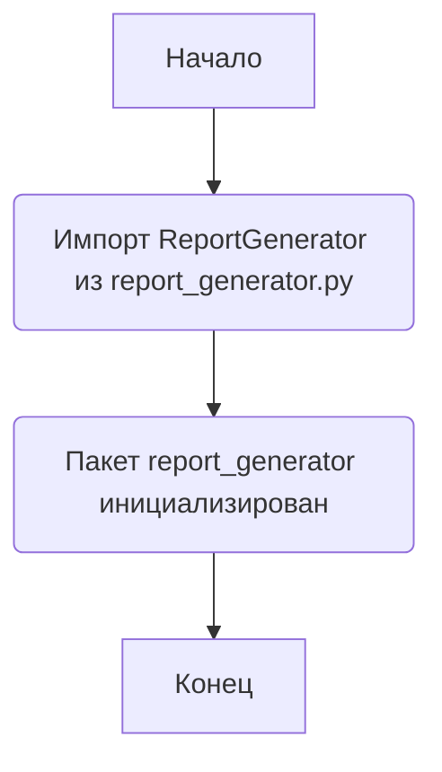
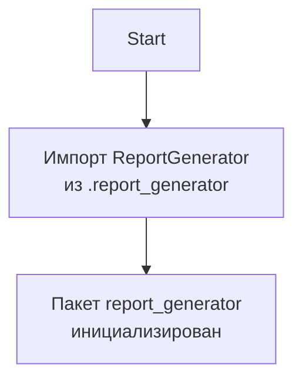

### **Анализ кода `hypotez/src/endpoints/kazarinov/report_generator/__init__.py`**

#### **1. <алгоритм>**:

Этот файл `__init__.py` служит для инициализации пакета `report_generator`. Он импортирует класс `ReportGenerator` из модуля `report_generator.py`. Это позволяет другим частям проекта обращаться к `ReportGenerator` через пакет `report_generator`.

#### **2. <mermaid>**:

#### **3. <объяснение>**:

- **Импорты**:
  - `from .report_generator import ReportGenerator`: Импортирует класс `ReportGenerator` из модуля `report_generator.py`, находящегося в той же директории. Это позволяет использовать `ReportGenerator` при обращении к пакету `report_generator`.

- **Файлы**:
  - `__init__.py`: Файл инициализации пакета.
  - `report_generator.py`: Содержит класс `ReportGenerator`, предназначенный для генерации отчетов.

- **Взаимосвязи**:
  - Другие части проекта могут импортировать пакет `report_generator` и использовать класс `ReportGenerator` для генерации отчетов.

- **Потенциальные улучшения**:
  - Можно добавить другие классы или функции в пакет `report_generator` и импортировать их здесь для более удобного доступа.