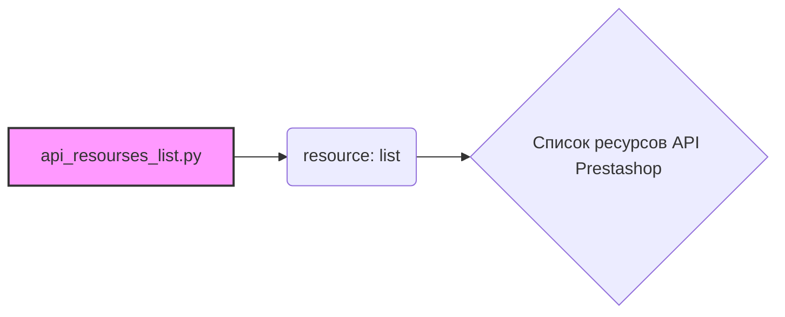

## Анализ кода: `hypotez/src/endpoints/prestashop/api_schemas/api_resourses_list.py`

### 1. <алгоритм>

1.  **Определение списка ресурсов**: Код определяет список строк, где каждая строка представляет собой название ресурса, доступного через API Prestashop.
2.  **Использование списка**: Этот список предназначен для использования в других частях проекта `hypotez`, где требуется знать все доступные ресурсы API Prestashop. Например, для валидации запросов, генерации документации или автоматического создания клиентских библиотек.

### 2. <mermaid>

**Объяснение зависимостей:**

*   `api_resourses_list.py`:  Этот файл содержит только определение списка `resource`.  Он не импортирует никаких внешних модулей.
*   `resource`:  Это переменная типа `list`, содержащая список строк.

### 3. <объяснение>

**Импорты**:

*   Отсутствуют. Данный файл не использует никаких импортов.

**Классы**:

*   Отсутствуют. В файле не определены классы.

**Функции**:

*   Отсутствуют. В файле не определены функции.

**Переменные**:

*   `resource: list`: Список строк, представляющих собой имена ресурсов API Prestashop.

**Потенциальные ошибки и области для улучшения**:

*   **Актуальность**:  Список ресурсов API Prestashop может устареть, если в Prestashop добавятся или будут удалены какие-либо ресурсы. Необходимо предусмотреть механизм обновления этого списка, например, автоматическую загрузку с сервера Prestashop или регулярную проверку актуальности.
*   **Типизация**: Можно добавить более строгую типизацию, например, создать `Enum` для ресурсов.
*   **Документирование**: Можно добавить документацию к каждому ресурсу, чтобы было понятно, за что он отвечает.

**Взаимосвязи с другими частями проекта**:

*   Предположительно, этот список используется в других модулях проекта `hypotez` для работы с API Prestashop. Например, он может использоваться для:
    *   Валидации URL-адресов API-запросов.
    *   Автоматической генерации документации API.
    *   Создания клиентских библиотек для работы с API.