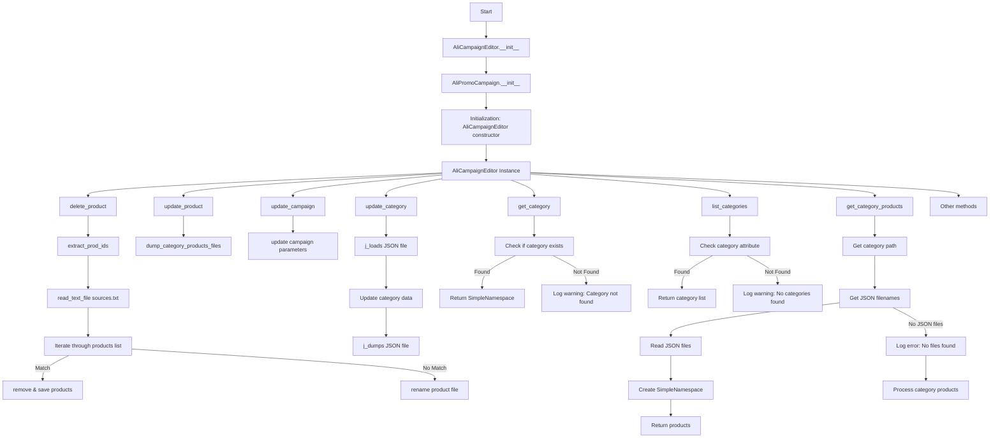
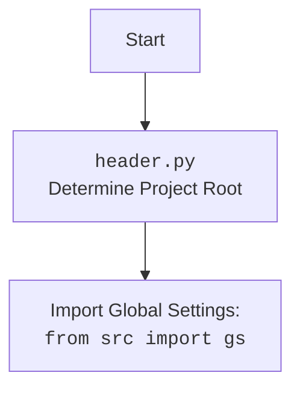

### **Анализ кода `hypotez`**

=========================================================================================

Описание функциональности и правил для генерации, анализа и улучшения кода. Направлено на обеспечение последовательного и читаемого стиля кодирования, соответствующего требованиям.

---

#### **1. <алгоритм>**:

1.  **`AliCampaignEditor.__init__`**:

    *   Принимает имя кампании, язык и валюту в качестве входных данных.
    *   Инициализирует экземпляр класса `AliCampaignEditor`, вызывая конструктор родительского класса `AliPromoCampaign`.
    *   Пример: `editor = AliCampaignEditor(campaign_name="Summer Sale", language="EN", currency="USD")`
2.  **`delete_product`**:

    *   Принимает `product_id` в качестве входных данных.
    *   Пытается удалить продукт из списка продуктов или переименовать файл продукта, если аффилиатная ссылка отсутствует.
    *   Пример: `editor.delete_product("12345")`
3.  **`update_product`**:

    *   Принимает имя категории, язык и словарь продукта в качестве входных данных.
    *   Обновляет информацию о продукте в рамках указанной категории, вызывая `dump_category_products_files`.
    *   Пример: `editor.update_product("Electronics", "EN", {"product_id": "12345", "title": "Smartphone"})`
4.  **`update_campaign`**:

    *   Обновляет свойства кампании, такие как описание и теги.
    *   Пример: `editor.update_campaign()`
5.  **`update_category`**:

    *   Принимает путь к JSON-файлу и объект категории `SimpleNamespace` в качестве входных данных.
    *   Обновляет категорию в JSON-файле, преобразуя `SimpleNamespace` в словарь.
    *   Пример:

        ```python
        category = SimpleNamespace(name="New Category", description="Updated description")
        result = editor.update_category(Path("category.json"), category)
        print(result)  # True if successful
        ```
6.  **`get_category`**:

    *   Принимает имя категории в качестве входных данных.
    *   Возвращает объект `SimpleNamespace` для указанной категории, если категория существует, иначе возвращает `None`.
    *   Пример:

        ```python
        category = editor.get_category("Electronics")
        print(category)  # SimpleNamespace or None
        ```
7.  **`list_categories`**:

    *   Возвращает список категорий в текущей кампании.
    *   Пример:

        ```python
        categories = editor.categories_list
        print(categories)  # ['Electronics', 'Fashion', 'Home']
        ```
8.  **`get_category_products`**:

    *   Принимает имя категории в качестве входных данных.
    *   Чтение данных о товарах из JSON файлов для конкретной категории.
    *   Пример:

        ```python
        products = campaign.get_category_products("Electronics")
        print(len(products))
        15
        ```

#### **2. <mermaid>**:



##### **Объяснение зависимостей `mermaid`**:

*   `AliCampaignEditor.__init__`: Инициализирует класс `AliCampaignEditor`.
*   `AliPromoCampaign.__init__`: Инициализирует класс `AliPromoCampaign` (родительский класс).
*   `delete_product`: Удаляет продукт из кампании.
*   `extract_prod_ids`: Извлекает идентификаторы продуктов из строк.
*   `read_text_file sources.txt`: Читает список продуктов из файла `sources.txt`.
*   `update_product`: Обновляет информацию о продукте.
*   `dump_category_products_files`: Записывает информацию о продукте в файлы категорий.
*   `update_campaign`: Обновляет параметры кампании.
*   `update_category`: Обновляет категорию в JSON-файле.
*   `j_loads JSON file`: Загружает данные из JSON-файла.
*   `j_dumps JSON file`: Сохраняет данные в JSON-файл.
*   `get_category`: Возвращает категорию по имени.
*   `list_categories`: Возвращает список категорий.
*   `get_category_products`: Получает продукты для указанной категории.



#### **3. <объяснение>**:

*   **Расположение файла**: `hypotez/src/suppliers/aliexpress/campaign/ali_campaign_editor.py`

    *   Этот файл является частью проекта `hypotez` и расположен в каталоге, отвечающем за работу с поставщиками AliExpress, конкретно с редактированием рекламных кампаний.
*   **Импорты**:

    *   `asyncio`: Предоставляет инфраструктуру для написания однопоточного конкурентного кода с использованием сопрограмм.
    *   `re`: Модуль для работы с регулярными выражениями.
    *   `shutil`: Модуль, предоставляющий ряд высокоуровневых операций с файлами.
    *   `datetime`: Модуль для работы с датой и временем.
    *   `Path` (from `pathlib`): Представляет пути файловой системы.
    *   `SimpleNamespace` (from `types`): Простой класс для создания объектов, доступ к атрибутам которых можно осуществлять через точку.
    *   `List`, `Optional` (from `typing`): Используются для аннотации типов.
    *   `header`: Содержит общие настройки и функции для проекта `hypotez`.
    *   `src.gs`: Глобальные настройки проекта.
    *   `src.suppliers.aliexpress.campaign.ali_promo_campaign`: Класс для управления промо-кампаниями AliExpress.
    *   `src.suppliers.aliexpress.campaign.gsheet`: Класс для работы с Google Sheets.
    *   `src.suppliers.aliexpress.utils`: Вспомогательные функции для работы с AliExpress.
    *   `src.utils.jjson`: Функции для работы с JSON-файлами.
    *   `src.utils.convertors.csv`: Инструменты для конвертации CSV в словарь.
    *   `src.utils.printer`: Инструменты для красивого вывода в консоль.
    *   `src.utils.file`: Функции для работы с файлами и директориями.
    *   `src.logger.logger`: Модуль для логирования событий.
*   **Класс `AliCampaignEditor`**:

    *   Роль: Предоставляет методы для редактирования рекламных кампаний AliExpress.
    *   Наследуется от `AliPromoCampaign`, расширяя его функциональность.
    *   Методы:

        *   `__init__`: Инициализирует редактор кампании с именем кампании, языком и валютой.
        *   `delete_product`: Удаляет продукт, у которого нет партнерской ссылки.
        *   `update_product`: Обновляет информацию о продукте в указанной категории.
        *   `update_campaign`: Обновляет свойства кампании, такие как описание и теги.
        *   `update_category`: Обновляет категорию в JSON-файле.
        *   `get_category`: Возвращает объект `SimpleNamespace` для данной категории.
        *   `list_categories`: Возвращает список категорий в текущей кампании.
        *   `get_category_products`: Получает продукты для указанной категории.
*   **Функции**:

    *   `__init__`:

        *   Аргументы: `campaign_name` (str), `language` (Optional[str | dict]), `currency` (Optional[str])
        *   Возвращает: `None`
        *   Назначение: Инициализирует экземпляр класса `AliCampaignEditor`.
    *   `delete_product`:

        *   Аргументы: `product_id` (str), `exc_info` (bool)
        *   Возвращает: `None`
        *   Назначение: Удаляет продукт, у которого нет партнерской ссылки.
    *   `update_product`:

        *   Аргументы: `category_name` (str), `lang` (str), `product` (dict)
        *   Возвращает: `None`
        *   Назначение: Обновляет информацию о продукте в указанной категории.
    *   `update_campaign`:

        *   Аргументы: Нет
        *   Возвращает: `None`
        *   Назначение: Обновляет свойства кампании, такие как описание и теги.
    *   `update_category`:

        *   Аргументы: `json_path` (Path), `category` (SimpleNamespace)
        *   Возвращает: `bool`
        *   Назначение: Обновляет категорию в JSON-файле.
    *   `get_category`:

        *   Аргументы: `category_name` (str)
        *   Возвращает: `Optional[SimpleNamespace]`
        *   Назначение: Возвращает объект `SimpleNamespace` для данной категории.
    *   `list_categories`:

        *   Аргументы: Нет
        *   Возвращает: `Optional[List[str]]`
        *   Назначение: Возвращает список категорий в текущей кампании.
    *   `get_category_products`:

        *   Аргументы: `category_name` (str)
        *   Возвращает: `Optional[List[SimpleNamespace]]`
        *   Назначение: Чтение данных о товарах из JSON файлов для конкретной категории.
*   **Переменные**:

    *   `campaign_name` (str): Имя кампании.
    *   `language` (str): Язык кампании.
    *   `currency` (str): Валюта кампании.
    *   `product_id` (str): Идентификатор продукта.
    *   `category_name` (str): Имя категории.
    *   `json_path` (Path): Путь к JSON-файлу.
    *   `category` (SimpleNamespace): Объект категории.
*   **Потенциальные ошибки и области для улучшения**:

    *   Обработка ошибок в методах `delete_product`, `update_category`, `get_category`, `list_categories` может быть улучшена для более точного логирования и обработки исключений.
    *   Отсутствует реализация методов `update_campaign` и `process_category_products`.
    *   Использование `j_loads_ns` и `j_dumps` для работы с JSON-файлами улучшает читаемость и упрощает код.
*   **Взаимосвязи с другими частями проекта**:

    *   Класс `AliCampaignEditor` наследуется от `AliPromoCampaign`, что указывает на тесную связь между редактированием кампании и управлением промо-камниями.
    *   Использование `AliCampaignGoogleSheet` предполагает интеграцию с Google Sheets для управления данными кампании.
    *   Функции из `src.utils.jjson`, `src.utils.file` и `src.logger.logger` используются для работы с JSON-файлами, файловой системой и логированием, соответственно.