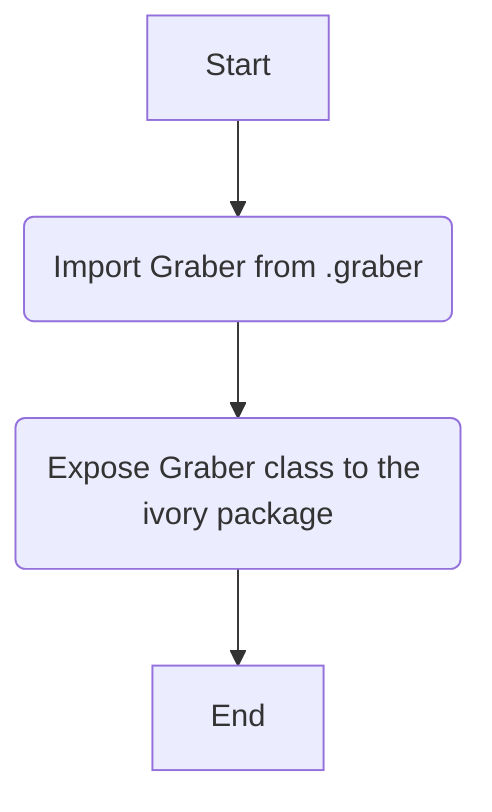
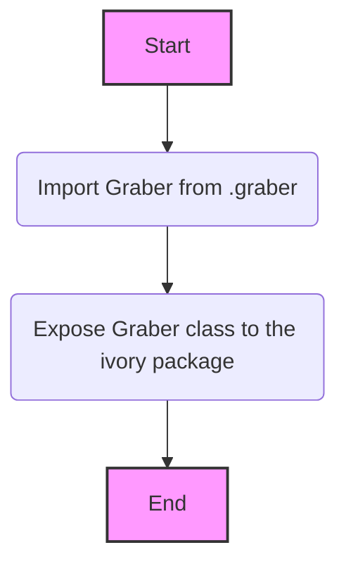

### **Анализ кода `hypotez/src/suppliers/ivory/__init__.py`**

#### **1. <алгоритм>**:

1.  **Импорт `Graber`**: Импортирует класс `Graber` из модуля `.graber`. Этот класс, вероятно, отвечает за извлечение данных с веб-сайтов поставщиков.
2.  **Инициализация модуля**: Файл `__init__.py` инициализирует пакет `ivory`, делая класс `Graber` доступным для использования в других частях проекта.



#### **2. <mermaid>**:



В данном случае импортируется `Graber` из `.graber`. Нет дополнительных внешних зависимостей, поэтому диаграмма показывает только импорт и экспорт класса `Graber`.

#### **3. <объяснение>**:

-   **Расположение файла**: `hypotez/src/suppliers/ivory/__init__.py` указывает на то, что это файл инициализации пакета `ivory` внутри подсистемы `suppliers`. Это говорит о том, что `ivory` — это один из поставщиков данных для проекта `hypotez`.

-   **Импорты**:
    -   `from .graber import Graber`: Импортирует класс `Graber` из модуля `graber.py`, находящегося в той же директории. `Graber`, вероятно, содержит логику для сбора и обработки данных с веб-сайтов, связанных с поставщиком `ivory`.

-   **Классы**:
    -   `Graber`: Класс, вероятно, предназначен для выполнения задач веб-скрейпинга и обработки данных, специфичных для поставщика `ivory`. Он может включать методы для навигации по сайту, извлечения данных и их очистки.

-   **Функции**:
    -   Файл `__init__.py` сам по себе не содержит функций, но он делает класс `Graber` доступным при импорте пакета `ivory`.

-   **Переменные**:
    -   В файле нет переменных на уровне модуля, только импортированный класс.

-   **Потенциальные улучшения**:
    -   Для повышения удобства использования можно добавить `__all__ = ['Graber']`, чтобы явно указать, какие символы должны быть импортированы при использовании `from src.suppliers.ivory import *`.

**Взаимосвязи с другими частями проекта**:

-   Пакет `ivory` является частью подсистемы `suppliers`, что подразумевает наличие других пакетов поставщиков (например, `suppliers/supplier_x`).
-   Класс `Graber`, вероятно, используется в других частях проекта для извлечения и обработки данных, специфичных для поставщика `ivory`.

```mermaid
flowchart TD
    A[src.suppliers] --> B(src.suppliers.ivory);
    B --> C(Graber из graber.py);
    style A fill:#f9f,stroke:#333,stroke-width:2px
    style B fill:#ccf,stroke:#333,stroke-width:2px
    style C fill:#ccf,stroke:#333,stroke-width:2px