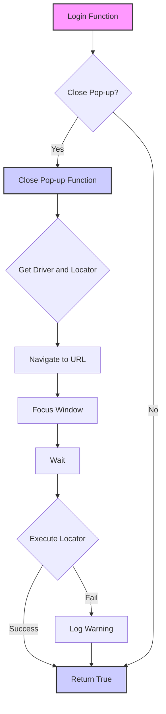

## Анализ кода `hypotez/src/suppliers/kualastyle/login.py`

### 1. <алгоритм>

**Общий рабочий процесс:**

1.  **Функция `login(s)`**:
    *   Принимает объект `s` типа `Supplier` в качестве аргумента.
    *   Вызывает функцию `close_pop_up(s)` для закрытия всплывающего окна.
    *   Всегда возвращает `True`, предполагая успешную авторизацию после закрытия всплывающего окна.

2.  **Функция `close_pop_up(s)`**:
    *   Принимает объект `s` типа `Supplier` в качестве аргумента.
    *   Извлекает драйвер браузера из объекта `s` (`_d = s.driver`).
    *   Извлекает локатор для закрытия всплывающего окна из объекта `s` (`_l = s.locators['close_pop_up_locator']`).
    *   Переходит по URL 'https://www.kualastyle.com' с помощью драйвера (`_d.get_url('https://www.kualastyle.com')`).
    *   Переводит фокус на окно браузера (`_d.window_focus(_d)`).
    *   Ожидает 5 секунд (`_d.wait(5)`).
    *   Пытается выполнить локатор для закрытия всплывающего окна (`_d.execute_locator(_l)`).
    *   В случае неудачи при выполнении локатора, записывает предупреждение в лог (`logger.warning(f"Не закрыл попап")`).
    *   Содержит не реализованную часть кода `...`.

**Примеры:**

*   **Функция `login(s)`**:

    ```python
    def login(s) -> bool:
        """ Функция логин.
       @param
            s - Supplier
        @returns
            True if login else False

       """
        close_pop_up(s)
        return True
    ```

    Пример вызова:

    ```python
    supplier = Supplier()  # Предполагается, что есть класс Supplier
    result = login(supplier)
    print(result)  # Вывод: True
    ```

*   **Функция `close_pop_up(s)`**:

    ```python
    def close_pop_up(s) -> bool:
        """ Функция логин
       @param
            s - Supplier
        @returns
            True if login else False

       """
        _d = s.driver
        _l : dict = s.locators['close_pop_up_locator']

        _d.get_url('https://www.kualastyle.com')
        _d.window_focus(_d)
        _d.wait(5)
        #_d.page_refresh()
        try:
            _d.execute_locator(_l)
        except Exception as e:
            logger.warning(f"Не закрыл попап")

        ...
    ```

    Пример вызова:

    ```python
    supplier = Supplier()  # Предполагается, что есть класс Supplier с атрибутами driver и locators
    supplier.locators = {'close_pop_up_locator': 'locator'}  # Заглушка для локатора
    close_pop_up(supplier)
    ```

### 2. <mermaid>



**Объяснение зависимостей:**

*   `Login Function` вызывает `Close Pop-up Function`.
*   `Close Pop-up Function` использует `driver` и `locator` из объекта `Supplier`.
*   При неудачном выполнении локатора вызывается `Log Warning` из модуля `logger`.

### 3. <объяснение>

**Импорты:**

*   `from src.logger.logger import logger`: Импортирует объект `logger` из модуля `src.logger.logger`. Используется для логирования предупреждений и ошибок.

**Классы:**

*   `Supplier`: Класс не определен в предоставленном коде. Предполагается, что он содержит атрибуты `driver` (экземпляр драйвера браузера) и `locators` (словарь, содержащий локаторы элементов страницы).

**Функции:**

*   **`login(s: Supplier) -> bool`**:
    *   **Аргументы**:
        *   `s` (Supplier): Объект поставщика, содержащий информацию, необходимую для авторизации.
    *   **Возвращаемое значение**:
        *   `bool`: Всегда возвращает `True`.
    *   **Назначение**:
        *   Выполняет авторизацию поставщика. В текущей реализации вызывает `close_pop_up(s)` и возвращает `True`.
    *   **Пример**:

        ```python
        supplier = Supplier()  # Предполагается, что есть класс Supplier
        result = login(supplier)
        print(result)  # Вывод: True
        ```

*   **`close_pop_up(s: Supplier) -> bool`**:
    *   **Аргументы**:
        *   `s` (Supplier): Объект поставщика, содержащий информацию, необходимую для закрытия всплывающего окна.
    *   **Возвращаемое значение**:
        *   `bool`: Всегда возвращает `True`.
    *   **Назначение**:
        *   Закрывает всплывающее окно на странице поставщика. Извлекает драйвер и локатор из объекта `Supplier`, переходит по URL, фокусируется на окне, ожидает и пытается выполнить локатор для закрытия всплывающего окна.
    *   **Пример**:

        ```python
        supplier = Supplier()  # Предполагается, что есть класс Supplier с атрибутами driver и locators
        supplier.locators = {'close_pop_up_locator': 'locator'}  # Заглушка для локатора
        close_pop_up(supplier)
        ```

**Переменные:**

*   `_d`: Локальная переменная, представляющая драйвер браузера, извлеченный из `s.driver`.
*   `_l`: Локальная переменная, представляющая локатор элемента для закрытия всплывающего окна, извлеченный из `s.locators['close_pop_up_locator']`.
*   `s`: Объект `Supplier`, передаваемый в функции `login` и `close_pop_up`.

**Потенциальные ошибки и области для улучшения:**

1.  **Обработка исключений**: В функции `close_pop_up` исключение `Exception` перехватывается, но не обрабатывается должным образом. Следует логировать конкретное исключение и, возможно, предпринять попытки повторного закрытия всплывающего окна.
2.  **Отсутствие обработки ошибок в `login`**: Функция `login` всегда возвращает `True`, даже если `close_pop_up` не удалось закрыть всплывающее окно. Следует добавить проверку успешности закрытия всплывающего окна и возвращать `False` в случае неудачи.
3.  **Неполная реализация**: В конце функции `close_pop_up` присутствует `...`, что указывает на неполную реализацию. Следует завершить реализацию функции.
4.  **Отсутствие аннотации типов для параметра `s` в функциях**: Необходимо добавить аннотацию типа `Supplier` для параметра `s` в функциях `login` и `close_pop_up`.
5.  **Отсутствие обработки случая, когда `s.locators['close_pop_up_locator']` не существует**: Необходимо добавить проверку наличия ключа `close_pop_up_locator` в словаре `s.locators` перед его использованием.
6.  **Комментарии**:
    *   Документация функций содержит устаревшую информацию ("Функция логин" в `close_pop_up`).
    *   Необходимо добавить более подробные комментарии, объясняющие назначение каждого блока кода.

**Взаимосвязи с другими частями проекта:**

*   `src.logger.logger`: Используется для логирования предупреждений.
*   Предполагается наличие класса `Supplier`, который должен быть определен в другом модуле проекта.
*   Функция `_d.get_url`, `_d.window_focus`, `_d.wait`, `_d.execute_locator` предположительно являются методами класса `driver`, который также должен быть определен в другом модуле проекта.