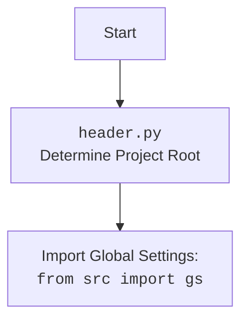

### **Анализ кода `hypotez/src/suppliers/wallashop/header.py`**

#### 1. **<алгоритм>**:
1.  **Определение корневой директории проекта (`set_project_root`)**:
    *   Функция `set_project_root` ищет корневую директорию проекта, начиная с директории текущего файла и двигаясь вверх по иерархии.
    *   Она останавливается, когда находит директорию, содержащую один из файлов-маркеров (по умолчанию `__root__` или `.git`).
    *   **Пример**: Если текущий файл находится в `/path/to/project/src/suppliers/wallashop/header.py`, функция проверит наличие `__root__` или `.git` в следующих директориях:
        *   `/path/to/project/src/suppliers/wallashop/`
        *   `/path/to/project/src/suppliers/`
        *   `/path/to/project/src/`
        *   `/path/to/project/`
    *   Если корневая директория найдена, она добавляется в `sys.path`, чтобы обеспечить возможность импорта модулей из этой директории.
2.  **Инициализация корневой директории проекта**:
    *   Переменная `__root__` инициализируется путем вызова функции `set_project_root()`.
    *   **Пример**: `__root__ = /path/to/project`.
3.  **Импорт глобальных настроек**:
    *   Импортируется модуль `gs` из пакета `src`. Предположительно, `gs` содержит глобальные настройки и пути проекта.
4.  **Загрузка настроек из `settings.json`**:
    *   Переменная `settings` пытается загрузить настройки из файла `settings.json`, расположенного в директории `src` относительно корневой директории проекта.
    *   Если файл не найден или содержит некорректный JSON, переменной `settings` присваивается значение `None`.
    *   **Пример**: Если `gs.path.root` указывает на `/path/to/project`, то файл `settings.json` будет искаться по адресу `/path/to/project/src/settings.json`.
5.  **Чтение содержимого файла `README.MD`**:
    *   Переменная `doc_str` пытается прочитать содержимое файла `README.MD`, расположенного в директории `src` относительно корневой директории проекта.
    *   Если файл не найден или не может быть прочитан, переменной `doc_str` присваивается значение `None`.
    *   **Пример**: Если `gs.path.root` указывает на `/path/to/project`, то файл `README.MD` будет искаться по адресу `/path/to/project/src/README.MD`.
6.  **Инициализация глобальных переменных**:
    *   Глобальные переменные `__project_name__`, `__version__`, `__doc__`, `__details__`, `__author__`, `__copyright__` и `__cofee__` инициализируются значениями из словаря `settings`, если он был успешно загружен. В противном случае используются значения по умолчанию.
    *   **Пример**: Если `settings = {"project_name": "hypotez", "version": "1.0.0"}`, то `__project_name__` будет равно `"hypotez"`, а `__version__` будет равно `"1.0.0"`. Если `settings = None`, то `__project_name__` будет равно `"hypotez"`, а `__version__` будет равно `""`.

#### 2. **<mermaid>**:

```mermaid
flowchart TD
    Start --> FindRoot[Find Project Root <br> <code>set_project_root()</code>]
    FindRoot --> CheckMarker{Check for marker files <br> (".git", "__root__")}
    CheckMarker -- Found --> SetRoot[Set project root]
    CheckMarker -- Not Found --> GoUp[Move to parent directory]
    GoUp --> CheckMarker
    SetRoot --> AddToSysPath[Add root to <code>sys.path</code>]
    AddToSysPath --> ImportGS[Import Global Settings: <br><code>from src import gs</code>]
    ImportGS --> LoadSettings[Load settings from <br> <code>settings.json</code>]
    LoadSettings -- Success --> ReadMe[Read <code>README.MD</code>]
    LoadSettings -- Failure --> ReadMe
    ReadMe -- Success --> SetGlobals[Set global variables]
    ReadMe -- Failure --> SetGlobals
    SetGlobals --> End
```

**Объяснение `mermaid`**:

*   **FindRoot**: Вызывает функцию `set_project_root()`, которая определяет корневую директорию проекта.
*   **CheckMarker**: Проверяет наличие файлов-маркеров (`.git`, `__root__`) в текущей директории.
*   **SetRoot**: Устанавливает корневую директорию проекта, если маркер найден.
*   **GoUp**: Переходит к родительской директории, если маркер не найден.
*   **AddToSysPath**: Добавляет корневую директорию в `sys.path`, чтобы обеспечить возможность импорта модулей из этой директории.
*   **ImportGS**: Импортирует глобальные настройки из модуля `src.gs`.
*   **LoadSettings**: Пытается загрузить настройки из файла `settings.json`.
*   **ReadMe**: Пытается прочитать содержимое файла `README.MD`.
*   **SetGlobals**: Устанавливает глобальные переменные, такие как `__project_name__`, `__version__` и т.д., используя значения из `settings.json` или значения по умолчанию.



#### 3. **<объяснение>**:

*   **Импорты**:
    *   `sys`: Используется для работы с системными переменными, в частности, для добавления корневой директории проекта в `sys.path`.
    *   `json`: Используется для чтения данных из JSON-файла (`settings.json`).
    *   `packaging.version.Version`: Используется для работы с версиями пакетов.
    *   `pathlib.Path`: Используется для работы с путями к файлам и директориям.
    *   `src.gs`: Предположительно, содержит глобальные настройки и пути проекта.
*   **Функции**:
    *   `set_project_root(marker_files: tuple[str, ...]=('__root__', '.git')) -> Path`:
        *   **Аргументы**:
            *   `marker_files`: Кортеж имен файлов или директорий, которые используются для определения корневой директории проекта. По умолчанию `('__root__', '.git')`.
        *   **Возвращаемое значение**:
            *   `Path`: Путь к корневой директории проекта.
        *   **Назначение**:
            *   Функция ищет корневую директорию проекта, начиная с директории текущего файла и двигаясь вверх по иерархии. Она останавливается, когда находит директорию, содержащую один из файлов-маркеров. Если корневая директория не найдена, возвращается директория, в которой находится скрипт.
        *   **Пример**:
            ```python
            root_path = set_project_root()
            print(root_path)  # Выводит путь к корневой директории проекта
            ```
*   **Переменные**:
    *   `__root__`: `Path` - Корневая директория проекта.
    *   `settings`: `dict` - Словарь с настройками, загруженными из файла `settings.json`.
    *   `doc_str`: `str` - Строка, содержащая содержимое файла `README.MD`.
    *   `__project_name__`: `str` - Название проекта.
    *   `__version__`: `str` - Версия проекта.
    *   `__doc__`: `str` - Документация проекта (содержимое `README.MD`).
    *   `__details__`: `str` - Дополнительная информация о проекте (в данном коде не инициализируется).
    *   `__author__`: `str` - Автор проекта.
    *   `__copyright__`: `str` - Информация об авторских правах.
    *   `__cofee__`: `str` - Сообщение с предложением угостить разработчика чашкой кофе.
*   **Потенциальные ошибки и области для улучшения**:
    *   Обработка исключений `FileNotFoundError` и `json.JSONDecodeError` осуществляется с помощью `...`, что не является хорошей практикой. Необходимо добавить логирование ошибок с использованием модуля `logger` из `src.logger.logger`.
    *   Переменная `__details__` не инициализируется. Возможно, это упущение, и ее следует инициализировать значением из файла `settings.json` или другим способом.
    *   Использование `gs.path.root` предполагает, что модуль `gs` уже содержит корректный путь к корневой директории проекта. Однако, если это не так, то могут возникнуть проблемы при загрузке файлов `settings.json` и `README.MD`.
*   **Взаимосвязи с другими частями проекта**:
    *   Файл `header.py` используется для определения корневой директории проекта и загрузки глобальных настроек. Эти настройки используются другими модулями проекта для получения информации о проекте, такой как название, версия, автор и т.д.
    *   Модуль `src.gs` предоставляет глобальные настройки и пути проекта, которые используются в `header.py` для определения местоположения файлов `settings.json` и `README.MD`.