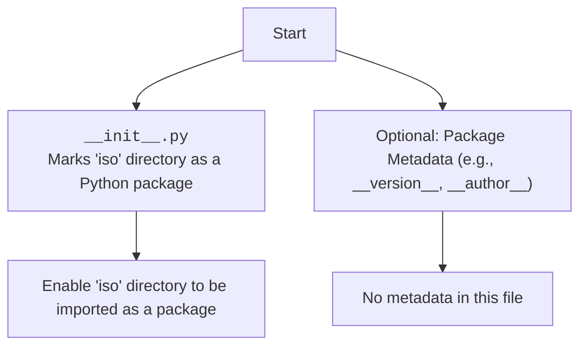

### **Анализ кода `hypotez/src/utils/iso/__init__.py`**

#### **1. <алгоритм>**:
Файл `__init__.py` в Python используется для обозначения каталога как пакета. В данном случае, он находится в `src/utils/iso/` и, по сути, преобразует каталог `iso` в пакет Python.

- **Шаг 1**: Определить наличие файла `__init__.py` в каталоге `src/utils/iso/`.
  - Пример: `os.path.exists('src/utils/iso/__init__.py')` возвращает `True`.

- **Шаг 2**: Импортировать модули или подпакеты, если необходимо. В данном случае, файл пустой, поэтому импортировать нечего.

- **Шаг 3**: Указать метаданные пакета, такие как `__version__`, `__author__`, `__email__`. В данном случае, метаданные отсутствуют.

#### **2. <mermaid>**:

**Объяснение зависимостей:**
- `__init__.py` не импортирует никаких внешних модулей или пакетов. Его основная функция - это преобразование каталога в пакет.

#### **3. <объяснение>**:

- **Расположение файла**: `hypotez/src/utils/iso/__init__.py`
  - Файл `__init__.py` расположен в каталоге `iso`, который находится в `src/utils/`. Это указывает на то, что `iso` является пакетом или подпакетом в рамках проекта `hypotez`.
- **Импорты**:
  - В данном файле нет импортов.
- **Классы**:
  - Файл не содержит классов.
- **Функции**:
  - Файл не содержит функций.
- **Переменные**:
  - Файл не содержит переменных.
- **Назначение**:
  - Файл `__init__.py` преобразует каталог `iso` в пакет Python. Это позволяет другим модулям и пакетам в проекте `hypotez` импортировать `iso` как пакет.
- **Потенциальные ошибки или области для улучшения**:
  - В текущем виде файл `__init__.py` выполняет только базовую функцию - преобразование каталога в пакет. В дальнейшем, если в пакете `iso` появятся модули, можно будет добавить их импорт в `__init__.py`, чтобы упростить использование пакета.