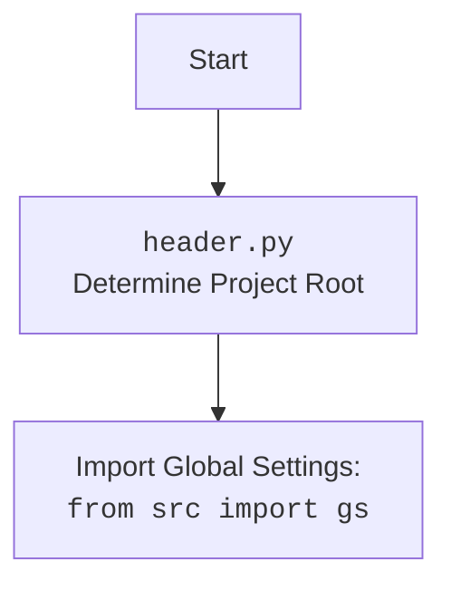

# Проект `hypotez`
# Роль `code explainer`

## АНАЛИЗ КОДА: `hypotez/src/webdriver/bs/header.py`

### 1. <алгоритм>

1.  **`set_project_root(marker_files: tuple) -> Path`**:
    *   Начинает поиск корневой директории проекта с директории текущего файла (`__file__`).
    *   Итерируется по родительским директориям, проверяя наличие одного из файлов-маркеров (по умолчанию `'__root__'` или `'.git'`).
    *   Если маркер найден, устанавливает родительскую директорию в качестве корневой (`__root__`) и прекращает поиск.
    *   Если корневая директория не найдена, оставляет текущую директорию в качестве корневой.
    *   Добавляет корневую директорию в `sys.path`, если её там нет.

    ```python
    # Пример:
    marker_files = ('__root__', '.git')
    root_path = set_project_root(marker_files)
    print(f"Root path: {root_path}")
    ```

2.  **`__root__: Path = set_project_root()`**:
    *   Вызывает функцию `set_project_root()` для определения корневой директории проекта.
    *   Присваивает возвращенное значение переменной `__root__`.

    ```python
    # Пример:
    print(f"Project root: {__root__}")
    ```

### 2. <mermaid>

```mermaid
flowchart TD
    Start[Начало] --> FindCurrentDir[Получить директорию текущего файла]
    FindCurrentDir --> LoopParents[Цикл по родительским директориям]
    LoopParents --> CheckMarker[Проверить наличие файлов-маркеров]

    CheckMarker -- "Маркер найден" --> SetRoot[Установить родительскую директорию как корневую]
    SetRoot --> BreakLoop[Прервать цикл]
    CheckMarker -- "Маркер не найден" --> NextParent[Перейти к следующей родительской директории]
    NextParent --> LoopParents

    LoopParents -- "Все родительские директории проверены" --> UseCurrentDir[Использовать текущую директорию как корневую]
    BreakLoop --> AddToSysPath[Добавить корневую директорию в sys.path (если отсутствует)]
    UseCurrentDir --> AddToSysPath
    AddToSysPath --> End[Конец]
```

#### Объяснение зависимостей:

*   `sys`: Используется для добавления корневой директории проекта в `sys.path`, что позволяет импортировать модули из этой директории.
*   `pathlib.Path`: Используется для работы с путями к файлам и директориям.

### 3. <объяснение>

*   **Импорты**:
    *   `sys`: Этот модуль предоставляет доступ к некоторым переменным и функциям, взаимодействующим с интерпретатором Python. Здесь он используется для добавления корневой директории проекта в `sys.path`.
    *   `json`: Хотя этот модуль импортируется, он не используется в предоставленном коде. Возможно, он предназначен для использования в других частях модуля.
    *   `packaging.version.Version`: Данный модуль импортируется, но не используется.
    *   `pathlib.Path`: Используется для представления путей к файлам и директориям, упрощая операции с файловой системой.

*   **Классы**:
    *   Нет классов в данном коде.

*   **Функции**:
    *   `set_project_root(marker_files: tuple) -> Path`:
        *   Аргументы:
            *   `marker_files` (tuple): Кортеж имен файлов или директорий, которые используются для определения корневой директории проекта. По умолчанию (`'__root__'`, `'.git'`).
        *   Возвращаемое значение:
            *   `Path`: Путь к корневой директории проекта.
        *   Назначение:
            *   Функция определяет корневую директорию проекта, начиная поиск с директории текущего файла и двигаясь вверх по родительским директориям. Поиск прекращается, когда найдена директория, содержащая один из файлов-маркеров. Затем корневая директория добавляется в `sys.path`, если её там ещё нет.
        *   Пример:

        ```python
        from pathlib import Path
        import sys
        marker_files = ('__root__', '.git')
        root_path = set_project_root(marker_files)
        print(f"Root path: {root_path}")
        print(f"Is root path in sys.path: {str(root_path) in sys.path}")
        ```

*   **Переменные**:
    *   `__root__`:
        *   Тип: `Path`
        *   Использование: Хранит путь к корневой директории проекта. Инициализируется результатом функции `set_project_root()`.

#### Потенциальные ошибки или области для улучшения:

*   Хотя модуль `json` импортирован, он нигде не используется в предоставленном коде. Это может указывать на то, что он предназначен для использования в других частях модуля, или что импорт является избыточным и его можно удалить.

#### Взаимосвязи с другими частями проекта:

*   Этот модуль важен для других частей проекта, так как он определяет корневую директорию проекта и добавляет её в `sys.path`. Это позволяет другим модулям импортировать модули из проекта, используя абсолютные пути относительно корневой директории.

