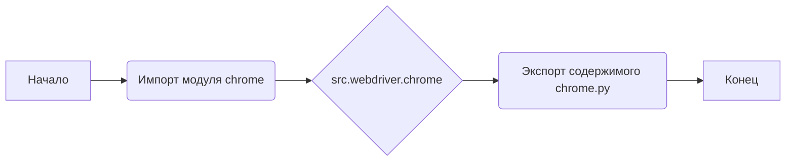
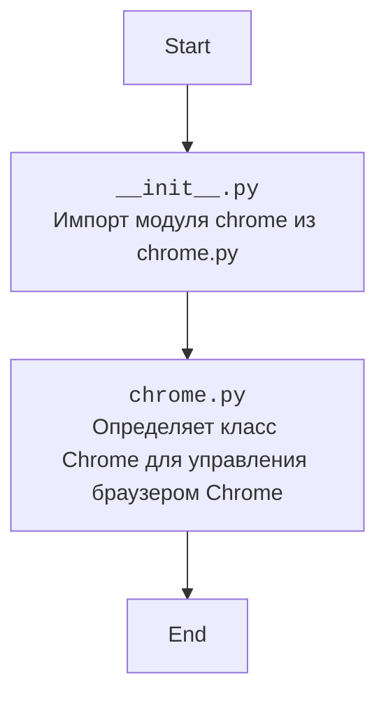

### **Анализ кода `hypotez/src/webdriver/chrome/__init__.py`**

#### **1. <алгоритм>**:
Этот файл (`__init__.py`) в пакете `src.webdriver.chrome` предназначен для импорта модуля `chrome`. Он делает класс или функции, определенные в `chrome.py`, доступными при импорте пакета `src.webdriver.chrome`.

#### **2. <mermaid>**:

**Объяснение `mermaid`**:
- `Start` обозначает начало процесса импорта.
- `ImportChrome` представляет файл `__init__.py`, который импортирует модуль `chrome` из файла `chrome.py`.
- `ChromeModule` представляет файл `chrome.py`, который содержит класс `Chrome` и другие связанные функции.
- `End` обозначает конец процесса.

#### **3. <объяснение>**:

**Импорты**:
- `from .chrome import Chrome`: импортирует класс `Chrome` из модуля `chrome.py`, расположенного в той же директории. Это позволяет использовать `Chrome` напрямую через пакет `src.webdriver.chrome`.

**Классы**:
- Класс `Chrome` (определен в `chrome.py`) предназначен для управления браузером Chrome. Он может включать методы для запуска браузера, навигации по страницам, взаимодействия с элементами и выполнения других действий.

**Функции**:
- В данном файле (`__init__.py`) функции отсутствуют.

**Переменные**:
- Отсутствуют.

**Потенциальные ошибки и области для улучшения**:
- Файл `__init__.py` выглядит правильно и выполняет свою задачу. Возможные улучшения могут быть в модуле `chrome.py`, где можно добавить больше функциональности для управления браузером.

**Взаимосвязи с другими частями проекта**:
- `src.webdriver.chrome` предоставляет интерфейс для управления браузером Chrome, что может быть использовано в других частях проекта `hypotez` для автоматизации тестирования, сбора данных или других задач, связанных с веб-браузерами.