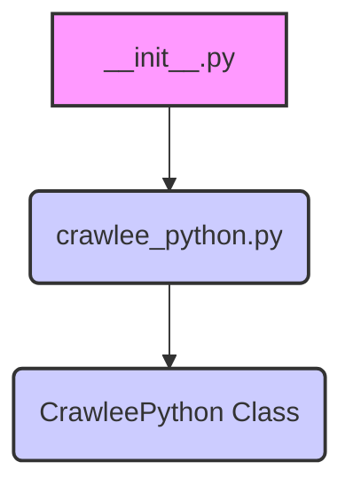

### **Анализ кода `hypotez/src/webdriver/crawlee_python/__init__.py`**

#### **1. <алгоритм>**:
1. **Импорт модуля `crawlee_python`**: Импортируется класс `CrawleePython` из модуля `crawlee_python.py`. Этот класс, вероятно, содержит логику для управления браузером и выполнения задач веб-скрапинга с использованием библиотеки Crawlee.

```python
from .crawlee_python import CrawleePython
```

#### **2. <mermaid>**:


**Описание зависимостей:**
- `__init__.py` импортирует `CrawleePython` из `crawlee_python.py`. Это означает, что функциональность, предоставляемая классом `CrawleePython`, будет доступна для использования в других модулях, которые импортируют пакет `src.webdriver.crawlee_python`.

#### **3. <объяснение>**:

- **Импорты**:
  - `from .crawlee_python import CrawleePython`: Импортирует класс `CrawleePython` из модуля `crawlee_python.py`, находящегося в той же директории. Это позволяет использовать класс `CrawleePython` для управления браузером и выполнения задач веб-скрапинга.

- **Классы**:
  - Класс `CrawleePython`, вероятно, содержит методы для настройки и запуска браузера, навигации по страницам, извлечения данных и обработки результатов. Подробная информация о его функциональности находится в файле `crawlee_python.py`.

- **Файлы**:
  - **`__init__.py`**: Используется для обозначения директории как пакета Python. В данном случае он импортирует класс `CrawleePython`, делая его доступным при импорте пакета `src.webdriver.crawlee_python`.
  - **`crawlee_python.py`**: Ожидается, что этот файл содержит основную логику для управления браузером и выполнения задач веб-скрапинга с использованием библиотеки Crawlee.

- **Цепочка взаимосвязей**:
  - Другие части проекта могут импортировать `src.webdriver.crawlee_python` и использовать класс `CrawleePython` для автоматизации действий в браузере и сбора данных с веб-сайтов. Например, модуль, отвечающий за выполнение поисковых запросов или сбор данных с определенных сайтов, может использовать этот класс.