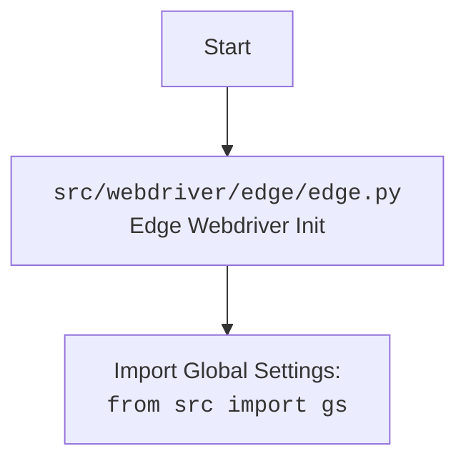

# Проект `hypotez`
# Роль `code explainer`
## АНАЛИЗ: `hypotez/src/webdriver/edge/edge.py`

### 1. <алгоритм>

1.  **Инициализация Edge WebDriver**:
    *   При создании экземпляра класса `Edge` происходит инициализация WebDriver Edge с заданными параметрами (user-agent, опции, режим окна).
    *   Считываются настройки из файла `edge.json` с использованием `j_loads_ns`.
    *   Определяется и устанавливается user-agent, либо случайный, либо заданный.
    *   Создается объект `EdgeOptions` и добавляются различные аргументы (user-agent, режим окна, дополнительные опции из параметров и конфигурации, заголовки).

2.  **Настройка профиля**:
    *   Определяется директория профиля на основе настроек из `edge.json` и имени профиля, переданного при инициализации.
    *   Если в директории профиля указана переменная `%LOCALAPPDATA%`, она заменяется на значение переменной окружения.

3.  **Запуск WebDriver**:
    *   Создается экземпляр `EdgeService` с указанием пути к исполняемому файлу edgedriver.
    *   Вызывается конструктор родительского класса `WebDriver` с передачей объекта опций и сервиса.
    *   Вызывается метод `_payload` для добавления дополнительных функций WebDriver.
    *   Обрабатываются исключения, которые могут возникнуть при запуске WebDriver.

4.  **Метод `_payload`**:
    *   Создается экземпляр класса `JavaScript` и связывается с текущим экземпляром WebDriver.
    *   Добавляются методы из `JavaScript` (например, `get_page_lang`, `ready_state`) в текущий экземпляр WebDriver.
    *   Создается экземпляр класса `ExecuteLocator` и связывается с текущим экземпляром WebDriver.
    *   Добавляются методы из `ExecuteLocator` (например, `execute_locator`, `get_webelement_as_screenshot`) в текущий экземпляр WebDriver.

5.  **Метод `set_options`**:
    *   Создает и конфигурирует параметры запуска для Edge WebDriver.
    *   Добавляет указанные параметры в Edge WebDriver.

6.  **Пример использования**:
    *   В блоке `if __name__ == "__main__":` создается экземпляр класса `Edge` с режимом окна "full_window".
    *   Выполняется переход на сайт "https://www.example.com".

### 2. <mermaid>

```mermaid
flowchart TD
    A[Начало: `Edge.__init__`] --> B{Определение user_agent}
    B -- Нет user_agent --> C[Создание случайного user_agent: `UserAgent().random`]
    B -- Есть user_agent --> D[Использование предоставленного user_agent]
    C --> E[Чтение настроек из `edge.json`: `j_loads_ns`]
    D --> E
    E --> F[Создание объекта `EdgeOptions`]
    F --> G{Определение режима окна}
    G -- Из конфига --> H[Установка режима окна из конфига]
    G -- Из параметров --> I[Установка режима окна из параметров]
    H --> J[Добавление аргументов из конфигурации и параметров в `EdgeOptions`]
    I --> J
    J --> K{Настройка директории профиля}
    K -- Определено --> L[Настройка директории профиля]
    L --> M[Добавление аргумента директории профиля в `EdgeOptions`]
    M --> N[Создание `EdgeService` с путем к исполняемому файлу]
    N --> O[Вызов конструктора `WebDriver` с опциями и сервисом]
    O --> P[Вызов `_payload` для добавления функций WebDriver]
    P --> Q[Конец: Инициализация завершена]
```



### 3. <объяснение>

#### Импорты:

*   `os`: Предоставляет функции для взаимодействия с операционной системой, например, для работы с переменными окружения.
*   `pathlib.Path`: Представляет пути к файлам и директориям, упрощает работу с файловой системой.
*   `typing.Optional, typing.List`: Используются для аннотации типов, указывают, что переменная может быть `None` или иметь указанный тип, а также для списков.
*   `selenium.webdriver.Edge as WebDriver`: Импортирует класс `Edge` из библиотеки `selenium`, который используется для управления браузером Edge. Переименовывается в `WebDriver` для удобства.
*   `selenium.webdriver.edge.service.Service as EdgeService`: Импортирует класс `Service`, который используется для управления сервисом Edge WebDriver.
*   `selenium.webdriver.edge.options.Options as EdgeOptions`: Импортирует класс `Options`, который используется для настройки параметров запуска Edge WebDriver.
*   `selenium.common.exceptions.WebDriverException`: Импортирует класс исключения, которое возникает при ошибках в работе WebDriver.
*   `src.webdriver.executor.ExecuteLocator`: Импортирует класс `ExecuteLocator` из модуля `executor`, который, вероятно, содержит методы для выполнения поиска элементов на странице.
*   `src.webdriver.js.JavaScript`: Импортирует класс `JavaScript` из модуля `js`, который, вероятно, содержит методы для выполнения JavaScript кода в браузере.
*   `fake_useragent.UserAgent`: Импортирует класс `UserAgent` из библиотеки `fake-useragent`, который используется для генерации случайных user-agent строк.
*   `src import gs`: Импортирует глобальные настройки проекта.
*   `src.logger.logger import logger`: Импортирует логгер для записи информации о работе скрипта.
*   `src.utils.jjson.j_loads_ns`: Импортирует функцию `j_loads_ns` из модуля `jjson`, которая, вероятно, используется для загрузки JSON файлов с поддержкой namespace.

#### Класс `Edge`:

*   **Назначение**: Представляет собой класс для управления браузером Edge с дополнительными настройками и функциями.
*   **Атрибуты**:
    *   `driver_name (str)`: Имя драйвера, по умолчанию `'edge'`.
    *   `user_agent (str)`: User-agent, используемый для браузера.
*   **Методы**:
    *   `__init__(self, user_agent: Optional[str] = None, options: Optional[List[str]] = None, window_mode: Optional[str] = None, *args, **kwargs) -> None`: Конструктор класса, инициализирует WebDriver с заданными параметрами.
    *   `_payload(self) -> None`: Загружает дополнительные функции для работы с локаторами и JavaScript.
    *   `set_options(self, opts: Optional[List[str]] = None) -> EdgeOptions`: Создает и настраивает параметры запуска для Edge WebDriver.

#### Функции:

*   `__init__`:
    *   **Аргументы**:
        *   `user_agent (Optional[str])`: User-agent для браузера. Если не указан, генерируется случайный.
        *   `options (Optional[List[str]])`: Список опций для Edge WebDriver.
        *   `window_mode (Optional[str])`: Режим окна браузера (`windowless`, `kiosk`, `full_window` и т.д.).
    *   **Возвращаемое значение**: `None`.
    *   **Назначение**: Инициализирует экземпляр класса `Edge`, настраивает параметры запуска браузера, устанавливает user-agent, опции и режим окна.
*   `_payload`:
    *   **Аргументы**: `None`.
    *   **Возвращаемое значение**: `None`.
    *   **Назначение**: Добавляет методы для работы с локаторами и JavaScript в экземпляр класса `Edge`.
*   `set_options`:
    *   **Аргументы**:
        *   `opts (Optional[List[str]])`: Список опций для добавления в Edge WebDriver.
    *   **Возвращаемое значение**: `EdgeOptions`.
    *   **Назначение**: Создает и конфигурирует параметры запуска для Edge WebDriver.

#### Переменные:

*   `self.user_agent (str)`: User-agent, используемый для браузера.
*   `settings (Namespace)`: Объект, содержащий настройки из файла `edge.json`.
*   `options_obj (EdgeOptions)`: Объект, содержащий опции для запуска Edge WebDriver.
*   `profile_directory (str)`: Директория профиля пользователя для Edge WebDriver.
*   `edgedriver_path (str)`: Путь к исполняемому файлу edgedriver.
*   `service (EdgeService)`: Объект, представляющий сервис Edge WebDriver.

#### Потенциальные ошибки и области для улучшения:

*   Обработка исключений при запуске WebDriver может быть улучшена, чтобы предоставлять более подробную информацию об ошибке.
*   Можно добавить возможность настройки других параметров запуска Edge WebDriver, таких как прокси-сервер, расширения и т.д.
*   В методе `_payload` можно вынести создание экземпляров классов `JavaScript` и `ExecuteLocator` в конструктор класса `Edge`, чтобы избежать повторного создания этих объектов при каждом вызове метода `_payload`.

#### Взаимосвязи с другими частями проекта:

*   Класс `Edge` использует классы `JavaScript` и `ExecuteLocator` из других модулей проекта для добавления дополнительных функций WebDriver.
*   Класс `Edge` использует глобальные настройки из модуля `src import gs`.
*   Класс `Edge` использует логгер из модуля `src.logger.logger` для записи информации о работе скрипта.
*   Класс `Edge` использует функцию `j_loads_ns` из модуля `src.utils.jjson` для загрузки JSON файлов с поддержкой namespace.