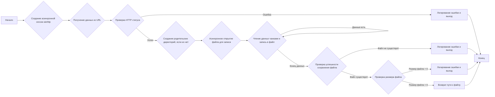
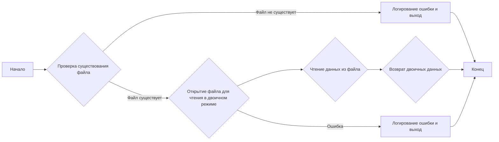

# Модуль `src.utils.video`

## Обзор

Модуль `src.utils.video` предоставляет асинхронные функции для загрузки и сохранения видеофайлов, а также для получения видеоданных. Он включает обработку ошибок и логирование для обеспечения надежной работы.

## Подробней

Этот модуль предоставляет функции для асинхронной загрузки и сохранения видеофайлов, а также для получения видеоданных. Он обрабатывает потенциальные сетевые проблемы и ошибки сохранения файлов, обеспечивая надежную работу. Модуль использует библиотеки `aiohttp` для асинхронных HTTP-запросов и `aiofiles` для асинхронной работы с файлами. Логирование осуществляется через модуль `src.logger.logger`.

## Функции

### `save_video_from_url`

```python
async def save_video_from_url(
    url: str,
    save_path: str
) -> Optional[Path]:
    """Download a video from a URL and save it locally asynchronously.

    Args:
        url (str): The URL from which to download the video.
        save_path (str): The path to save the downloaded video.

    Returns:
        Optional[Path]: The path to the saved file, or `None` if the operation failed.  Returns None on errors and if file is 0 bytes.

    Raises:
        aiohttp.ClientError: on network issues during the download.
    """
    ...
```

**Описание**: Загружает видео из URL и сохраняет его локально асинхронно.

**Параметры**:
- `url` (str): URL-адрес, из которого нужно загрузить видео.
- `save_path` (str): Путь для сохранения загруженного видео.

**Возвращает**:
- `Optional[Path]`: Путь к сохраненному файлу или `None`, если операция не удалась. Возвращает `None` при ошибках и если размер файла равен 0 байт.

**Вызывает исключения**:
- `aiohttp.ClientError`: При сетевых проблемах во время загрузки.

**Как работает функция**:



**Примеры**:

```python
import asyncio
async def main():
    url = "https://example.com/video.mp4"  # Замените на действительный URL
    save_path = "local_video.mp4"
    result = await save_video_from_url(url, save_path)
    if result:
        print(f"Видео сохранено в {result}")
    else:
        print("Не удалось сохранить видео")

asyncio.run(main())
```

### `get_video_data`

```python
def get_video_data(file_name: str) -> Optional[bytes]:
    """Retrieve binary data of a video file if it exists.

    Args:
        file_name (str): The path to the video file to read.

    Returns:
        Optional[bytes]: The binary data of the file if it exists, or `None` if the file is not found or an error occurred.
    """
    ...
```

**Описание**: Извлекает двоичные данные видеофайла, если он существует.

**Параметры**:
- `file_name` (str): Путь к видеофайлу для чтения.

**Возвращает**:
- `Optional[bytes]`: Двоичные данные файла, если он существует, или `None`, если файл не найден или произошла ошибка.

**Как работает функция**:



**Примеры**:

```python
data = get_video_data("local_video.mp4")
if data:
    print(data[:10])  # Вывод первых 10 байт для проверки