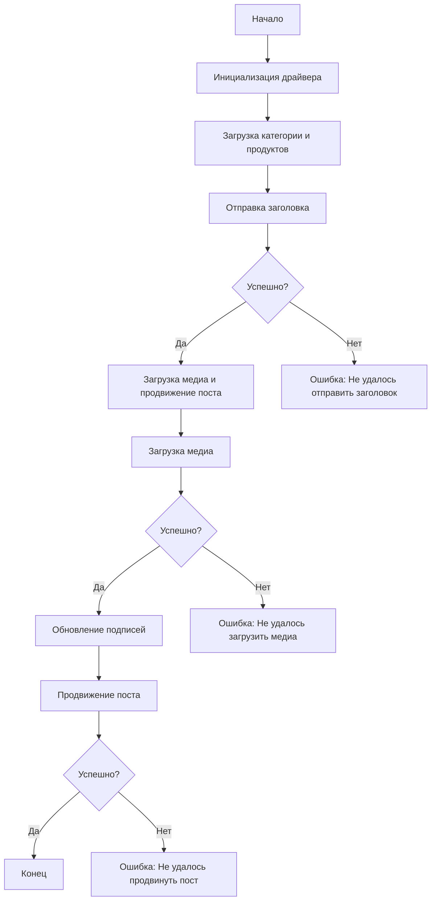

# Модуль: src.endpoints.advertisement.facebook.post_message_async

## Обзор

Этот модуль, расположенный в `hypotez/src/endpoints/advertisement/facebook/scenarios`, предназначен для автоматизации процесса публикации сообщений в Facebook. Он взаимодействует со страницей Facebook, используя локаторы для выполнения различных действий, таких как отправка сообщений, загрузка медиафайлов и обновление подписей.

## Подробнее

Модуль автоматизирует процесс продвижения постов в Facebook, включая отправку заголовка и описания, загрузку медиафайлов (изображений и видео) и обновление подписей к изображениям. Это позволяет автоматизировать маркетинговые кампании и поддерживать активность на странице Facebook. Скрипт использует асинхронные функции для обеспечения эффективной работы с веб-страницей.

## Структура модуля



## Легенда

1.  **Начало**: Начало выполнения скрипта.
2.  **Инициализация драйвера**: Создание экземпляра класса `Driver`.
3.  **Загрузка категории и продуктов**: Загрузка данных о категории и продуктах.
4.  **Отправка заголовка**: Вызов функции `post_title` для отправки заголовка.
5.  **Проверка успеха отправки заголовка**: Проверка, был ли успешно отправлен заголовок.
    *   **Да**: Переход к загрузке медиа и продвижению поста.
    *   **Нет**: Вывод ошибки "Не удалось отправить заголовок".
6.  **Загрузка медиа и продвижение поста**: Вызов функции `promote_post`.
7.  **Загрузка медиа**: Вызов функции `upload_media` для загрузки медиафайлов.
8.  **Проверка успеха загрузки медиа**: Проверка, были ли успешно загружены медиафайлы.
    *   **Да**: Переход к обновлению подписей изображений.
    *   **Нет**: Вывод ошибки "Не удалось загрузить медиа".
9.  **Обновление подписей**: Вызов функции `update_images_captions` для обновления подписей.
10. **Продвижение поста**: Завершение процесса продвижения поста.
11. **Проверка успеха продвижения**: Проверка, был ли успешно продвинут пост.
    *   **Да**: Завершение выполнения скрипта.
    *   **Нет**: Вывод ошибки "Не удалось продвинуть пост".

## Функции

### `post_title`

```python
def post_title(d: Driver, category: SimpleNamespace) -> bool:
    """
    Отправляет заголовок и описание кампании в поле сообщения Facebook.

    Args:
        d (Driver): Экземпляр `Driver`, используемый для взаимодействия с веб-страницей.
        category (SimpleNamespace): Категория, содержащая заголовок и описание для отправки.

    Returns:
        bool: `True`, если заголовок и описание были успешно отправлены, иначе `None`.
    """
```

**Как работает функция**:
Функция `post_title` отправляет заголовок и описание кампании в поле сообщения Facebook. Она использует предоставленный экземпляр `Driver` для взаимодействия с веб-страницей и `category`, содержащую заголовок и описание, которые необходимо отправить.

**Параметры**:
*   `d` (Driver): Экземпляр `Driver`, используемый для взаимодействия с веб-страницей.
*   `category` (SimpleNamespace): Категория, содержащая заголовок и описание для отправки.

**Возвращает**:
*   `bool`: `True`, если заголовок и описание были успешно отправлены, иначе `None`.

### `upload_media`

```python
def upload_media(d: Driver, products: List[SimpleNamespace], no_video: bool = False) -> bool:
    """
    Загружает медиафайлы в пост Facebook и обновляет их подписи.

    Args:
        d (Driver): Экземпляр `Driver`, используемый для взаимодействия с веб-страницей.
        products (List[SimpleNamespace]): Список продуктов, содержащих пути к медиафайлам.
        no_video (bool, optional): Флаг, указывающий, следует ли пропускать загрузку видео. По умолчанию `False`.

    Returns:
        bool: `True`, если медиафайлы были успешно загружены, иначе `None`.
    """
```

**Как работает функция**:
Функция `upload_media` загружает медиафайлы (изображения и видео) в пост Facebook. Она использует предоставленный экземпляр `Driver` для взаимодействия с веб-страницей и список `products`, содержащий пути к медиафайлам. Параметр `no_video` позволяет пропустить загрузку видео.

**Параметры**:
*   `d` (Driver): Экземпляр `Driver`, используемый для взаимодействия с веб-страницей.
*   `products` (List[SimpleNamespace]): Список продуктов, содержащих пути к медиафайлам.
*   `no_video` (bool, optional): Флаг, указывающий, следует ли пропускать загрузку видео. По умолчанию `False`.

**Возвращает**:
*   `bool`: `True`, если медиафайлы были успешно загружены, иначе `None`.

### `update_images_captions`

```python
def update_images_captions(d: Driver, products: List[SimpleNamespace], textarea_list: List[WebElement]) -> None:
    """
    Асинхронно добавляет описания к загруженным медиафайлам.

    Args:
        d (Driver): Экземпляр `Driver`, используемый для взаимодействия с веб-страницей.
        products (List[SimpleNamespace]): Список продуктов с деталями для обновления.
        textarea_list (List[WebElement]): Список текстовых областей, куда добавляются подписи.
    """
```

**Как работает функция**:
Функция `update_images_captions` асинхронно добавляет описания к загруженным медиафайлам. Она использует предоставленный экземпляр `Driver` для взаимодействия с веб-страницей, список `products` с деталями для обновления и список `textarea_list`, содержащий текстовые области, в которые добавляются подписи.

**Параметры**:
*   `d` (Driver): Экземпляр `Driver`, используемый для взаимодействия с веб-страницей.
*   `products` (List[SimpleNamespace]): Список продуктов с деталями для обновления.
*   `textarea_list` (List[WebElement]): Список текстовых областей, куда добавляются подписи.

### `promote_post`

```python
def promote_post(d: Driver, category: SimpleNamespace, products: List[SimpleNamespace], no_video: bool = False) -> bool:
    """
    Управляет процессом продвижения поста с заголовком, описанием и медиафайлами.

    Args:
        d (Driver): Экземпляр `Driver`, используемый для взаимодействия с веб-страницей.
        category (SimpleNamespace): Детали категории, используемые для заголовка и описания поста.
        products (List[SimpleNamespace]): Список продуктов, содержащих медиа и детали для публикации.
        no_video (bool, optional): Флаг, указывающий, следует ли пропускать загрузку видео. По умолчанию `False`.

    Returns:
        bool: `True`, если пост был успешно продвинут, иначе `None`.
    """
```

**Как работает функция**:
Функция `promote_post` управляет процессом продвижения поста в Facebook, включая отправку заголовка и описания, загрузку медиафайлов и обновление подписей. Она использует предоставленный экземпляр `Driver` для взаимодействия с веб-страницей, `category` для заголовка и описания поста, список `products` с медиа и деталями для публикации. Параметр `no_video` позволяет пропустить загрузку видео.

**Параметры**:
*   `d` (Driver): Экземпляр `Driver`, используемый для взаимодействия с веб-страницей.
*   `category` (SimpleNamespace): Детали категории, используемые для заголовка и описания поста.
*   `products` (List[SimpleNamespace]): Список продуктов, содержащих медиа и детали для публикации.
*   `no_video` (bool, optional): Флаг, указывающий, следует ли пропускать загрузку видео. По умолчанию `False`.

**Возвращает**:
*   `bool`: `True`, если пост был успешно продвинут, иначе `None`.

## Использование

Для использования этого скрипта выполните следующие шаги:

1.  **Инициализация драйвера**: Создайте экземпляр класса `Driver`.
2.  **Загрузка локаторов**: Загрузите локаторы из JSON-файла.
3.  **Вызов функций**: Используйте предоставленные функции для отправки заголовка, загрузки медиа и продвижения поста.

## Пример

```python
from src.webdriver.driver import Driver
from types import SimpleNamespace

# Инициализация драйвера
driver = Driver(...)

# Загрузка категории и продуктов
category = SimpleNamespace(title="Заголовок кампании", description="Описание кампании")
products = [SimpleNamespace(local_image_path='путь/к/изображению.jpg', ...)]

# Отправка заголовка
post_title(driver, category)

# Загрузка медиа и продвижение поста
await promote_post(driver, category, products)
```

## Зависимости

*   `selenium`: Для автоматизации веб-интерфейса.
*   `asyncio`: Для асинхронных операций.
*   `pathlib`: Для работы с путями к файлам.
*   `types`: Для создания простых пространств имен.
*   `typing`: Для аннотаций типов.

## Обработка ошибок

Скрипт включает надежную обработку ошибок, чтобы гарантировать продолжение выполнения даже в случае, если определенные элементы не найдены или возникли проблемы с веб-страницей. Это особенно полезно для работы с динамическими или нестабильными веб-страницами.

## Лицензия

Этот скрипт лицензирован в соответствии с лицензией MIT. Дополнительные сведения см. в файле `LICENSE`.