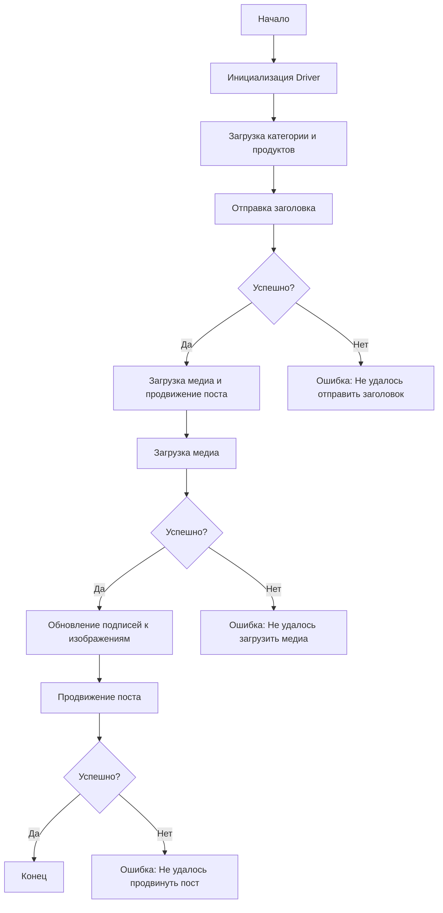

# Сценарий асинхронной публикации сообщения на Facebook

## Обзор

Этот скрипт, расположенный в директории `hypotez/src/endpoints/advertisement/facebook/scenarios`, предназначен для автоматизации процесса публикации сообщений на Facebook. Он взаимодействует со страницей Facebook, используя локаторы для выполнения различных действий, таких как отправка сообщений, загрузка медиафайлов и обновление подписей.

## Подробней

Этот скрипт автоматизирует процесс публикации рекламных постов на Facebook, начиная с отправки заголовка и описания кампании, загрузки медиафайлов (изображений и видео) и заканчивая обновлением подписей и продвижением поста. Он использует асинхронные функции для повышения эффективности и включает обработку ошибок для обеспечения стабильности работы.

## Структура модуля

### Диаграмма Mermaid



### Легенда к диаграмме

1.  **Start**: Начало выполнения скрипта.
2.  **InitDriver**: Создание экземпляра класса `Driver`.
3.  **LoadCategoryAndProducts**: Загрузка данных категории и продуктов.
4.  **SendTitle**: Вызов функции `post_title` для отправки заголовка.
5.  **CheckTitleSuccess**: Проверка успешности отправки заголовка.

    *   **Да**: Переход к загрузке медиа и продвижению поста.
    *   **Нет**: Вывод ошибки "Не удалось отправить заголовок".
6.  **UploadMediaAndPromotePost**: Вызов функции `promote_post`.
7.  **UploadMedia**: Вызов функции `upload_media` для загрузки медиафайлов.
8.  **CheckMediaSuccess**: Проверка успешности загрузки медиа.

    *   **Да**: Переход к обновлению подписей к изображениям.
    *   **Нет**: Вывод ошибки "Не удалось загрузить медиа".
9.  **UpdateCaptions**: Вызов функции `update_images_captions` для обновления подписей.
10. **PromotePost**: Завершение процесса продвижения поста.
11. **CheckPromoteSuccess**: Проверка успешности продвижения поста.

    *   **Да**: Конец выполнения скрипта.
    *   **Нет**: Вывод ошибки "Не удалось продвинуть пост".

## Функции

### `post_title`

```python
def post_title(d: Driver, category: SimpleNamespace) -> bool:
    """
    Отправляет заголовок и описание кампании в поле сообщения на Facebook.

    Args:
        d (Driver): Экземпляр `Driver` для взаимодействия с веб-страницей.
        category (SimpleNamespace): Категория, содержащая заголовок и описание для отправки.

    Returns:
        bool: `True`, если заголовок и описание были успешно отправлены, иначе `None`.

    """
```

**Как работает функция**:

Функция `post_title` принимает экземпляр `Driver` и объект `category`, содержащий заголовок и описание кампании. Она использует методы объекта `Driver` для заполнения соответствующих полей на странице Facebook.

**Параметры**:

*   `d` (Driver): Экземпляр класса `Driver`, используемый для управления браузером и взаимодействия с веб-страницей Facebook.
*   `category` (SimpleNamespace): Объект, содержащий атрибуты `title` (заголовок кампании) и `description` (описание кампании), которые будут отправлены на Facebook.

**Возвращает**:

*   `bool`: `True`, если заголовок и описание были успешно отправлены, иначе `None`.

**Примеры**:

```python
from src.webdriver.driver import Driver
from types import SimpleNamespace

# Инициализация Driver
driver = Driver(...)

# Создание объекта category с заголовком и описанием
category = SimpleNamespace(title="Заголовок кампании", description="Описание кампании")

# Отправка заголовка и описания
result = post_title(driver, category)
print(f"Заголовок отправлен успешно: {result}")
```

### `upload_media`

```python
def upload_media(d: Driver, products: List[SimpleNamespace], no_video: bool = False) -> bool:
    """
    Загружает медиафайлы на пост Facebook и обновляет их подписи.

    Args:
        d (Driver): Экземпляр `Driver` для взаимодействия с веб-страницей.
        products (List[SimpleNamespace]): Список продуктов, содержащих пути к медиафайлам.
        no_video (bool, optional): Флаг, указывающий, следует ли пропустить загрузку видео. По умолчанию `False`.

    Returns:
        bool: `True`, если медиафайлы были успешно загружены, иначе `None`.

    """
```

**Как работает функция**:

Функция `upload_media` загружает медиафайлы (изображения и видео) на пост Facebook. Она принимает экземпляр `Driver`, список объектов `products` (содержащих пути к медиафайлам) и флаг `no_video`, указывающий, следует ли пропускать загрузку видео. Функция использует методы объекта `Driver` для загрузки файлов и проверки успешности загрузки.

**Параметры**:

*   `d` (Driver): Экземпляр класса `Driver`, используемый для управления браузером и взаимодействия с веб-страницей Facebook.
*   `products` (List[SimpleNamespace]): Список объектов, каждый из которых содержит информацию о продукте, включая пути к медиафайлам (например, `local_image_path`, `local_video_path`).
*   `no_video` (bool, optional): Флаг, указывающий, нужно ли пропускать загрузку видео. По умолчанию `False`.

**Возвращает**:

*   `bool`: `True`, если медиафайлы были успешно загружены, иначе `None`.

**Примеры**:

```python
from src.webdriver.driver import Driver
from types import SimpleNamespace

# Инициализация Driver
driver = Driver(...)

# Создание списка продуктов с путями к изображениям
products = [
    SimpleNamespace(local_image_path='путь/к/изображению1.jpg'),
    SimpleNamespace(local_image_path='путь/к/изображению2.jpg')
]

# Загрузка медиафайлов
result = upload_media(driver, products)
print(f"Медиафайлы загружены успешно: {result}")

# Загрузка только изображений (без видео)
result_no_video = upload_media(driver, products, no_video=True)
print(f"Изображения загружены успешно (без видео): {result_no_video}")
```

### `update_images_captions`

```python
def update_images_captions(d: Driver, products: List[SimpleNamespace], textarea_list: List[WebElement]) -> None:
    """
    Асинхронно добавляет описания к загруженным медиафайлам.

    Args:
        d (Driver): Экземпляр `Driver` для взаимодействия с веб-страницей.
        products (List[SimpleNamespace]): Список продуктов с деталями для обновления.
        textarea_list (List[WebElement]): Список текстовых полей, куда добавляются подписи.

    """
```

**Как работает функция**:

Функция `update_images_captions` добавляет описания к загруженным медиафайлам на Facebook. Она принимает экземпляр `Driver`, список объектов `products` (содержащих описания для каждого медиафайла) и список элементов `textarea_list`, представляющих текстовые поля для ввода описаний.

**Параметры**:

*   `d` (Driver): Экземпляр класса `Driver`, используемый для управления браузером и взаимодействия с веб-страницей Facebook.
*   `products` (List[SimpleNamespace]): Список объектов, каждый из которых содержит информацию о продукте, включая описание для медиафайла (например, `image_description`).
*   `textarea_list` (List[WebElement]): Список веб-элементов (текстовых полей), в которые будут добавлены описания.

**Примеры**:

```python
from src.webdriver.driver import Driver
from selenium.webdriver.remote.webelement import WebElement
from types import SimpleNamespace

# Инициализация Driver
driver = Driver(...)

# Создание списка продуктов с описаниями
products = [
    SimpleNamespace(image_description='Описание для изображения 1'),
    SimpleNamespace(image_description='Описание для изображения 2')
]

# Получение списка текстовых полей (пример, нужно заменить на реальный код получения списка)
textarea_list = [WebElement(...), WebElement(...)]

# Обновление подписей к изображениям
update_images_captions(driver, products, textarea_list)
print("Подписи к изображениям обновлены успешно")
```

### `promote_post`

```python
def promote_post(d: Driver, category: SimpleNamespace, products: List[SimpleNamespace], no_video: bool = False) -> bool:
    """
    Управляет процессом продвижения поста с заголовком, описанием и медиафайлами.

    Args:
        d (Driver): Экземпляр `Driver` для взаимодействия с веб-страницей.
        category (SimpleNamespace): Детали категории, используемые для заголовка и описания поста.
        products (List[SimpleNamespace]): Список продуктов, содержащих медиа и детали для публикации.
        no_video (bool, optional): Флаг, указывающий, следует ли пропустить загрузку видео. По умолчанию `False`.

    Returns:
        bool: `True`, если пост был успешно продвинут, иначе `None`.

    """
```

**Как работает функция**:

Функция `promote_post` управляет всем процессом продвижения поста на Facebook, включая отправку заголовка и описания, загрузку медиафайлов и обновление подписей. Она принимает экземпляр `Driver`, объект `category` (содержащий заголовок и описание), список объектов `products` (содержащих медиафайлы и детали) и флаг `no_video`.

**Параметры**:

*   `d` (Driver): Экземпляр класса `Driver`, используемый для управления браузером и взаимодействия с веб-страницей Facebook.
*   `category` (SimpleNamespace): Объект, содержащий информацию о категории поста, включая заголовок и описание.
*   `products` (List[SimpleNamespace]): Список объектов, каждый из которых содержит информацию о продукте, включая пути к медиафайлам и описания.
*   `no_video` (bool, optional): Флаг, указывающий, нужно ли пропускать загрузку видео. По умолчанию `False`.

**Возвращает**:

*   `bool`: `True`, если пост был успешно продвинут, иначе `None`.

**Примеры**:

```python
from src.webdriver.driver import Driver
from types import SimpleNamespace

# Инициализация Driver
driver = Driver(...)

# Создание объекта category с заголовком и описанием
category = SimpleNamespace(title="Заголовок кампании", description="Описание кампании")

# Создание списка продуктов с путями к изображениям и описаниями
products = [
    SimpleNamespace(local_image_path='путь/к/изображению1.jpg', image_description='Описание для изображения 1'),
    SimpleNamespace(local_image_path='путь/к/изображению2.jpg', image_description='Описание для изображения 2')
]

# Продвижение поста
result = promote_post(driver, category, products)
print(f"Пост продвинут успешно: {result}")

# Продвижение поста только с изображениями (без видео)
result_no_video = promote_post(driver, category, products, no_video=True)
print(f"Пост продвинут успешно (без видео): {result_no_video}")
```

## Использование

Для использования этого скрипта выполните следующие шаги:

1.  **Инициализация Driver**: Создайте экземпляр класса `Driver`.
2.  **Загрузка локаторов**: Загрузите локаторы из JSON-файла.
3.  **Вызов функций**: Используйте предоставленные функции для отправки заголовка, загрузки медиа и продвижения поста.

## Зависимости

*   `selenium`: Для веб-автоматизации.
*   `asyncio`: Для асинхронных операций.
*   `pathlib`: Для обработки путей к файлам.
*   `types`: Для создания простых пространств имен.
*   `typing`: Для аннотаций типов.

## Обработка ошибок

Скрипт включает надежную обработку ошибок, чтобы обеспечить продолжение выполнения даже в случае, если некоторые элементы не найдены или если возникли проблемы с веб-страницей. Это особенно полезно для обработки динамических или нестабильных веб-страниц.

## Вклад

Вклад в этот скрипт приветствуется. Пожалуйста, убедитесь, что любые изменения хорошо документированы и включают соответствующие тесты.

## Лицензия

Этот скрипт лицензирован под MIT License. Подробности смотрите в файле `LICENSE`.