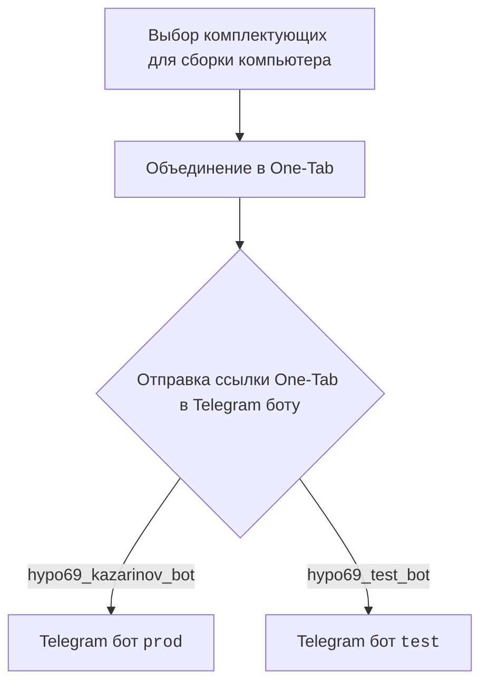
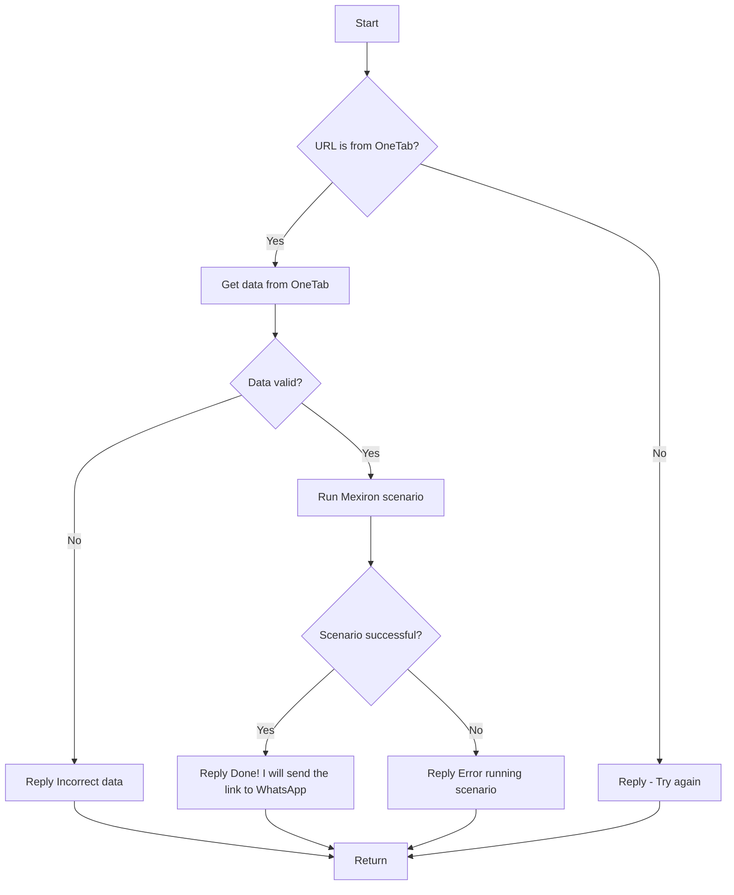

# Документация модуля `src.endpoints.kazarinov`

## Обзор

Документация описывает функциональность `Kazarinov. PDF Mexiron Creator`, включая взаимодействие с Telegram ботами `prod` и `test`, а также логику обработки данных, полученных из One-Tab.
В данном модуле описывается логика работы телеграм бота, который принимает ссылки One-Tab, извлекает данные, выполняет сценарии и отправляет результаты в WhatsApp.

## Содержание

- [Обзор](#Обзор)
- [Подробней](#Подробней)
- [Схема работы](#Схема-работы)
    - [Client side (Kazarinov)](#client-side-kazarinov)
    - [Code side](#code-side)
- [Next](#Next)

## Подробней

Модуль `src.endpoints.kazarinov` предназначен для обработки данных, полученных от Telegram ботов (`prod` и `test`), и выполнения определенных сценариев. Основная цель - автоматизация процесса, начиная от получения ссылки One-Tab до отправки результатов в WhatsApp.

## Схема работы

### Client side (Kazarinov)

Схема описывает клиентскую сторону взаимодействия, где пользователь выбирает комплектующие для сборки компьютера, объединяет их в One-Tab и отправляет ссылку в Telegram боту.

### Code side

Схема описывает логику обработки данных на стороне кода, начиная от проверки URL до выполнения сценария и отправки результатов.

## Next

- [Kazarinov bot](https://github.com/hypo69/hypo/blob/master/src/endpoints/kazarinov/kazarinov_bot.md)
- [Scenario Execution](https://github.com/hypo69/hypo/blob/master/src/endpoints/kazarinov/scenarios/README.MD)