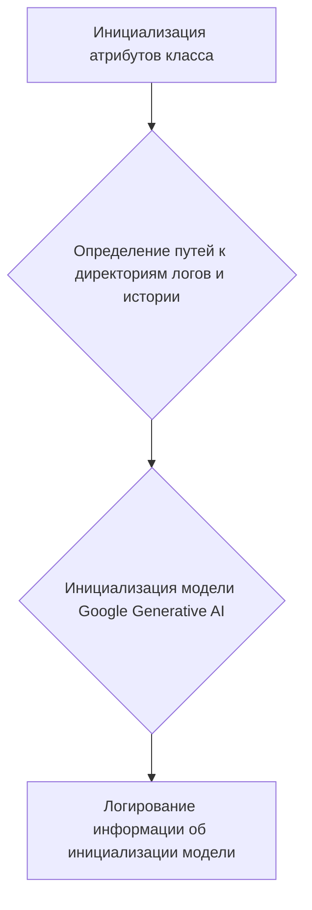
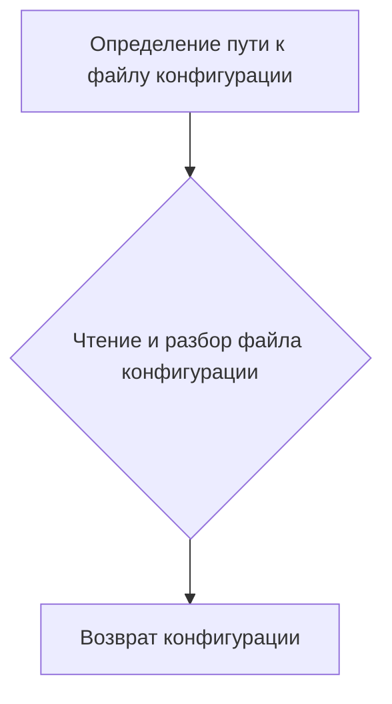
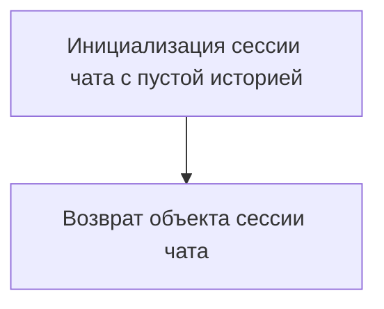
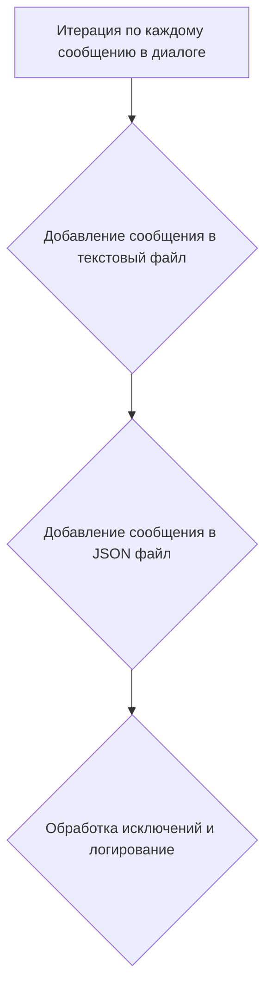
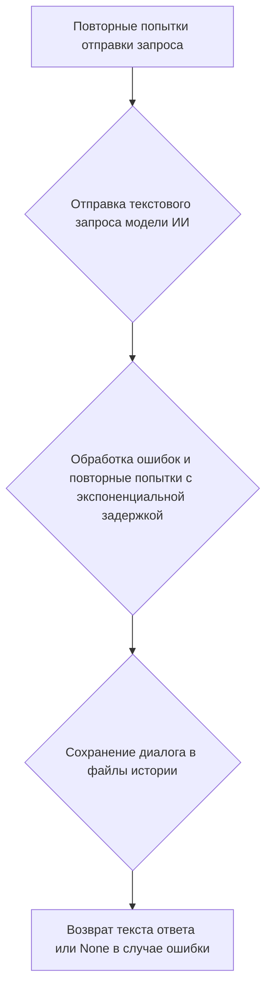
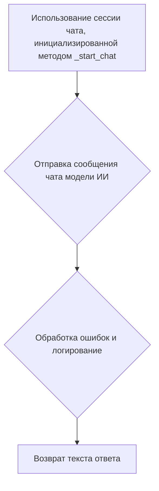
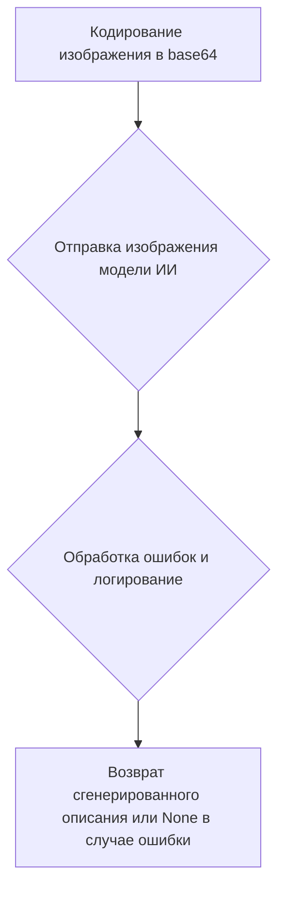
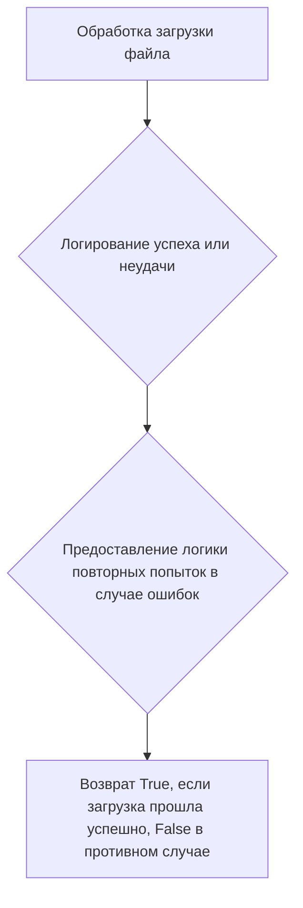

# Модуль интеграции Google Generative AI

## Обзор

Класс `GoogleGenerativeAI` предназначен для взаимодействия с моделями Google Generative AI. Этот класс предоставляет методы для отправки запросов, обработки ответов, управления диалогами и интеграции с различными функциональностями ИИ. Он включает в себя надежную обработку ошибок, ведение журнала и настройки конфигурации для обеспечения беспрепятственной работы.

## Подробнее

Более подробное описание. Объясни как и зачем используется данный код в проекте.
Анализируй предоставленный тебе ранее код
Модуль `src.ai.gemini` предоставляет класс `GoogleGenerativeAI`, который позволяет взаимодействовать с моделями Google Generative AI. Это обеспечивает интеграцию с различными функциональностями ИИ, включая отправку запросов, обработку ответов, управление диалогами и многое другое. Класс предоставляет надежную обработку ошибок, ведение журнала и настройки конфигурации для обеспечения бесперебойной работы.

## Классы

### `GoogleGenerativeAI`

**Описание**: Класс для взаимодействия с моделями Google Generative AI.

**Принцип работы**:
Класс инициализируется с ключом API, именем модели, конфигурацией генерации и системной инструкцией. Он предоставляет методы для отправки запросов, обработки ответов, управления диалогами, загрузки файлов и генерации описаний изображений. Все взаимодействия с моделями ИИ логируются и сохраняются в текстовых и JSON форматах для последующего анализа.

**Атрибуты**:

- `api_key` (str): Ключ API для доступа к Google Generative AI.
- `model_name` (Optional[str]): Имя используемой модели Google Generative AI. По умолчанию `None`.
- `generation_config` (Optional[Dict]): Конфигурация генерации для модели. По умолчанию `None`.
- `system_instruction` (Optional[str]): Системная инструкция для модели. По умолчанию `None`.
- `log_dir` (Path): Путь к директории для хранения логов диалогов.
- `history_dir` (Path): Путь к директории для хранения истории диалогов.
- `model`: Инициализированная модель Google Generative AI.

**Методы**:

- `__init__`: Инициализирует класс `GoogleGenerativeAI` с необходимыми конфигурациями.
- `config`: Получает конфигурацию из файла настроек.
- `_start_chat`: Запускает сессию чата с моделью ИИ.
- `_save_dialogue`: Сохраняет диалог в текстовые и JSON файлы.
- `ask`: Отправляет текстовый запрос модели ИИ и получает ответ.
- `chat`: Отправляет сообщение чата модели ИИ и получает ответ.
- `describe_image`: Генерирует текстовое описание изображения.
- `upload_file`: Загружает файл в модель ИИ.

## Функции

### `__init__`

```python
def __init__(self, api_key: str, model_name: Optional[str] = None, generation_config: Optional[Dict] = None, system_instruction: Optional[str] = None, **kwargs)
```

**Назначение**: Инициализирует класс `GoogleGenerativeAI` с необходимыми конфигурациями.

**Параметры**:

- `api_key` (str): Ключ API для доступа к Google Generative AI.
- `model_name` (Optional[str]): Имя используемой модели Google Generative AI. По умолчанию `None`.
- `generation_config` (Optional[Dict]): Конфигурация генерации для модели. По умолчанию `None`.
- `system_instruction` (Optional[str]): Системная инструкция для модели. По умолчанию `None`.
- `**kwargs`: Дополнительные аргументы.

**Возвращает**:
- `None`

**Как работает функция**:

1. **Инициализация атрибутов**: Функция инициализирует атрибуты класса, такие как ключ API (`api_key`), имя модели (`model_name`), конфигурацию генерации (`generation_config`), системную инструкцию (`system_instruction`), директории для хранения логов и истории диалогов (`log_dir`, `history_dir`).
2. **Настройка путей**: Определяет пути для ведения журнала диалогов и хранения истории, используя `gs.path.root` и другие параметры конфигурации.
3. **Инициализация модели**: Инициализирует модель Google Generative AI, используя предоставленные параметры.
4. **Логирование**: Логирует информацию об инициализации модели.



**Примеры**:

```python
ai = GoogleGenerativeAI(api_key="your_api_key", system_instruction="Instruction")
```

### `config`

```python
def config(self)
```

**Назначение**: Получает конфигурацию из файла настроек.

**Параметры**:
- `None`

**Возвращает**:
- `None`

**Как работает функция**:

1. **Определение пути к файлу конфигурации**: Функция определяет путь к файлу конфигурации `gemini.json`, расположенному в директории `src/ai/gemini`.
2. **Чтение и разбор файла конфигурации**: Функция читает и разбирает файл конфигурации, используя `j_loads`.
3. **Возврат конфигурации**: Функция возвращает словарь с данными конфигурации.



**Примеры**:

```python
config_data = ai.config()
print(config_data)
```

### `_start_chat`

```python
def _start_chat(self)
```

**Назначение**: Запускает сессию чата с моделью ИИ.

**Параметры**:
- `None`

**Возвращает**:
- `None`

**Как работает функция**:

1. **Инициализация сессии чата**: Функция инициализирует сессию чата с пустой историей, используя метод `start_chat` модели.
2. **Возврат сессии чата**: Функция возвращает объект сессии чата.



**Примеры**:

```python
chat_session = ai._start_chat()
print(chat_session)
```

### `_save_dialogue`

```python
def _save_dialogue(self, dialogue: list)
```

**Назначение**: Сохраняет диалог в текстовые и JSON файлы.

**Параметры**:

- `dialogue` (list): Список сообщений диалога.

**Возвращает**:
- `None`

**Как работает функция**:

1. **Подготовка данных**: Функция итерируется по каждому сообщению в диалоге.
2. **Сохранение в текстовый файл**: Добавляет каждое сообщение в текстовый файл, используя `file.add_text`.
3. **Сохранение в JSON файл**: Добавляет каждое сообщение в формате JSON в JSON файл, используя `jjson.add`.
4. **Обработка исключений**: В случае возникновения ошибок, логирует их, используя `logger.error`.



**Примеры**:

```python
dialogue = ["Привет!", "Как дела?"]
ai._save_dialogue(dialogue)
```

### `ask`

```python
def ask(self, q: str, attempts: int = 15) -> Optional[str]
```

**Назначение**: Отправляет текстовый запрос модели ИИ и получает ответ.

**Параметры**:

- `q` (str): Текстовый запрос.
- `attempts` (int): Количество попыток в случае ошибок. По умолчанию 15.

**Возвращает**:

- `Optional[str]`: Ответ модели ИИ или `None` в случае ошибки.

**Как работает функция**:

1. **Повторные попытки**: Функция выполняет несколько попыток отправки запроса в случае ошибок сети или недоступности сервиса.
2. **Отправка запроса**: Отправляет текстовый запрос модели ИИ и получает ответ.
3. **Обработка ошибок**: Ведет журнал ошибок и повторяет попытки с экспоненциальной задержкой.
4. **Сохранение диалога**: Сохраняет диалог в файлы истории.
5. **Возврат ответа**: Возвращает текст ответа или `None` в случае ошибки.



**Примеры**:

```python
response = ai.ask("Как дела?")
print(response)
```

### `chat`

```python
def chat(self, q: str) -> str
```

**Назначение**: Отправляет сообщение чата модели ИИ и получает ответ.

**Параметры**:

- `q` (str): Сообщение чата.

**Возвращает**:

- `str`: Ответ модели ИИ.

**Как работает функция**:

1. **Использование сессии чата**: Функция использует сессию чата, инициализированную методом `_start_chat`.
2. **Отправка сообщения**: Отправляет сообщение чата модели ИИ и получает ответ.
3. **Обработка ошибок**: Ведет журнал ошибок.
4. **Возврат ответа**: Возвращает текст ответа.



**Примеры**:

```python
response = ai.chat("Как дела?")
print(response)
```

### `describe_image`

```python
def describe_image(self, image_path: Path) -> Optional[str]
```

**Назначение**: Генерирует текстовое описание изображения.

**Параметры**:

- `image_path` (Path): Путь к изображению.

**Возвращает**:

- `Optional[str]`: Сгенерированное описание или `None` в случае ошибки.

**Как работает функция**:

1. **Кодирование изображения**: Кодирует изображение в base64.
2. **Отправка изображения**: Отправляет изображение модели ИИ.
3. **Обработка ошибок**: Ведет журнал ошибки, если операция не удалась.
4. **Возврат описания**: Возвращает сгенерированное описание или `None` в случае ошибки.



**Примеры**:

```python
image_path = Path("image.jpg")
description = ai.describe_image(image_path)
print(description)
```

### `upload_file`

```python
def upload_file(self, file: str | Path | IOBase, file_name: Optional[str] = None) -> bool
```

**Назначение**: Загружает файл в модель ИИ.

**Параметры**:

- `file` (str | Path | IOBase): Файл для загрузки.
- `file_name` (Optional[str]): Имя файла. По умолчанию `None`.

**Возвращает**:

- `bool`: `True`, если загрузка прошла успешно, `False` в противном случае.

**Как работает функция**:

1. **Загрузка файла**: Обрабатывает загрузку файла.
2. **Логирование**: Ведет журнал успеха или неудачи.
3. **Повторные попытки**: Предоставляет логику повторных попыток в случае ошибок.
4. **Возврат результата**: Возвращает `True`, если загрузка прошла успешно, `False` в противном случае.



**Примеры**:

```python
file_path = "file.txt"
success = ai.upload_file(file_path)
print(success)
```

## Обработка ошибок

Класс включает в себя комплексную обработку ошибок для различных сценариев:

- **Ошибки сети**: Повторяет попытки с экспоненциальной задержкой.
- **Недоступность сервиса**: Ведет журнал ошибок и повторяет попытки.
- **Лимиты квот**: Ведет журнал и ждет перед повторной попыткой.
- **Ошибки аутентификации**: Ведет журнал и прекращает дальнейшие попытки.
- **Неверный ввод**: Ведет журнал и повторяет попытки с таймаутом.
- **Ошибки API**: Ведет журнал и прекращает дальнейшие попытки.

## Ведение журнала и история

Все взаимодействия с моделями ИИ ведутся в журнале, и диалоги сохраняются как в текстовых, так и в JSON форматах для последующего анализа. Это обеспечивает отслеживаемость всех операций и возможность их просмотра для отладки или аудита.

## Зависимости

- `google.generativeai`
- `requests`
- `grpc`
- `google.api_core.exceptions`
- `google.auth.exceptions`
- `src.logger`
- `src.utils.printer`
- `src.utils.file`
- `src.utils.date_time`
- `src.utils.convertors.unicode`
- `src.utils.jjson`

## Пример использования

```python
ai = GoogleGenerativeAI(api_key="your_api_key", system_instruction="Instruction")
response = ai.ask("Как дела?")
print(response)
```

Этот пример инициализирует класс `GoogleGenerativeAI` и отправляет запрос модели ИИ, выводя ответ.

---

Для получения более подробной информации обратитесь к исходному коду и комментариям внутри класса `GoogleGenerativeAI`.