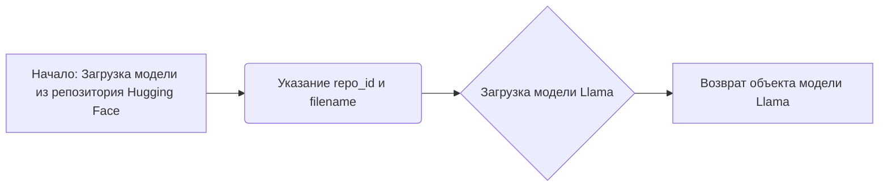
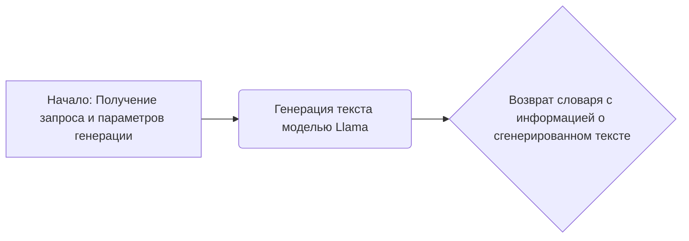

# Модуль для работы с моделью Llama
## Обзор
Модуль предназначен для загрузки и использования модели Meta-Llama-3.1-8B-Instruct-GGUF с помощью библиотеки `llama_cpp`. Он демонстрирует базовый пример генерации текста с использованием загруженной модели.

## Подробней
Этот модуль служит отправной точкой для интеграции больших языковых моделей (LLM) в проект `hypotez`. Он использует модель Llama для генерации текста на основе заданного запроса. Модуль загружает предварительно обученную модель из репозитория Hugging Face и выполняет простой запрос для демонстрации функциональности.

## Классы

### `Llama`

**Описание**: Класс для загрузки и использования языковой модели Llama.

**Принцип работы**:
Класс `Llama` из библиотеки `llama_cpp` используется для загрузки предварительно обученной модели из репозитория Hugging Face. Модель загружается из указанного репозитория с использованием `repo_id` и конкретного файла модели с использованием `filename`. После загрузки модель может быть использована для генерации текста на основе заданных входных данных и параметров.

**Методы**:
- `from_pretrained`: Загружает предварительно обученную модель из репозитория.
- `__call__`: Выполняет запрос к модели для генерации текста.

## Функции

### `Llama.from_pretrained`

```python
llm = Llama.from_pretrained(
	repo_id="lmstudio-community/Meta-Llama-3.1-8B-Instruct-GGUF",
	filename="Meta-Llama-3.1-8B-Instruct-IQ4_XS.gguf",
)
```

**Назначение**: Загружает предварительно обученную модель Llama из репозитория.

**Параметры**:
- `repo_id` (str): Идентификатор репозитория на Hugging Face, содержащего модель. В данном случае `"lmstudio-community/Meta-Llama-3.1-8B-Instruct-GGUF"`.
- `filename` (str): Имя файла модели, который нужно загрузить. В данном случае `"Meta-Llama-3.1-8B-Instruct-IQ4_XS.gguf"`.

**Возвращает**:
- `Llama`: Объект загруженной модели Llama.

**Как работает функция**:

1.  **Инициализация**: Функция `from_pretrained` класса `Llama` загружает предварительно обученную модель из репозитория Hugging Face.
2.  **Загрузка модели**: Модель загружается на основе `repo_id` и `filename`, которые указывают, какую модель и из какого репозитория следует загрузить.
3.  **Возврат модели**: Возвращает объект модели `Llama`, который можно использовать для дальнейшей генерации текста.



**Примеры**:

```python
from llama_cpp import Llama

llm = Llama.from_pretrained(
	repo_id="lmstudio-community/Meta-Llama-3.1-8B-Instruct-GGUF",
	filename="Meta-Llama-3.1-8B-Instruct-IQ4_XS.gguf",
)
```

### `Llama.__call__`

```python
output = llm(
	"Once upon a time,",
	max_tokens=512,
	echo=True
)
print(output)
```

**Назначение**: Генерирует текст с использованием загруженной модели Llama на основе заданного запроса.

**Параметры**:
- `prompt` (str): Текст запроса, на основе которого генерируется продолжение. В данном случае `"Once upon a time,"`.
- `max_tokens` (int): Максимальное количество токенов, которое должна сгенерировать модель. В данном случае `512`.
- `echo` (bool): Если `True`, то в выходных данных будет отображен исходный запрос. В данном случае `True`.

**Возвращает**:
- `dict`: Словарь с информацией о сгенерированном тексте, включая сам текст.

**Как работает функция**:

1.  **Получение запроса**: Функция `__call__` принимает текстовый запрос и параметры генерации.
2.  **Генерация текста**: Модель генерирует текст на основе запроса и заданных параметров, таких как `max_tokens` и `echo`.
3.  **Возврат результата**: Возвращает словарь, содержащий сгенерированный текст и другую информацию.



**Примеры**:

```python
from llama_cpp import Llama

llm = Llama.from_pretrained(
	repo_id="lmstudio-community/Meta-Llama-3.1-8B-Instruct-GGUF",
	filename="Meta-Llama-3.1-8B-Instruct-IQ4_XS.gguf",
)

output = llm(
	"Once upon a time,",
	max_tokens=512,
	echo=True
)
print(output)