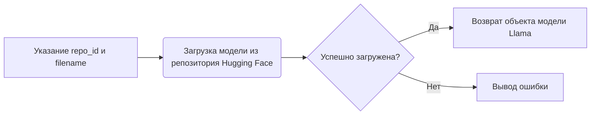
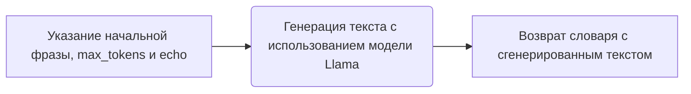
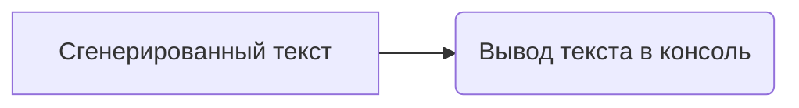

# Модуль для работы с моделью Llama
=========================================

Модуль содержит функциональность для загрузки и использования модели Llama.

## Обзор

Этот модуль предназначен для загрузки предварительно обученной модели Llama и ее использования для генерации текста. Он использует библиотеку `llama_cpp` для взаимодействия с моделью.

## Подробней

Модуль загружает модель из репозитория Hugging Face и генерирует текст на основе заданной фразы.
Модуль можно использовать для экспериментов с генерацией текста, оценки производительности модели и интеграции в другие приложения.

## Функции

### `Llama.from_pretrained`

```python
llm = Llama.from_pretrained(
    repo_id="lmstudio-community/Meta-Llama-3.1-8B-Instruct-GGUF",
    filename="Meta-Llama-3.1-8B-Instruct-IQ4_XS.gguf",
)
```

**Назначение**: Загрузка предварительно обученной модели Llama из репозитория Hugging Face.

**Параметры**:
- `repo_id` (str): Идентификатор репозитория, содержащего модель. В данном случае `"lmstudio-community/Meta-Llama-3.1-8B-Instruct-GGUF"`.
- `filename` (str): Имя файла модели. В данном случае `"Meta-Llama-3.1-8B-Instruct-IQ4_XS.gguf"`.

**Возвращает**:
- `Llama`: Объект модели Llama.

**Как работает функция**:

1.  **Загрузка модели**: Функция `Llama.from_pretrained` из библиотеки `llama_cpp` используется для загрузки предварительно обученной модели Llama.



**Примеры**:

```python
from llama_cpp import Llama

llm = Llama.from_pretrained(
    repo_id="lmstudio-community/Meta-Llama-3.1-8B-Instruct-GGUF",
    filename="Meta-Llama-3.1-8B-Instruct-IQ4_XS.gguf",
)
```

### `llm`

```python
output = llm(
    "Once upon a time,",
    max_tokens=512,
    echo=True
)
```

**Назначение**: Генерация текста с использованием загруженной модели Llama.

**Параметры**:
- `prompt` (str): Начальная фраза для генерации текста. В данном случае `"Once upon a time,"`.
- `max_tokens` (int): Максимальное количество токенов для генерации. В данном случае `512`.
- `echo` (bool): Если `True`, начальная фраза будет включена в сгенерированный текст.

**Возвращает**:
- `dict`: Словарь, содержащий сгенерированный текст.

**Как работает функция**:

1.  **Генерация текста**: Функция `llm` вызывается с начальной фразой и параметрами генерации.



**Примеры**:

```python
from llama_cpp import Llama

llm = Llama.from_pretrained(
    repo_id="lmstudio-community/Meta-Llama-3.1-8B-Instruct-GGUF",
    filename="Meta-Llama-3.1-8B-Instruct-IQ4_XS.gguf",
)

output = llm(
    "Once upon a time,",
    max_tokens=512,
    echo=True
)
print(output)
```

### `print(output)`

**Назначение**: Вывод сгенерированного текста в консоль.

**Параметры**:
- `output` (dict): Словарь, содержащий сгенерированный текст.

**Возвращает**:
- `None`

**Как работает функция**:

1.  **Вывод текста**: Функция `print` используется для вывода сгенерированного текста в консоль.



**Примеры**:

```python
from llama_cpp import Llama

llm = Llama.from_pretrained(
    repo_id="lmstudio-community/Meta-Llama-3.1-8B-Instruct-GGUF",
    filename="Meta-Llama-3.1-8B-Instruct-IQ4_XS.gguf",
)

output = llm(
    "Once upon a time,",
    max_tokens=512,
    echo=True
)
print(output)