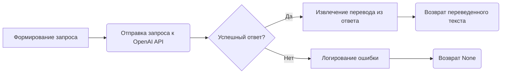

# Модуль для перевода текста с использованием OpenAI API

## Обзор

Модуль `translator.py` предназначен для перевода текста с одного языка на другой с использованием API OpenAI. Он содержит функцию `translate`, которая принимает текст, язык оригинала и язык перевода в качестве аргументов и возвращает переведенный текст. Модуль использует библиотеку `openai` для взаимодействия с API OpenAI.

## Подробней

Модуль предоставляет простой интерфейс для использования возможностей перевода OpenAI.  Для работы с модулем необходимо получить ключ API OpenAI и установить библиотеку `openai`. В проекте `hypotez` модуль используется для перевода текстов, используемых в различных частях проекта, например, для локализации интерфейса или контента.

## Функции

### `translate`

```python
def translate(text, source_language, target_language):
    """
    Перевод текста с использованием OpenAI API.

    Этот метод отправляет текст для перевода на указанный язык с помощью модели OpenAI и возвращает переведённый текст.

    Аргументы:
        text (str): Текст для перевода.
        source_language (str): Язык исходного текста.
        target_language (str): Язык для перевода.

    Возвращает:
        str: Переведённый текст.

    Пример использования:
        >>> source_text = "Привет, как дела?"
        >>> source_language = "Russian"
        >>> target_language = "English"
        >>> translation = translate_text(source_text, source_language, target_language)
        >>> print(f"Translated text: {translation}")
    """
```

**Назначение**: Функция `translate` переводит текст с использованием API OpenAI. Она принимает текст для перевода, язык исходного текста и язык, на который нужно перевести текст, в качестве входных данных.

**Параметры**:

- `text` (str): Текст, который необходимо перевести.
- `source_language` (str): Язык исходного текста.
- `target_language` (str): Язык, на который нужно перевести текст.

**Возвращает**:

- `str`: Переведенный текст. Возвращает `None` в случае возникновения ошибки.

**Вызывает исключения**:

- `Exception`: Возникает при ошибках во время взаимодействия с OpenAI API.

**Как работает функция**:

1. **Формирование запроса**: Функция формирует текстовый запрос (`prompt`) для OpenAI API, включающий текст, который требуется перевести, а также указание исходного и целевого языков.
2. **Отправка запроса к API**: Запрос отправляется в OpenAI API с использованием метода `openai.Completion.create`. Указывается модель (`engine`), максимальное количество токенов (`max_tokens`), количество возвращаемых вариантов (`n`), условие остановки генерации (`stop`) и уровень "креативности" (`temperature`).
3. **Обработка ответа**: Из ответа API извлекается переведенный текст.
4. **Обработка ошибок**: Если во время выполнения запроса или обработки ответа возникает ошибка, она логируется с использованием `logger.error`, и функция возвращает `None`.



**Примеры**:

```python
source_text = "Привет, как дела?"
source_language = "Russian"
target_language = "English"
translation = translate(source_text, source_language, target_language)
print(f"Переведенный текст: {translation}")
# Output: Переведенный текст: Hello, how are you?
```

```python
source_text = "This is a test."
source_language = "English"
target_language = "French"
translation = translate(source_text, source_language, target_language)
print(f"Переведенный текст: {translation}")
# Output: Переведенный текст: Ceci est un test.