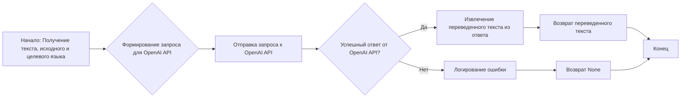

# Модуль `translator`

## Обзор

Модуль `translator` предназначен для перевода текста с одного языка на другой с использованием OpenAI API. Он предоставляет функцию `translate`, которая принимает текст, исходный язык и целевой язык в качестве аргументов и возвращает переведенный текст.

## Подробней

Модуль использует OpenAI API для выполнения перевода. Для работы с API требуется ключ, который должен быть указан в файле `src/gs.py` в переменной `credentials.openai`. Модуль предназначен для интеграции в проекты, где требуется автоматический перевод текста. Он обрабатывает исключения, возникающие при обращении к API, и логирует их с использованием модуля `src.logger`.

## Функции

### `translate`

```python
def translate(text: str, source_language: str, target_language: str) -> str:
    """
    Перевод текста с использованием OpenAI API.

    Этот метод отправляет текст для перевода на указанный язык с помощью модели OpenAI и возвращает переведённый текст.

    Args:
        text (str): Текст для перевода.
        source_language (str): Язык исходного текста.
        target_language (str): Язык для перевода.

    Returns:
        str: Переведённый текст.

    Raises:
        Exception: Возникает при ошибке во время обращения к OpenAI API.

    Example:
        >>> source_text = "Привет, как дела?"
        >>> source_language = "Russian"
        >>> target_language = "English"
        >>> translation = translate_text(source_text, source_language, target_language)
        >>> print(f"Translated text: {translation}")
    """
```

**Назначение**: Переводит текст с одного языка на другой, используя OpenAI API.

**Параметры**:
- `text` (str): Текст, который необходимо перевести.
- `source_language` (str): Язык, с которого нужно перевести текст.
- `target_language` (str): Язык, на который нужно перевести текст.

**Возвращает**:
- `str`: Переведенный текст. В случае ошибки возвращает `None`.

**Вызывает исключения**:
- `Exception`: Возникает в случае проблем при взаимодействии с OpenAI API.

**Как работает функция**:

1. **Формирование запроса**: Функция формирует запрос к OpenAI API, включая в него текст для перевода, исходный язык и целевой язык.
2. **Отправка запроса**: Запрос отправляется к OpenAI API с использованием метода `openai.Completion.create`. Используется модель `text-davinci-003`, устанавливаются параметры, такие как максимальное количество токенов, количество возвращаемых вариантов перевода и температура (случайность) генерации текста.
3. **Обработка ответа**: Функция извлекает переведенный текст из ответа API.
4. **Обработка ошибок**: В случае возникновения ошибки, информация об ошибке логируется с использованием `logger.error`, и функция возвращает `None`.



**Примеры**:

Пример 1: Перевод текста с русского на английский.

```python
source_text = "Привет, как дела?"
source_language = "Russian"
target_language = "English"
translation = translate(source_text, source_language, target_language)
print(f"Translated text: {translation}")
```

Пример 2: Обработка ошибки при переводе.

```python
source_text = "Привет, как дела?"
source_language = "Russian"
target_language = "English"
openai.api_key = None  # simulate error
translation = translate(source_text, source_language, target_language)
if translation is None:
    print("Translation failed.")