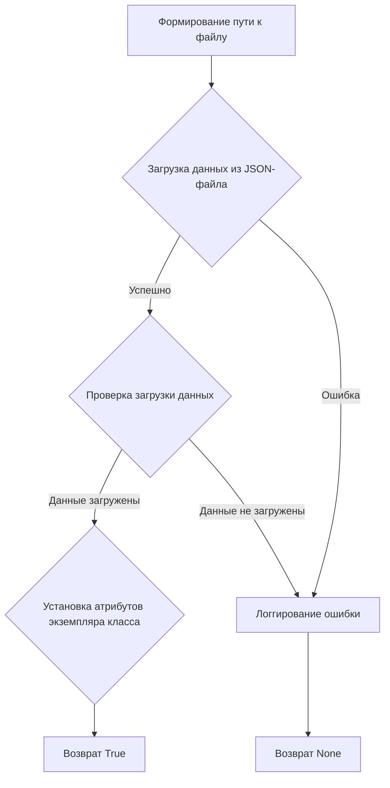

# Модуль `facebook_fields`

## Обзор

Модуль `facebook_fields` предназначен для хранения и загрузки полей, используемых в рекламных объявлениях и событиях Facebook. Он содержит класс `FacebookFields`, который загружает данные полей из JSON-файла и делает их доступными в виде атрибутов экземпляра класса.

## Подробней

Этот модуль используется для централизованного управления полями, необходимыми для взаимодействия с Facebook Ads API. Он обеспечивает удобный способ доступа к этим полям через атрибуты класса, что упрощает их использование в других частях проекта. Расположение файла в структуре проекта `hypotez/src/endpoints/advertisement/facebook/facebook_fields.py` указывает на его принадлежность к подсистеме работы с рекламой в Facebook.

## Классы

### `FacebookFields`

**Описание**: Класс `FacebookFields` предназначен для хранения и загрузки полей, используемых в рекламных объявлениях и событиях Facebook.

**Принцип работы**:
1.  При инициализации класса вызывается метод `_payload`, который загружает данные из JSON-файла.
2.  Данные из JSON-файла преобразуются в атрибуты экземпляра класса, что позволяет удобно обращаться к ним.
3.  Если загрузка данных из файла не удалась, регистрируется сообщение отладки.

**Атрибуты**:
-   `self`: Ссылка на экземпляр класса `FacebookFields`.

**Методы**:
-   `__init__()`: Конструктор класса, инициализирует экземпляр класса и вызывает метод `_payload` для загрузки данных.
-   `_payload()`: Загружает данные из JSON-файла и устанавливает их как атрибуты экземпляра класса.

### `FacebookFields.__init__`

```python
def __init__(self):
    """ """
    ...
    self._payload()
```

**Назначение**: Конструктор класса `FacebookFields`.

**Параметры**:
-   `self`: Ссылка на экземпляр класса `FacebookFields`.

**Возвращает**:
-   None

**Как работает функция**:

1.  Инициализирует экземпляр класса `FacebookFields`.
2.  Вызывает метод `_payload()` для загрузки данных полей из JSON-файла.

**Примеры**:

```python
facebook_fields = FacebookFields()
```

### `FacebookFields._payload`

```python
def _payload(self):
    """ """
    ...
    data = j_loads (Path (gs.path.src, 'advertisement', 'facebok', 'facebook_feilds.json'))
    if not data:
        logger.debug(f"Ошибка загрузки полей из файла {gs.path.src}/advertisement/facebok/facebook_feilds.json")
        return 
    for name, value in data.items():
        setattr(self, f'{name}', value)
    return True
```

**Назначение**: Загружает данные из JSON-файла и устанавливает их как атрибуты экземпляра класса.

**Параметры**:
-   `self`: Ссылка на экземпляр класса `FacebookFields`.

**Возвращает**:
-   `True`: Если данные успешно загружены и установлены.
-   `None`: Если не удалось загрузить данные из файла.

**Как работает функция**:

1.  Формирует путь к файлу `facebook_feilds.json`, используя `gs.path.src`, `'advertisement'`, `'facebok'`.
2.  Использует функцию `j_loads` для загрузки данных из JSON-файла.
3.  Проверяет, удалось ли загрузить данные. Если нет, регистрирует сообщение отладки с помощью `logger.debug` и возвращает `None`.
4.  Если данные успешно загружены, итерируется по элементам словаря `data` и устанавливает каждый элемент как атрибут экземпляра класса, используя `setattr`.
5.  Возвращает `True` после успешной загрузки и установки данных.



**Примеры**:

```python
facebook_fields = FacebookFields()
facebook_fields._payload()