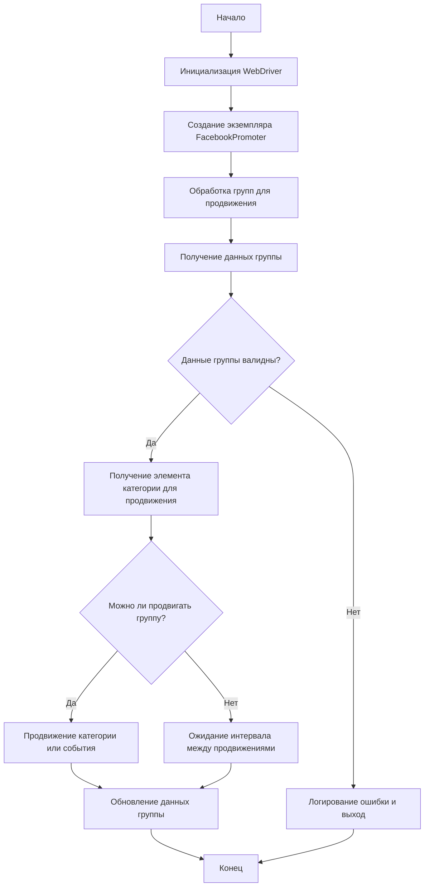

# Документация модуля Facebook Promoter

## Обзор

Модуль **Facebook Promoter** автоматизирует продвижение товаров и событий AliExpress в группах Facebook. Модуль отвечает за размещение рекламных акций в Facebook, обеспечивая продвижение категорий и событий без дубликатов. Он использует WebDriver для автоматизации работы браузера, что обеспечивает эффективное управление рекламными акциями.

## Функциональность модуля

- Продвижение категорий и событий в группах Facebook.
- Предотвращение дублирования рекламных акций путем отслеживания ранее продвигаемых элементов.
- Поддержка настройки данных группы через файлы.
- Возможность отключения загрузки видео в рекламных акциях.

## Требования

- **Python** 3.x
- Необходимые библиотеки:
  - `random`
  - `datetime`
  - `pathlib`
  - `urllib.parse`
  - `types.SimpleNamespace`
  - `src` (пользовательский модуль)

## Блок-схема



## Использование

### Пример использования класса FacebookPromoter

```python
from src.endpoints.advertisement.facebook.promoter import FacebookPromoter
from src.webdriver.driver import Driver
from src.utils.jjson import j_loads_ns

# Создание инстанса драйвера (пример с Chrome)
d = Driver()

# Создание экземпляра FacebookPromoter
promoter = FacebookPromoter(
    d=d, 
    promoter="aliexpress", 
    group_file_paths=["path/to/group/file1.json", "path/to/group/file2.json"]
)

# Запуск продвижения продуктов или событий
promoter.process_groups(
    campaign_name="Campaign1",
    events=[], 
    group_categories_to_adv=["sales"],
    language="en",
    currency="USD"
)
```

## Документация по классам

### Класс `FacebookPromoter`

Этот класс управляет процессом продвижения товаров и событий AliExpress в группах Facebook.

**Как работает класс:**

Класс `FacebookPromoter` предназначен для автоматизации процесса продвижения товаров и событий из AliExpress в различные группы Facebook. Он инициализируется с использованием экземпляра `Driver` (для управления браузером), имени промоутера (например, "aliexpress") и путей к файлам с данными групп Facebook.

Основная задача класса заключается в итерации по группам, проверки возможности их продвижения на основе заданных интервалов и валидации данных группы. Для каждой группы класс извлекает элементы категорий или событий для продвижения, а затем публикует их в группе Facebook. После успешной публикации данные группы обновляются, чтобы избежать повторного продвижения одних и тех же элементов.

Класс также предоставляет методы для обработки ошибок продвижения и ведения журнала этих ошибок. Если продвижение не удаётся, соответствующая запись добавляется в журнал.

#### Методы

##### `__init__(self, d: Driver, promoter: str, group_file_paths: Optional[list[str | Path] | str | Path] = None, no_video: bool = False)`

Инициализирует промоутер Facebook с необходимыми конфигурациями.

**Как работает функция:**

1.  Сохраняет переданные аргументы в атрибуты экземпляра класса.
2.  Инициализирует атрибуты `groups` и `promoted_categories` как пустые списки.
3.  Если `group_file_paths` не равен `None`, загружает данные групп из указанных файлов, используя `j_loads_ns` для загрузки JSON данных в пространство имен `SimpleNamespace`.

**Параметры:**

- `d` (Driver): Экземпляр WebDriver для автоматизации.
- `promoter` (str): Имя промоутера (например, "aliexpress").
- `group_file_paths` (Optional[list[str | Path] | str | Path], optional): Пути к файлам с данными групп. По умолчанию `None`.
- `no_video` (bool): Флаг для отключения видео в постах. По умолчанию `False`.

##### `promote(self, group: SimpleNamespace, item: SimpleNamespace, is_event: bool = False, language: str = None, currency: str = None) -> bool`

Продвигает категорию или событие в указанной группе Facebook.

**Как работает функция:**

1.  Формирует текст сообщения для публикации, используя данные из `item` и `group`.
2.  Выполняет действия по продвижению в Facebook, используя `driver.execute_locator`.
3.  Логирует успех или неудачу продвижения.
4.  Возвращает `True`, если продвижение прошло успешно, и `False` в противном случае.

**Параметры:**

- `group` (SimpleNamespace): Данные группы.
- `item` (SimpleNamespace): Элемент категории или события для продвижения.
- `is_event` (bool): Указывает, является ли элемент событием.
- `language` (str): Язык продвижения.
- `currency` (str): Валюта для продвижения.

**Возвращает:**

- `bool`: Указывает, было ли продвижение успешным.

##### `log_promotion_error(self, is_event: bool, item_name: str)`

Регистрирует ошибку при сбое продвижения.

**Как работает функция:**

1.  Формирует сообщение об ошибке на основе параметров `is_event` и `item_name`.
2.  Использует `logger.error` для записи сообщения об ошибке.

**Параметры:**

- `is_event` (bool): Указывает, является ли элемент событием.
- `item_name` (str): Имя элемента.

##### `update_group_promotion_data(self, group: SimpleNamespace, item_name: str, is_event: bool = False)`

Обновляет данные группы после продвижения, добавляя продвинутый элемент в список продвинутых категорий или событий.

**Как работает функция:**

1.  Определяет, какой список следует обновить (категории или события) на основе параметра `is_event`.
2.  Добавляет `item_name` в соответствующий список продвинутых элементов в данных группы.
3.  Обновляет данные группы, чтобы избежать повторного продвижения одного и того же элемента.

**Параметры:**

- `group` (SimpleNamespace): Данные группы.
- `item_name` (str): Имя продвинутого элемента.
- `is_event` (bool): Указывает, является ли элемент событием.

##### `process_groups(self, campaign_name: str = None, events: list[SimpleNamespace] = None, is_event: bool = False, group_file_paths: list[str] = None, group_categories_to_adv: list[str] = ['sales'], language: str = None, currency: str = None)`

Обрабатывает группы для текущей кампании или продвижения событий.

**Как работает функция:**

1.  Загружает данные групп из файлов, если `group_file_paths` указан.
2.  Итерируется по группам.
3.  Вызывает `validate_group` для проверки данных группы.
4.  Вызывает `check_interval` для проверки возможности продвижения группы.
5.  Вызывает `get_category_item` для получения элемента категории для продвижения.
6.  Вызывает `promote` для продвижения элемента в группе.
7.  Вызывает `update_group_promotion_data` для обновления данных группы после продвижения.

**Параметры:**

- `campaign_name` (str, optional): Имя кампании.
- `events` (list[SimpleNamespace], optional): Список событий для продвижения.
- `is_event` (bool, optional): Указывает, следует ли продвигать события или категории.
- `group_file_paths` (list[str], optional): Пути к файлам с данными групп.
- `group_categories_to_adv` (list[str], optional): Категории для продвижения.
- `language` (str, optional): Язык продвижения.
- `currency` (str, optional): Валюта для продвижения.

##### `get_category_item(self, campaign_name: str, group: SimpleNamespace, language: str, currency: str) -> SimpleNamespace`

Получает элемент категории для продвижения на основе кампании и промоутера.

**Как работает функция:**

1.  Извлекает элементы категорий из данных группы.
2.  Выбирает элемент, который еще не был продвинут в данной группе.
3.  Возвращает выбранный элемент.

**Параметры:**

- `campaign_name` (str): Имя кампании.
- `group` (SimpleNamespace): Данные группы.
- `language` (str): Язык для продвижения.
- `currency` (str): Валюта для продвижения.

**Возвращает:**

- `SimpleNamespace`: Элемент категории для продвижения.

##### `check_interval(self, group: SimpleNamespace) -> bool`

Проверяет, достаточно ли времени прошло для повторного продвижения этой группы.

**Как работает функция:**

1.  Рассчитывает время, прошедшее с момента последнего продвижения группы.
2.  Сравнивает прошедшее время с интервалом между продвижениями, указанным в данных группы.
3.  Возвращает `True`, если прошло достаточно времени, и `False` в противном случае.

**Параметры:**

- `group` (SimpleNamespace): Данные группы.

**Возвращает:**

- `bool`: Указывает, может ли группа быть продвинута.

##### `validate_group(self, group: SimpleNamespace) -> bool`

Проверяет данные группы, чтобы убедиться, что у них есть необходимые атрибуты.

**Как работает функция:**

1.  Проверяет наличие обязательных атрибутов в данных группы (например, `group_name`, `group_id`).
2.  Возвращает `True`, если данные группы валидны, и `False` в противном случае.

**Параметры:**

- `group` (SimpleNamespace): Данные группы.

**Возвращает:**

- `bool`: Указывает, являются ли данные группы валидными.

## Лицензия

Этот модуль является частью большого пакета **Facebook Promoter** и лицензируется в соответствии с лицензией MIT.