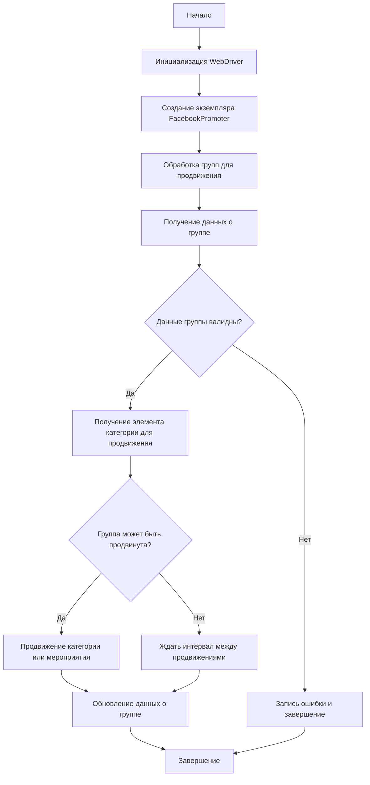

# Документация модуля Facebook Promoter

## Обзор

Модуль **Facebook Promoter** автоматизирует продвижение товаров и мероприятий AliExpress в группах Facebook. Модуль управляет публикациями рекламных материалов на Facebook, избегая дублирования. Для эффективного продвижения используется WebDriver для автоматизации браузера.

## Подробнее

Более подробное описание. Объясни как и зачем используется данный код в проекте.
Этот модуль предназначен для автоматизации процесса продвижения товаров и мероприятий AliExpress в группах Facebook. Он помогает маркетологам и владельцам бизнеса увеличивать охват аудитории и привлекать больше потенциальных клиентов через социальную сеть Facebook. Модуль использует WebDriver для автоматизации действий в браузере, что позволяет имитировать действия пользователя и выполнять задачи, такие как публикация рекламных материалов, без ручного вмешательства.

## Особенности модуля

- Продвижение категорий и мероприятий в группах Facebook.
- Избежание дублирования публикаций через отслеживание уже опубликованных элементов.
- Поддержка конфигурации данных групп через файлы.
- Возможность отключения загрузки видео в публикациях.

## Требования

- **Python** 3.x
- Необходимые библиотеки:
  - `random`
  - `datetime`
  - `pathlib`
  - `urllib.parse`
  - `types.SimpleNamespace`
  - `src` (пользовательский модуль)

## Использование

### Пример использования класса FacebookPromoter

```python
from src.endpoints.advertisement.facebook.promoter import FacebookPromoter
from src.webdriver.driver import Driver
from src.utils.jjson import j_loads_ns

# Настройка экземпляра WebDriver (замените на реальный WebDriver)
d = Driver()

# Создание экземпляра FacebookPromoter
promoter = FacebookPromoter(
    d=d, 
    promoter="aliexpress", 
    group_file_paths=["path/to/group/file1.json", "path/to/group/file2.json"]
)

# Начало продвижения товаров или мероприятий
promoter.process_groups(
    campaign_name="Campaign1",
    events=[], 
    group_categories_to_adv=["sales"],
    language="en",
    currency="USD"
)
```

## Документация классов

### Класс `FacebookPromoter`

**Описание**: Этот класс управляет процессом продвижения товаров и мероприятий AliExpress в группах Facebook.

**Как работает класс**:
1. **Инициализация**: Класс инициализируется с экземпляром WebDriver, именем промоутера и путями к файлам конфигурации групп Facebook.
2. **Обработка групп**: Метод `process_groups` обрабатывает каждую группу, проверяет возможность продвижения и запускает процесс продвижения для каждой группы.
3. **Продвижение**: Метод `promote` выполняет фактическое продвижение, публикуя контент в группах Facebook.
4. **Обновление данных**: После успешного продвижения данные о группе обновляются, чтобы избежать повторной публикации одного и того же контента.



#### Методы

##### `__init__(self, d: Driver, promoter: str, group_file_paths: Optional[list[str | Path] | str | Path] = None, no_video: bool = False)`

```python
    def __init__(self, d: Driver, promoter: str, group_file_paths: Optional[list[str | Path] | str | Path] = None, no_video: bool = False):
        """Инициализирует промоутер для Facebook с необходимыми конфигурациями.

        Args:
            d (Driver): Экземпляр WebDriver для автоматизации.
            promoter (str): Имя промоутера (например, "aliexpress").
            group_file_paths (Optional[list[str  Path]  str  Path], optional): Пути к файлам с данными групп. По умолчанию `None`.
            no_video (bool): Флаг для отключения видео в публикациях. По умолчанию `False`.
        """
        ...
```

**Назначение**: Инициализирует промоутер для Facebook с необходимыми конфигурациями.

**Как работает функция**:
1. Функция принимает экземпляр WebDriver, имя промоутера и пути к файлам с данными групп.
2. Устанавливает переданные значения в качестве атрибутов экземпляра класса `FacebookPromoter`.
3. Инициализирует внутренние переменные, такие как `driver` (WebDriver), `group_promotion_data` (данные о продвижении групп) и `no_video` (флаг отключения видео).

**Параметры**:
- `d` (Driver): Экземпляр WebDriver для автоматизации.
- `promoter` (str): Имя промоутера (например, "aliexpress").
- `group_file_paths` (Optional[list[str | Path] | str | Path], optional): Пути к файлам с данными групп. По умолчанию `None`.
- `no_video` (bool): Флаг для отключения видео в публикациях. По умолчанию `False`.

##### `promote(self, group: SimpleNamespace, item: SimpleNamespace, is_event: bool = False, language: str = None, currency: str = None) -> bool`

```python
    def promote(self, group: SimpleNamespace, item: SimpleNamespace, is_event: bool = False, language: str = None, currency: str = None) -> bool:
        """Продвигает категорию или мероприятие в указанной группе Facebook.

        Args:
            group (SimpleNamespace): Данные группы.
            item (SimpleNamespace): Категория или мероприятие для продвижения.
            is_event (bool): Является ли элемент мероприятием.
            language (str): Язык публикации.
            currency (str): Валюта для продвижения.

        Returns:
            bool: Успешно ли прошло продвижение.
        """
        ...
```

**Назначение**: Продвигает категорию или мероприятие в указанной группе Facebook.

**Как работает функция**:
1. Функция принимает данные группы, элемент для продвижения (категорию или мероприятие) и флаги для определения языка и валюты.
2. Формирует URL для публикации на основе предоставленных данных.
3. Использует WebDriver для выполнения действий в браузере, таких как переход по URL и публикация контента в группе Facebook.

**Параметры**:
- `group` (SimpleNamespace): Данные группы.
- `item` (SimpleNamespace): Категория или мероприятие для продвижения.
- `is_event` (bool): Является ли элемент мероприятием.
- `language` (str): Язык публикации.
- `currency` (str): Валюта для продвижения.

**Возвращает**:
- `bool`: Успешно ли прошло продвижение.

##### `log_promotion_error(self, is_event: bool, item_name: str)`

```python
    def log_promotion_error(self, is_event: bool, item_name: str):
        """Записывает ошибку, если продвижение не удалось.

        Args:
            is_event (bool): Является ли элемент мероприятием.
            item_name (str): Название элемента.
        """
        ...
```

**Назначение**: Записывает ошибку, если продвижение не удалось.

**Как работает функция**:
1. Функция принимает флаг, указывающий, является ли продвигаемый элемент мероприятием, и название элемента.
2. Формирует сообщение об ошибке на основе этих данных.
3. Логирует сообщение об ошибке с использованием модуля `logger` из `src.logger`.

**Параметры**:
- `is_event` (bool): Является ли элемент мероприятием.
- `item_name` (str): Название элемента.

##### `update_group_promotion_data(self, group: SimpleNamespace, item_name: str, is_event: bool = False)`

```python
    def update_group_promotion_data(self, group: SimpleNamespace, item_name: str, is_event: bool = False):
        """Обновляет данные группы после продвижения, добавляя продвигаемый элемент в список продвигаемых категорий или мероприятий.

        Args:
            group (SimpleNamespace): Данные группы.
            item_name (str): Название продвигаемого элемента.
            is_event (bool): Является ли элемент мероприятием.
        """
        ...
```

**Назначение**: Обновляет данные группы после продвижения, добавляя продвигаемый элемент в список продвигаемых категорий или мероприятий.

**Как работает функция**:
1. Функция принимает данные группы, название продвигаемого элемента и флаг, указывающий, является ли элемент мероприятием.
2. Добавляет название элемента в список продвигаемых категорий или мероприятий в данных группы.

**Параметры**:
- `group` (SimpleNamespace): Данные группы.
- `item_name` (str): Название продвигаемого элемента.
- `is_event` (bool): Является ли элемент мероприятием.

##### `process_groups(self, campaign_name: str = None, events: list[SimpleNamespace] = None, is_event: bool = False, group_file_paths: list[str] = None, group_categories_to_adv: list[str] = ['sales'], language: str = None, currency: str = None)`

```python
    def process_groups(self, campaign_name: str = None, events: list[SimpleNamespace] = None, is_event: bool = False, group_file_paths: list[str] = None, group_categories_to_adv: list[str] = ['sales'], language: str = None, currency: str = None):
        """Обрабатывает группы для текущей кампании или продвижения мероприятия.

        Args:
            campaign_name (str): Название кампании.
            events (list[SimpleNamespace]): Список мероприятий для продвижения.
            is_event (bool): Является ли продвижение мероприятий или категорий.
            group_file_paths (list[str]): Пути к файлам с данными групп.
            group_categories_to_adv (list[str]): Категории для продвижения.
            language (str): Язык публикации.
            currency (str): Валюта для продвижения.
        """
        ...
```

**Назначение**: Обрабатывает группы для текущей кампании или продвижения мероприятия.

**Как работает функция**:
1. Функция принимает параметры кампании, список мероприятий, флаг для определения типа продвижения (мероприятия или категории), пути к файлам с данными групп, категории для продвижения, язык и валюту.
2. Загружает данные о группах из файлов.
3. Для каждой группы проверяет, можно ли ее продвигать, и запускает процесс продвижения.

**Параметры**:
- `campaign_name` (str): Название кампании.
- `events` (list[SimpleNamespace]): Список мероприятий для продвижения.
- `is_event` (bool): Является ли продвижение мероприятий или категорий.
- `group_file_paths` (list[str]): Пути к файлам с данными групп.
- `group_categories_to_adv` (list[str]): Категории для продвижения.
- `language` (str): Язык публикации.
- `currency` (str): Валюта для продвижения.

##### `get_category_item(self, campaign_name: str, group: SimpleNamespace, language: str, currency: str) -> SimpleNamespace`

```python
    def get_category_item(self, campaign_name: str, group: SimpleNamespace, language: str, currency: str) -> SimpleNamespace:
        """Получает элемент категории для продвижения в зависимости от кампании и промоутера.

        Args:
            campaign_name (str): Название кампании.
            group (SimpleNamespace): Данные группы.
            language (str): Язык для публикации.
            currency (str): Валюта для публикации.

        Returns:
            SimpleNamespace: Элемент категории для продвижения.
        """
        ...
```

**Назначение**: Получает элемент категории для продвижения в зависимости от кампании и промоутера.

**Как работает функция**:
1. Функция принимает название кампании, данные группы, язык и валюту.
2. Формирует URL для получения данных о категории на основе этих параметров.
3. Выполняет запрос к API промоутера для получения данных о категории.

**Параметры**:
- `campaign_name` (str): Название кампании.
- `group` (SimpleNamespace): Данные группы.
- `language` (str): Язык для публикации.
- `currency` (str): Валюта для публикации.

**Возвращает**:
- `SimpleNamespace`: Элемент категории для продвижения.

##### `check_interval(self, group: SimpleNamespace) -> bool`

```python
    def check_interval(self, group: SimpleNamespace) -> bool:
        """Проверяет, прошло ли достаточно времени, чтобы снова продвигать эту группу.

        Args:
            group (SimpleNamespace): Данные группы.

        Returns:
            bool: Можно ли снова продвигать группу.
        """
        ...
```

**Назначение**: Проверяет, прошло ли достаточно времени, чтобы снова продвигать эту группу.

**Как работает функция**:
1. Функция принимает данные группы.
2. Вычисляет, прошло ли достаточно времени с момента последнего продвижения группы.

**Параметры**:
- `group` (SimpleNamespace): Данные группы.

**Возвращает**:
- `bool`: Можно ли снова продвигать группу.

##### `validate_group(self, group: SimpleNamespace) -> bool`

```python
    def validate_group(self, group: SimpleNamespace) -> bool:
        """Проверяет данные группы, чтобы убедиться в их корректности.

        Args:
            group (SimpleNamespace): Данные группы.

        Returns:
            bool: Корректны ли данные группы.
        """
        ...
```

**Назначение**: Проверяет данные группы, чтобы убедиться в их корректности.

**Как работает функция**:
1. Функция принимает данные группы.
2. Проверяет наличие необходимых полей в данных группы, таких как URL группы и интервал между продвижениями.

**Параметры**:
- `group` (SimpleNamespace): Данные группы.

**Возвращает**:
- `bool`: Корректны ли данные группы.

## Лицензия

Модуль является частью пакета **Facebook Promoter** и лицензируется по лицензии MIT.