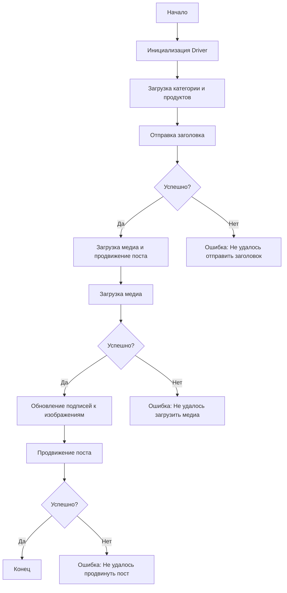

# Сценарий асинхронной публикации сообщения на Facebook

## Обзор

Этот модуль, расположенный в директории `hypotez/src/endpoints/advertisement/facebook/scenarios`, предназначен для автоматизации процесса публикации сообщений на Facebook. Он взаимодействует со страницей Facebook, используя локаторы для выполнения различных действий, таких как отправка заголовков и описаний, загрузка медиафайлов и обновление подписей.

## Содержание

- [Основные возможности](#основные-возможности)
- [Структура модуля](#структура-модуля)
- [Легенда](#легенда)
- [Функции](#функции)
  - [`post_title`](#post_title)
  - [`upload_media`](#upload_media)
  - [`update_images_captions`](#update_images_captions)
  - [`promote_post`](#promote_post)
- [Использование](#использование)
- [Зависимости](#зависимости)
- [Обработка ошибок](#обработка-ошибок)
- [Вклад](#вклад)
- [Лицензия](#лицензия)

## Основные возможности

1.  **Отправка заголовка и описания**: Отправляет заголовок и описание кампании в поле сообщения на Facebook.
2.  **Загрузка медиафайлов**: Загружает медиафайлы (изображения и видео) на пост Facebook и обновляет их подписи.
3.  **Продвижение поста**: Управляет всем процессом продвижения поста с заголовком, описанием и медиафайлами.

## Структура модуля



## Легенда

1.  **Start**: Начало выполнения скрипта.
2.  **InitDriver**: Создание экземпляра класса `Driver`.
3.  **LoadCategoryAndProducts**: Загрузка данных категории и продуктов.
4.  **SendTitle**: Вызов функции `post_title` для отправки заголовка.
5.  **CheckTitleSuccess**: Проверка успешности отправки заголовка.

    -   **Да**: Переход к загрузке медиа и продвижению поста.
    -   **Нет**: Вывод ошибки "Не удалось отправить заголовок".
6.  **UploadMediaAndPromotePost**: Вызов функции `promote_post`.
7.  **UploadMedia**: Вызов функции `upload_media` для загрузки медиафайлов.
8.  **CheckMediaSuccess**: Проверка успешности загрузки медиа.

    -   **Да**: Переход к обновлению подписей к изображениям.
    -   **Нет**: Вывод ошибки "Не удалось загрузить медиа".
9.  **UpdateCaptions**: Вызов функции `update_images_captions` для обновления подписей.
10. **PromotePost**: Завершение процесса продвижения поста.
11. **CheckPromoteSuccess**: Проверка успешности продвижения поста.

    -   **Да**: Конец выполнения скрипта.
    -   **Нет**: Вывод ошибки "Не удалось продвинуть пост".

## Функции

### `post_title`

```python
def post_title(d: Driver, category: SimpleNamespace) -> bool:
    """
    Отправляет заголовок и описание кампании в поле сообщения на Facebook.

    Args:
        d (Driver): Экземпляр `Driver` для взаимодействия с веб-страницей.
        category (SimpleNamespace): Категория, содержащая заголовок и описание для отправки.

    Returns:
        bool: `True`, если заголовок и описание были успешно отправлены, иначе `None`.

    Raises:
        исключения не вызываются.

    Example:
        Пример вызова функции
        >>> d = Driver(Chrome)
        >>> category = SimpleNamespace(title='Заголовок', description='Описание')
        >>> post_title(d, category)
        True
    """
    ...
```

**Как работает функция**:

1.  Функция `post_title` принимает экземпляр `Driver` и объект `SimpleNamespace`, содержащий заголовок и описание.
2.  Она использует методы объекта `Driver` для поиска элементов на веб-странице Facebook, в которые нужно ввести заголовок и описание.
3.  Функция заполняет соответствующие поля заголовком и описанием, извлеченными из объекта `category`.
4.  Если все операции выполнены успешно, функция возвращает `True`, иначе `None`.

**Параметры**:

*   `d` (Driver): Экземпляр класса `Driver`, используемый для управления веб-браузером и взаимодействия с веб-страницей Facebook.
*   `category` (SimpleNamespace): Объект, содержащий атрибуты `title` (заголовок) и `description` (описание), которые будут отправлены в поля сообщения на Facebook.

**Возвращает**:

*   `bool`: Возвращает `True`, если заголовок и описание были успешно отправлены. В случае неудачи возвращает `None`.

### `upload_media`

```python
def upload_media(d: Driver, products: List[SimpleNamespace], no_video: bool = False) -> bool:
    """
    Загружает медиафайлы на пост Facebook и обновляет их подписи.

    Args:
        d (Driver): Экземпляр `Driver` для взаимодействия с веб-страницей.
        products (List[SimpleNamespace]): Список продуктов, содержащих пути к медиафайлам.
        no_video (bool, optional): Флаг, указывающий, следует ли пропустить загрузку видео. По умолчанию `False`.

    Returns:
        bool: `True`, если медиафайлы были успешно загружены, иначе `None`.

    Raises:
        исключения не вызываются.

    Example:
        Пример вызова функции
        >>> d = Driver(Chrome)
        >>> products = [SimpleNamespace(local_image_path='путь/к/изображению.jpg', local_video_path='путь/к/видео.mp4')]
        >>> upload_media(d, products)
        True
    """
    ...
```

**Как работает функция**:

1.  Функция `upload_media` принимает экземпляр `Driver`, список объектов `SimpleNamespace` (продуктов) и необязательный флаг `no_video`.
2.  Она итерируется по списку продуктов, загружая медиафайлы (изображения и видео) для каждого продукта.
3.  Для загрузки медиафайлов используются методы объекта `Driver`, которые взаимодействуют с элементами веб-страницы Facebook.
4.  Если `no_video` установлен в `True`, загрузка видео пропускается.
5.  В случае успешной загрузки всех медиафайлов функция возвращает `True`, иначе `None`.

**Параметры**:

*   `d` (Driver): Экземпляр класса `Driver`, используемый для управления веб-браузером и взаимодействия с веб-страницей Facebook.
*   `products` (List[SimpleNamespace]): Список объектов, каждый из которых содержит пути к локальным медиафайлам (изображениям и видео), которые нужно загрузить.
*   `no_video` (bool, optional): Флаг, указывающий, следует ли пропускать загрузку видеофайлов. По умолчанию `False`.

**Возвращает**:

*   `bool`: Возвращает `True`, если все медиафайлы были успешно загружены. В случае неудачи возвращает `None`.

### `update_images_captions`

```python
def update_images_captions(d: Driver, products: List[SimpleNamespace], textarea_list: List[WebElement]) -> None:
    """
    Асинхронно добавляет описания к загруженным медиафайлам.

    Args:
        d (Driver): Экземпляр `Driver` для взаимодействия с веб-страницей.
        products (List[SimpleNamespace]): Список продуктов с деталями для обновления.
        textarea_list (List[WebElement]): Список текстовых полей, куда добавляются подписи.

    Raises:
        исключения не вызываются.

    Example:
        Пример вызова функции
        >>> d = Driver(Chrome)
        >>> products = [SimpleNamespace(description='Описание изображения')]
        >>> textarea_list = [WebElement(), WebElement()]
        >>> update_images_captions(d, products, textarea_list)
    """
    ...
```

**Как работает функция**:

1.  Функция `update_images_captions` принимает экземпляр `Driver`, список объектов `SimpleNamespace` (продуктов) и список элементов `WebElement` (текстовые поля).
2.  Она асинхронно добавляет описания к загруженным медиафайлам, используя текстовые поля, предоставленные в `textarea_list`.
3.  Функция итерируется по списку продуктов и соответствующим текстовым полям, заполняя каждое поле описанием из объекта продукта.
4.  Для взаимодействия с текстовыми полями используются методы объекта `Driver`.

**Параметры**:

*   `d` (Driver): Экземпляр класса `Driver`, используемый для управления веб-браузером и взаимодействия с веб-страницей Facebook.
*   `products` (List[SimpleNamespace]): Список объектов, каждый из которых содержит описание для соответствующего медиафайла.
*   `textarea_list` (List[WebElement]): Список веб-элементов (текстовых полей), в которые будут добавлены описания.

**Возвращает**:

*   `None`: Функция ничего не возвращает.

### `promote_post`

```python
def promote_post(d: Driver, category: SimpleNamespace, products: List[SimpleNamespace], no_video: bool = False) -> bool:
    """
    Управляет процессом продвижения поста с заголовком, описанием и медиафайлами.

    Args:
        d (Driver): Экземпляр `Driver` для взаимодействия с веб-страницей.
        category (SimpleNamespace): Детали категории, используемые для заголовка и описания поста.
        products (List[SimpleNamespace]): Список продуктов, содержащих медиа и детали для публикации.
        no_video (bool, optional): Флаг, указывающий, следует ли пропустить загрузку видео. По умолчанию `False`.

    Returns:
        bool: `True`, если пост был успешно продвинут, иначе `None`.

    Raises:
        исключения не вызываются.

    Example:
        Пример вызова функции
        >>> d = Driver(Chrome)
        >>> category = SimpleNamespace(title='Заголовок', description='Описание')
        >>> products = [SimpleNamespace(local_image_path='путь/к/изображению.jpg', local_video_path='путь/к/видео.mp4')]
        >>> promote_post(d, category, products)
        True
    """
    ...
```

**Как работает функция**:

1.  Функция `promote_post` управляет процессом продвижения поста на Facebook, объединяя в себе отправку заголовка и описания, загрузку медиафайлов и обновление подписей.
2.  Она принимает экземпляр `Driver`, объект `SimpleNamespace` для категории, список объектов `SimpleNamespace` для продуктов и необязательный флаг `no_video`.
3.  Функция вызывает `post_title` для отправки заголовка и описания.
4.  Затем вызывает `upload_media` для загрузки медиафайлов.
5.  После загрузки медиафайлов вызывает `update_images_captions` для обновления подписей.
6.  Если все этапы выполнены успешно, функция возвращает `True`, иначе `None`.

**Параметры**:

*   `d` (Driver): Экземпляр класса `Driver`, используемый для управления веб-браузером и взаимодействия с веб-страницей Facebook.
*   `category` (SimpleNamespace): Объект, содержащий заголовок и описание для поста.
*   `products` (List[SimpleNamespace]): Список объектов, каждый из которых содержит пути к медиафайлам и описания для подписей.
*   `no_video` (bool, optional): Флаг, указывающий, следует ли пропускать загрузку видеофайлов. По умолчанию `False`.

**Возвращает**:

*   `bool`: Возвращает `True`, если пост был успешно продвинут. В случае неудачи возвращает `None`.

## Использование

Для использования этого скрипта выполните следующие шаги:

1.  **Инициализация Driver**: Создайте экземпляр класса `Driver`.
2.  **Загрузка локаторов**: Загрузите локаторы из JSON-файла.
3.  **Вызов функций**: Используйте предоставленные функции для отправки заголовка, загрузки медиа и продвижения поста.

### Пример

```python
from src.webdriver.driver import Driver
from types import SimpleNamespace

# Инициализация Driver
driver = Driver(...)

# Загрузка категории и продуктов
category = SimpleNamespace(title="Заголовок кампании", description="Описание кампании")
products = [SimpleNamespace(local_image_path='путь/к/изображению.jpg', ...)]

# Отправка заголовка
post_title(driver, category)

# Загрузка медиа и продвижение поста
await promote_post(driver, category, products)
```

## Зависимости

*   `selenium`: Для веб-автоматизации.
*   `asyncio`: Для асинхронных операций.
*   `pathlib`: Для обработки путей к файлам.
*   `types`: Для создания простых пространств имен.
*   `typing`: Для аннотаций типов.

## Обработка ошибок

Скрипт включает надежную обработку ошибок, чтобы обеспечить продолжение выполнения даже в случае, если некоторые элементы не найдены или если возникли проблемы с веб-страницей. Это особенно полезно для обработки динамических или нестабильных веб-страниц.

## Вклад

Вклад в этот скрипт приветствуется. Пожалуйста, убедитесь, что любые изменения хорошо документированы и включают соответствующие тесты.

## Лицензия

Этот скрипт лицензирован под MIT License. Подробности смотрите в файле `LICENSE`.