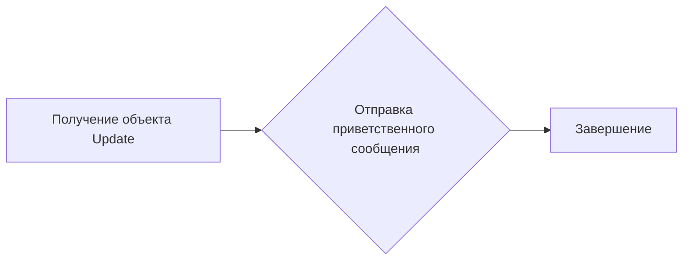
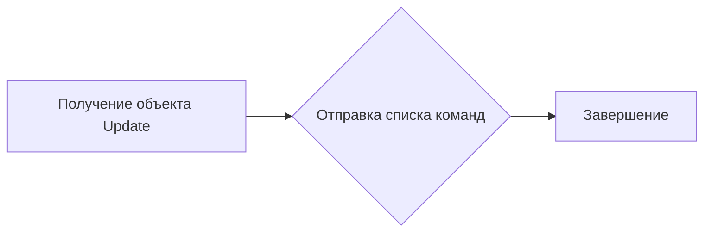
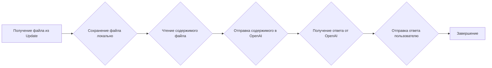
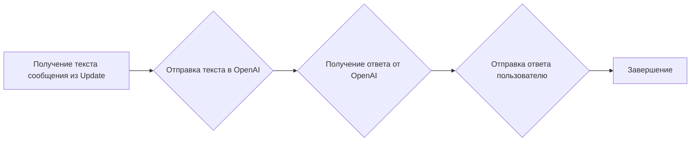
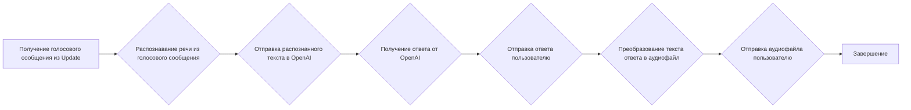
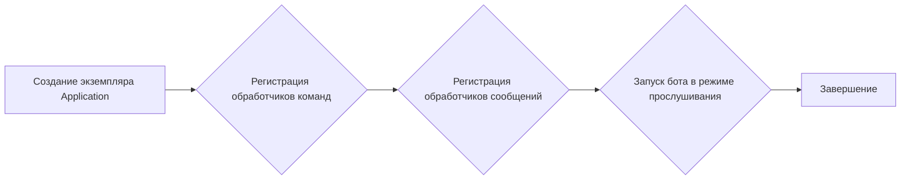

# Модуль для обучения Telegram-бота с использованием OpenAI

## Обзор

Модуль предоставляет функциональность для создания и обучения Telegram-бота с использованием библиотеки `python-telegram-bot` и моделей OpenAI. Бот может обрабатывать текстовые сообщения, голосовые сообщения и документы, отправляя их содержимое в OpenAI для получения ответов.

## Подробнее

Этот модуль позволяет Telegram-боту взаимодействовать с OpenAI для обработки и генерации ответов на различные типы входящих данных. Он использует `python-telegram-bot` для обработки сообщений и `src.ai.openai.model.training.Model` для взаимодействия с моделями OpenAI.

## Классы

В данном модуле классы отсутствуют.

## Функции

### `start`

```python
async def start(update: Update, context: CallbackContext) -> None:
    """ Handle the /start command."""
    ...
```

**Назначение**: Обрабатывает команду `/start`, отправляя приветственное сообщение пользователю.

**Параметры**:
- `update` (Update): Объект `Update` от Telegram API, содержащий информацию об обновлении.
- `context` (CallbackContext): Объект `CallbackContext`, содержащий информацию о контексте команды.

**Возвращает**:
- `None`

**Как работает функция**:
1. Получает объект `Update` с информацией о сообщении.
2. Отправляет приветственное сообщение пользователю через `update.message.reply_text`.



**Примеры**:

```python
# Пример вызова (в контексте обработчика Telegram)
await start(update, context)
```

### `help_command`

```python
async def help_command(update: Update, context: CallbackContext) -> None:
    """ Handle the /help command."""
    ...
```

**Назначение**: Обрабатывает команду `/help`, отправляя пользователю список доступных команд.

**Параметры**:
- `update` (Update): Объект `Update` от Telegram API.
- `context` (CallbackContext): Объект `CallbackContext`.

**Возвращает**:
- `None`

**Как работает функция**:
1. Получает объект `Update` с информацией о сообщении.
2. Отправляет сообщение со списком доступных команд через `update.message.reply_text`.



**Примеры**:

```python
# Пример вызова (в контексте обработчика Telegram)
await help_command(update, context)
```

### `handle_document`

```python
async def handle_document(update: Update, context: CallbackContext):
    """  """
    ...
```

**Назначение**: Обрабатывает отправленные пользователем документы, отправляет содержимое документа в OpenAI для обучения модели, и отправляет полученный ответ обратно пользователю.

**Параметры**:
- `update` (Update): Объект `Update` от Telegram API.
- `context` (CallbackContext): Объект `CallbackContext`.

**Возвращает**:
- `None`

**Как работает функция**:
1. Получает файл из объекта `update.message.document`.
2. Сохраняет файл локально во временную папку.
3. Читает содержимое файла.
4. Отправляет содержимое файла в OpenAI для обучения модели.
5. Получает ответ от OpenAI и отправляет его пользователю.



**Примеры**:

```python
# Пример вызова (в контексте обработчика Telegram)
await handle_document(update, context)
```

### `handle_message`

```python
async def handle_message(update: Update, context: CallbackContext) -> None:
    """ Handle any text message."""
    ...
```

**Назначение**: Обрабатывает текстовые сообщения, отправляет текст сообщения в OpenAI и отправляет полученный ответ обратно пользователю.

**Параметры**:
- `update` (Update): Объект `Update` от Telegram API.
- `context` (CallbackContext): Объект `CallbackContext`.

**Возвращает**:
- `None`

**Как работает функция**:
1. Получает текст сообщения из объекта `update.message.text`.
2. Отправляет текст сообщения в OpenAI.
3. Получает ответ от OpenAI и отправляет его пользователю.



**Примеры**:

```python
# Пример вызова (в контексте обработчика Telegram)
await handle_message(update, context)
```

### `handle_voice`

```python
async def handle_voice(update: Update, context: CallbackContext) -> None:
    """ Handle voice messages."""
    ...
```

**Назначение**: Обрабатывает голосовые сообщения, распознает речь из голосового сообщения, отправляет распознанный текст в OpenAI и отправляет полученный ответ обратно пользователю.

**Параметры**:
- `update` (Update): Объект `Update` от Telegram API.
- `context` (CallbackContext): Объект `CallbackContext`.

**Возвращает**:
- `None`

**Как работает функция**:
1. Получает голосовое сообщение из объекта `update.message.voice`.
2. Распознает речь из голосового сообщения, используя `recognizer(audio_url=voice_file.file_path)`.
3. Отправляет распознанный текст в OpenAI.
4. Получает ответ от OpenAI и отправляет его пользователю.
5. Преобразует текст ответа в аудиофайл с помощью `text_to_speech`.
6. Отправляет аудиофайл пользователю.



**Примеры**:

```python
# Пример вызова (в контексте обработчика Telegram)
await handle_voice(update, context)
```

### `main`

```python
def main() -> None:
    """ Start the bot."""
    ...
```

**Назначение**: Запускает Telegram-бота, регистрирует обработчики команд и сообщений, и начинает прослушивание входящих сообщений.

**Параметры**:
- `None`

**Возвращает**:
- `None`

**Как работает функция**:
1. Создает экземпляр `Application` с использованием токена Telegram API.
2. Регистрирует обработчики команд (`/start`, `/help`).
3. Регистрирует обработчики текстовых, голосовых сообщений и документов.
4. Запускает бота в режиме прослушивания (`application.run_polling()`).



**Примеры**:

```python
# Пример вызова
main()