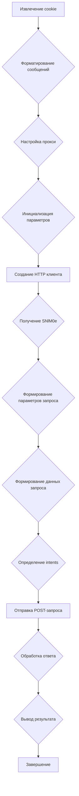

# Модуль для работы с Google Bard через неофициальный API
========================================================

Модуль содержит функции для взаимодействия с Google Bard, используя неофициальный API. Он предоставляет возможность отправлять текстовые запросы к Bard и получать ответы.

## Оглавление
- [Обзор](#обзор)
- [Подробнее](#подробнее)
- [Функции](#функции)
    - [`_create_completion`](#_create_completion)

## Обзор

Этот модуль предоставляет способ взаимодействия с моделью Google Bard.
Он использует `requests` для отправки запросов к API Bard и `browser_cookie3` для получения необходимых cookie для аутентификации.

## Подробнее

Модуль предназначен для использования в проектах, требующих интеграции с Google Bard для генерации текста.
Он обрабатывает установку прокси, формирование запросов и извлечение ответов от API Bard.

## Функции

### `_create_completion`

```python
def _create_completion(model: str, messages: list, stream: bool, **kwargs):
    """
    Создает запрос к Google Bard и возвращает ответ.

    Args:
        model (str): Модель для использования (в данном случае всегда 'Palm2').
        messages (list): Список сообщений для отправки в Bard, где каждое сообщение содержит роль ('user' или 'assistant') и контент.
        stream (bool): Флаг, указывающий, использовать ли потоковую передачу данных. В данном коде всегда `False`.
        **kwargs: Дополнительные аргументы, такие как прокси.

    Returns:
        Generator[str, None, None]: Генератор, выдающий текст ответа от Bard.

    Raises:
        Отсутствуют явные исключения, но функция может выдать исключение при сетевых проблемах или неверных данных.
    """
```

**Как работает функция**:

1.  **Извлечение cookie**: Функция пытается извлечь cookie `__Secure-1PSID` из браузера Chrome, используя библиотеку `browser_cookie3`.

2.  **Форматирование сообщений**: Входные сообщения форматируются в строку, где каждое сообщение объединяется с ролью и контентом.

3.  **Настройка прокси**: Если указан прокси, он используется для всех запросов.

4.  **Инициализация параметров**: Инициализируются параметры `snlm0e`, `conversation_id`, `response_id` и `choice_id`.

5.  **Создание HTTP клиента**: Создается сессия `requests.Session()` и устанавливаются заголовки, включая cookie.

6.  **Получение `SNlM0e`**: Если `snlm0e` не определен, он извлекается из HTML главной страницы Bard.

7.  **Формирование параметров запроса**: Формируются параметры запроса, включая случайный `_reqid`.

8.  **Формирование данных запроса**: Формируются данные запроса, включая отформатированный запрос (`prompt`).

9.  **Определение intents**: Определяются intents для запроса.

10. **Отправка запроса**: Отправляется POST-запрос к API Bard.

11. **Обработка ответа**: Ответ разделяется на строки, извлекается JSON и возвращается текст ответа.

12. **Обработка ошибок**: Если ответ пустой, возвращается строка `'error'`.



**Примеры**:

```python
# Пример вызова функции
messages = [
    {'role': 'user', 'content': 'Напиши короткое стихотворение о космосе.'}
]
#Предположим, что browser_cookie3 может получить cookie __Secure-1PSID из вашего браузера
#psid_value = "ваш_psid_cookie_из_браузера"

#with mock.patch("browser_cookie3.chrome", return_value=[Mock(name='__Secure-1PSID', value=psid_value)]):
#    for response in _create_completion(model='Palm2', messages=messages, stream=False):
#        print(response)