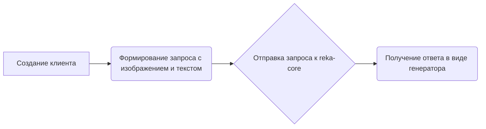

# Модуль для работы с Image Chat с Reka
=================================================

Модуль демонстрирует пример взаимодействия с моделью Reka для анализа изображений. Он включает в себя отправку изображения и текстового запроса к модели и вывод ответа.

## Обзор

Этот код показывает, как использовать клиент `g4f` для взаимодействия с моделью `Reka` (или `reka-core`) для анализа изображений. Он загружает изображение, отправляет его вместе с текстовым запросом и выводит ответ модели.

## Подробней

Этот файл демонстрирует, как отправлять изображения в модель Reka для анализа. Для работы с `chat.reka.ai` необходимо быть авторизованным и иметь cookies. Код открывает изображение (`cat.jpeg`), отправляет его вместе с запросом "What can you see in the image ?" и выводит ответ модели.

## Функции

### `create`

```python
completion = client.chat.completions.create(
    model = "reka-core",
    messages = [
        {
            "role": "user",
            "content": "What can you see in the image ?"
        }
    ],
    stream = True,
    image = open("docs/images/cat.jpeg", "rb") # open("path", "rb"), do not use .read(), etc. it must be a file object
)
```

**Назначение**: Создает запрос к модели Reka для анализа изображения и получения ответа.

**Параметры**:

-   `model` (str): Имя модели, используемой для анализа, в данном случае "reka-core".
-   `messages` (list): Список сообщений, содержащих запрос пользователя. В данном случае, один объект словаря с ключами:
    -   `role` (str): Роль отправителя сообщения, в данном случае "user".
    -   `content` (str): Текст запроса, в данном случае "What can you see in the image ?".
-   `stream` (bool): Указывает, следует ли возвращать ответ в режиме потока. В данном случае `True`.
-   `image` (file object): Открытый файл изображения для анализа. Важно передавать именно файловый объект, а не содержимое файла.

**Возвращает**:

-   `completion` (Generator): Генератор, выдающий части ответа от модели.

**Как работает функция**:

1.  Создает клиент `Client` для взаимодействия с моделью `Reka`.
2.  Формирует запрос, содержащий текст вопроса и изображение.
3.  Отправляет запрос к модели `reka-core` через метод `client.chat.completions.create()`.
4.  Получает ответ в виде генератора, который выдает части ответа модели.



**Примеры**:

```python
from g4f.client import Client
from g4f.Provider import Reka

client = Client(
    provider = Reka # Optional if you set model name to reka-core
)

completion = client.chat.completions.create(
    model = "reka-core",
    messages = [
        {
            "role": "user",
            "content": "What can you see in the image ?"
        }
    ],
    stream = True,
    image = open("docs/images/cat.jpeg", "rb") # open("path", "rb"), do not use .read(), etc. it must be a file object
)

for message in completion:
    print(message.choices[0].delta.content or "")