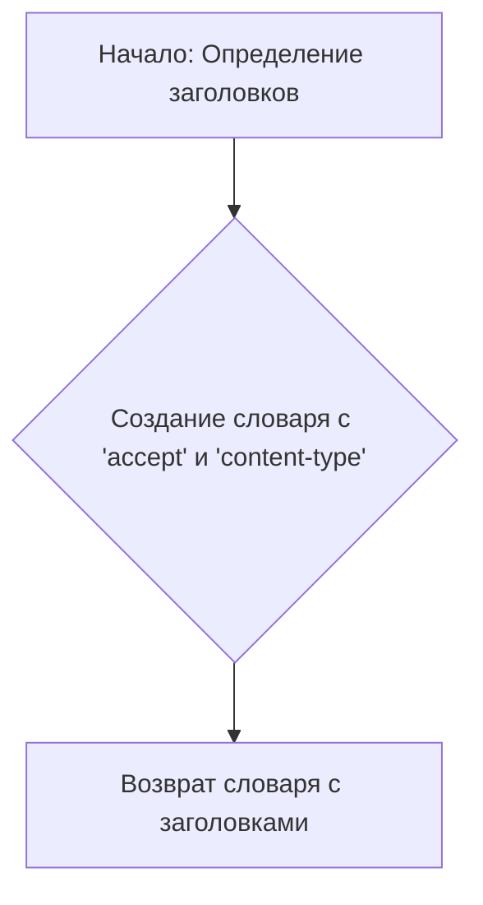
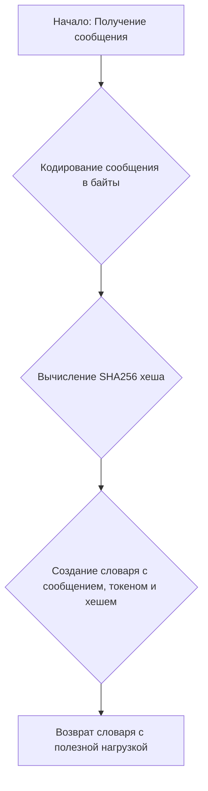

# Модуль Cromicle
## Обзор
Модуль `Cromicle` предоставляет асинхронный генератор для взаимодействия с сервисом `cromicle.top`. Он использует `aiohttp` для выполнения асинхронных HTTP-запросов и предоставляет функциональность для обмена сообщениями с моделью GPT-3.5 Turbo.

## Подробней
Модуль предназначен для асинхронного обмена сообщениями с сервисом `cromicle.top`. Он включает функции для создания заголовков и полезной нагрузки запроса, а также для обработки потоковых ответов от сервера. Используется в проекте для обеспечения взаимодействия с внешним API.

## Классы

### `Cromicle`

**Описание**: Класс `Cromicle` является асинхронным провайдером генератора. Он взаимодействует с API `cromicle.top` для получения ответов на сообщения.

**Наследует**:
- `AsyncGeneratorProvider`: Наследует функциональность асинхронного генератора.

**Атрибуты**:
- `url` (str): URL-адрес сервиса `cromicle.top`.
- `working` (bool): Указывает, работает ли сервис. По умолчанию `False`.
- `supports_gpt_35_turbo` (bool): Указывает, поддерживает ли сервис модель GPT-3.5 Turbo. По умолчанию `True`.

**Методы**:
- `create_async_generator`: Создает асинхронный генератор для обмена сообщениями с API.

#### `create_async_generator`

```python
@classmethod
async def create_async_generator(
    cls,
    model: str,
    messages: Messages,
    proxy: str = None,
    **kwargs
) -> AsyncResult:
    """
    Создает асинхронный генератор для обмена сообщениями с API cromicle.top.

    Args:
        model (str): Модель для использования.
        messages (Messages): Список сообщений для отправки.
        proxy (str, optional): Прокси-сервер для использования. По умолчанию `None`.
        **kwargs: Дополнительные аргументы.

    Returns:
        AsyncResult: Асинхронный генератор, выдающий ответы от API.

    Raises:
        Exception: Если возникает ошибка при выполнении запроса.
    """
```

**Как работает функция**:

1. **Создание сессии**:
   - Создается асинхронная сессия `ClientSession` с заголовками, полученными из функции `_create_header`.
2. **Выполнение POST-запроса**:
   - Выполняется POST-запрос к адресу `f'{cls.url}/chat` с использованием `session.post`.
   - В качестве данных передается JSON-содержимое, созданное функцией `_create_payload`, которая форматирует сообщения.
3. **Обработка ответа**:
   - Если запрос выполнен успешно, функция переходит к итерации по содержимому ответа (`response.content.iter_any()`).
   - Каждый чанк данных декодируется и передается через `yield`, что делает функцию генератором.
4. **Обработка ошибок**:
   - Если при выполнении запроса возникает ошибка, вызывается исключение `response.raise_for_status()`.

```mermaid
graph TD
    A[Начало: Создание сессии aiohttp.ClientSession] --> B{Выполнение POST-запроса к cromicle.top/chat};
    B --> C{Обработка ответа: Итерация по содержимому};
    C --> D{Декодирование чанка данных};
    D --> E[Выдача (yield) декодированного чанка];
    E --> C;
    B -- Ошибка --> F[Выброс исключения];
    C -- Конец потока --> G[Завершение];
```

**Примеры**:

```python
# Пример использования create_async_generator
messages = [{"role": "user", "content": "Hello"}]
async def run_generator():
    async for message in Cromicle.create_async_generator(model="gpt-3.5-turbo", messages=messages):
        print(message)

# Запуск асинхронной функции (требуется asyncio.run)
# asyncio.run(run_generator())
```

## Функции

### `_create_header`

```python
def _create_header() -> Dict[str, str]:
    """
    Создает словарь с заголовками для HTTP-запроса.

    Returns:
        Dict[str, str]: Словарь с заголовками 'accept' и 'content-type'.
    """
```

**Как работает функция**:

1. **Определение заголовков**:
   - Функция создает словарь, содержащий заголовки `accept` и `content-type`.
   - Заголовок `accept` указывает, что клиент принимает любой тип контента (`*/*`).
   - Заголовок `content-type` указывает, что содержимое запроса имеет тип `application/json`.
2. **Возврат заголовков**:
   - Функция возвращает созданный словарь с заголовками.



**Примеры**:

```python
# Пример использования _create_header
headers = _create_header()
print(headers)
# {'accept': '*/*', 'content-type': 'application/json'}
```

### `_create_payload`

```python
def _create_payload(message: str) -> Dict[str, str]:
    """
    Создает словарь с полезной нагрузкой (payload) для HTTP-запроса.

    Args:
        message (str): Сообщение для отправки.

    Returns:
        Dict[str, str]: Словарь с ключами 'message', 'token' и 'hash'.
    """
```

**Как работает функция**:

1. **Кодирование сообщения**:
   - Функция принимает сообщение в виде строки и кодирует его в байты с использованием кодировки UTF-8.
2. **Вычисление хеша**:
   - Вычисляется хеш SHA256 для конкатенации строки 'abc' и закодированного сообщения.
   - Результат хеширования преобразуется в шестнадцатеричный формат.
3. **Создание полезной нагрузки**:
   - Создается словарь, содержащий сообщение, токен 'abc' и вычисленный хеш.
4. **Возврат полезной нагрузки**:
   - Функция возвращает созданный словарь с полезной нагрузкой.



**Примеры**:

```python
# Пример использования _create_payload
payload = _create_payload("Test message")
print(payload)
# {'message': 'Test message', 'token': 'abc', 'hash': '...'}
```