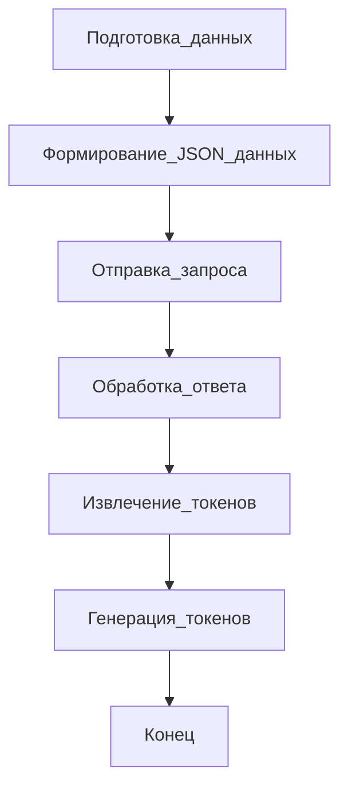

# Модуль для работы с провайдером Forefront
=================================================

Модуль содержит класс `Forefront`, который используется для взаимодействия с сервисом Forefront для генерации текста. Forefront является одним из провайдеров, предоставляющих доступ к моделям GPT, в данном случае, gpt-4.

## Обзор

Модуль `Forefront` предоставляет класс `Forefront`, который наследуется от `AbstractProvider` и реализует метод `create_completion` для создания запросов к API Forefront. Он поддерживает потоковую передачу данных и модель `gpt-35-turbo`.

## Подробнее

Этот модуль позволяет отправлять запросы к Forefront API для генерации текста на основе предоставленных сообщений. Он использует потоковую передачу данных для получения результатов по мере их генерации.
Расположение модуля в структуре проекта `hypotez` указывает на его роль как одного из провайдеров для работы с GPT-моделями, а именно, с Forefront.

## Классы

### `Forefront(AbstractProvider)`

**Описание**: Класс `Forefront` предоставляет реализацию для взаимодействия с API Forefront.

**Наследует**:
- `AbstractProvider`: Абстрактный класс, определяющий интерфейс для всех провайдеров.

**Атрибуты**:
- `url` (str): URL-адрес сервиса Forefront.
- `supports_stream` (bool): Поддержка потоковой передачи данных. Всегда `True`.
- `supports_gpt_35_turbo` (bool): Поддержка модели `gpt-35-turbo`. Всегда `True`.

**Методы**:
- `create_completion()`: Создает запрос к API Forefront и возвращает результат.

## Функции

### `create_completion(model: str, messages: list[dict[str, str]], stream: bool, **kwargs: Any) -> CreateResult`

**Назначение**: Отправляет запрос к API Forefront и возвращает результат генерации текста.

**Параметры**:
- `model` (str): Идентификатор используемой модели.
- `messages` (list[dict[str, str]]): Список сообщений, используемых для генерации текста. Каждое сообщение представляет собой словарь с ключами `role` и `content`.
- `stream` (bool): Определяет, использовать ли потоковую передачу данных.
- `**kwargs` (Any): Дополнительные параметры.

**Возвращает**:
- `CreateResult`: Генератор токенов, полученных от API.

**Вызывает исключения**:
- `requests.exceptions.HTTPError`: Возникает, если HTTP-запрос завершается с ошибкой.

**Как работает функция**:

1.  **Подготовка данных**: Функция принимает входные параметры, такие как используемая модель, список сообщений и флаг потоковой передачи данных. На основе этих данных формируется словарь `json_data`, который будет отправлен в теле POST-запроса.

2.  **Формирование JSON-данных**: Подготавливает JSON-данные для запроса, включая текст последнего сообщения, информацию о persona, модели и предыдущие сообщения.

3.  **Отправка запроса**: Отправляет POST-запрос к API Forefront (`https://streaming.tenant-forefront-default.knative.chi.coreweave.com/free-chat`) с использованием библиотеки `requests`. Указывается, что ожидается потоковая передача данных (`stream=True`).

4.  **Обработка ответа**: После успешной отправки запроса начинается обработка потока данных. Функция итерируется по строкам ответа, полученным от API.

5.  **Извлечение токенов**: Для каждой строки проверяется наличие подстроки `b"delta"`. Если она присутствует, строка считается содержащей полезные данные (токен). Извлекает дельту из JSON-ответа и возвращает её.

6.  **Генерация токенов**: Извлекает полезные данные из строки, декодирует их из формата JSON и извлекает значение по ключу `"delta"`. Это значение (токен) возвращается как часть генератора.

7.  **Обработка ошибок**: Если в процессе выполнения запроса возникает HTTP-ошибка, функция вызывает исключение `response.raise_for_status()`, которое прерывает выполнение функции и передает управление в блок обработки исключений.



**Примеры**:

Пример 1: Базовый вызов функции с потоковой передачей данных.
```python
model = "gpt-4"
messages = [{"role": "user", "content": "Hello, how are you?"}]
stream = True

result = Forefront.create_completion(model=model, messages=messages, stream=stream)
for token in result:
    print(token)
```

Пример 2: Вызов функции с несколькими сообщениями в истории.
```python
model = "gpt-4"
messages = [
    {"role": "user", "content": "Hello, how are you?"},
    {"role": "assistant", "content": "I am fine, thank you."},
    {"role": "user", "content": "What is your name?"}
]
stream = True

result = Forefront.create_completion(model=model, messages=messages, stream=stream)
for token in result:
    print(token)