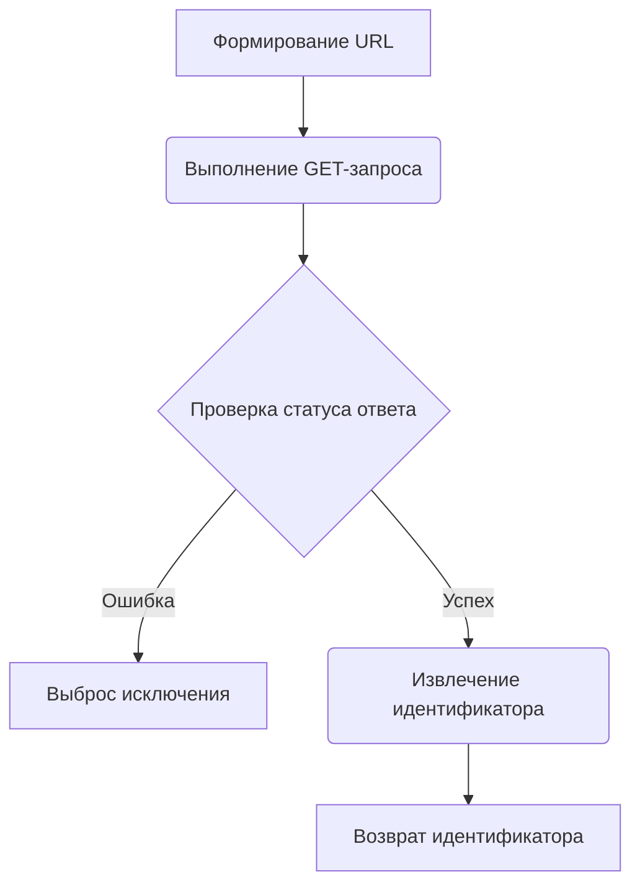
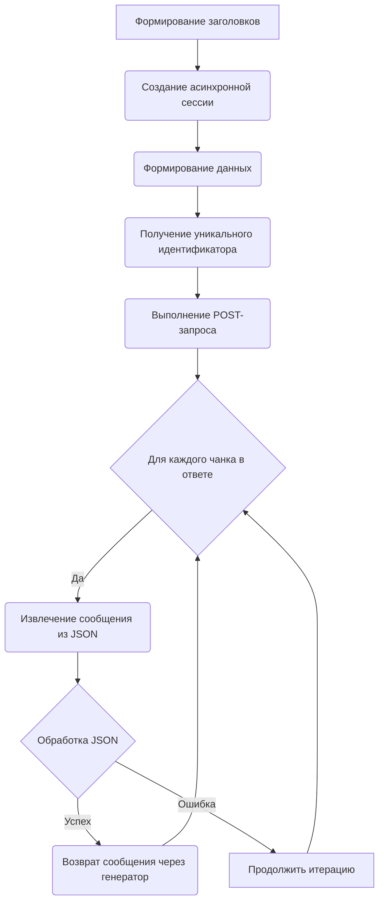

# Модуль AiChatOnline

## Обзор

Модуль `AiChatOnline` предоставляет асинхронный интерфейс для взаимодействия с сервисом AiChatOnline, используя GPT модели.
Он позволяет генерировать текст на основе предоставленных сообщений, используя асинхронные генераторы для эффективной обработки данных.

## Подробнее

Модуль предназначен для интеграции с веб-сервисом AiChatOnline для генерации ответов на основе входных сообщений. 
Он использует `aiohttp` для выполнения асинхронных HTTP-запросов. Модуль предназначен для работы в асинхронной среде, что позволяет эффективно обрабатывать запросы без блокировки основного потока выполнения.

## Классы

### `AiChatOnline`

**Описание**: Класс `AiChatOnline` предоставляет функциональность для взаимодействия с сервисом AiChatOnline.

**Наследует**:
- `AsyncGeneratorProvider`: Обеспечивает базовую структуру для асинхронных провайдеров, генерирующих данные.
- `ProviderModelMixin`: Добавляет поддержку выбора модели.

**Атрибуты**:
- `site_url` (str): URL сайта AiChatOnline.
- `url` (str): URL API AiChatOnline.
- `api_endpoint` (str): Путь к API для отправки сообщений.
- `working` (bool): Указывает, работает ли провайдер.
- `default_model` (str): Модель, используемая по умолчанию (`gpt-4o-mini`).

**Методы**:
- `grab_token`: Получает уникальный идентификатор пользователя.
- `create_async_generator`: Создает асинхронный генератор для получения ответов от AiChatOnline.

## Функции

### `grab_token`

```python
@classmethod
async def grab_token(
    cls,
    session: ClientSession,
    proxy: str
) -> str:
    """
    Получает уникальный идентификатор пользователя с сервера AiChatOnline.

    Args:
        session (ClientSession): Асинхронная HTTP-сессия для выполнения запросов.
        proxy (str): Прокси-сервер для использования при подключении.

    Returns:
        str: Уникальный идентификатор пользователя.

    Raises:
        aiohttp.ClientResponseError: Если HTTP-запрос завершается с ошибкой.
    """
```

**Назначение**: Функция `grab_token` асинхронно получает уникальный идентификатор пользователя, необходимый для аутентификации при запросах к API AiChatOnline.

**Параметры**:
- `cls`: Ссылка на класс `AiChatOnline`.
- `session` (ClientSession): Асинхронная HTTP-сессия для выполнения запросов.
- `proxy` (str): Прокси-сервер для использования при подключении.

**Возвращает**:
- `str`: Уникальный идентификатор пользователя, полученный из JSON-ответа.

**Вызывает исключения**:
- `aiohttp.ClientResponseError`: Если HTTP-запрос завершается с ошибкой.

**Как работает функция**:

1. **Формирование URL**: Формируется URL для запроса уникального идентификатора, включающий случайную строку.
2. **Выполнение GET-запроса**: Выполняется GET-запрос к API AiChatOnline с использованием предоставленной асинхронной сессии и прокси-сервера.
3. **Обработка ответа**: Проверяется статус ответа на наличие ошибок.
4. **Извлечение идентификатора**: Из JSON-ответа извлекается значение ключа `data`, которое и является уникальным идентификатором пользователя.



**Примеры**:

```python
import asyncio
from aiohttp import ClientSession

async def main():
    async with ClientSession() as session:
        token = await AiChatOnline.grab_token(session, proxy='http://proxy.example.com')
        print(f"Token: {token}")

if __name__ == "__main__":
    asyncio.run(main())
```

### `create_async_generator`

```python
@classmethod
async def create_async_generator(
    cls,
    model: str,
    messages: Messages,
    proxy: str = None,
    **kwargs
) -> AsyncResult:
    """
    Создает асинхронный генератор для получения ответов от AiChatOnline.

    Args:
        model (str): Модель для использования при генерации текста.
        messages (Messages): Список сообщений для отправки в AiChatOnline.
        proxy (str, optional): Прокси-сервер для использования при подключении. Defaults to None.
        **kwargs: Дополнительные параметры.

    Returns:
        AsyncResult: Асинхронный генератор, выдающий ответы от AiChatOnline.

    Raises:
        aiohttp.ClientResponseError: Если HTTP-запрос завершается с ошибкой.
    """
```

**Назначение**: Функция `create_async_generator` создает и возвращает асинхронный генератор, который отправляет сообщения в AiChatOnline и возвращает сгенерированные ответы.

**Параметры**:
- `cls`: Ссылка на класс `AiChatOnline`.
- `model` (str): Модель для использования при генерации текста.
- `messages` (Messages): Список сообщений для отправки в AiChatOnline.
- `proxy` (str, optional): Прокси-сервер для использования при подключении. По умолчанию `None`.
- `**kwargs`: Дополнительные параметры.

**Возвращает**:
- `AsyncResult`: Асинхронный генератор, выдающий ответы от AiChatOnline.

**Вызывает исключения**:
- `aiohttp.ClientResponseError`: Если HTTP-запрос завершается с ошибкой.

**Как работает функция**:

1. **Формирование заголовков**: Создаются HTTP-заголовки, включающие User-Agent, Referer, Content-Type и другие необходимые параметры.
2. **Создание асинхронной сессии**: Создается асинхронная HTTP-сессия с заданными заголовками.
3. **Формирование данных**: Формируются данные запроса, включающие `conversationId` (случайная строка) и `prompt` (отформатированные сообщения).
4. **Получение уникального идентификатора**: Получается уникальный идентификатор пользователя с помощью `grab_token`.
5. **Выполнение POST-запроса**: Выполняется POST-запрос к API AiChatOnline с использованием предоставленных заголовков, данных и прокси-сервера.
6. **Обработка ответа**: Для каждого чанка (фрагмента) в ответе:
   - Извлекается сообщение из JSON-ответа.
   - Возвращается сообщение через генератор.
   - В случае ошибки при обработке JSON, итерация продолжается.



**Примеры**:

```python
import asyncio
from aiohttp import ClientSession

async def main():
    messages = [{"role": "user", "content": "Hello, how are you?"}]
    async for message in AiChatOnline.create_async_generator(model='gpt-4o-mini', messages=messages, proxy='http://proxy.example.com'):
        print(message)

if __name__ == "__main__":
    asyncio.run(main())