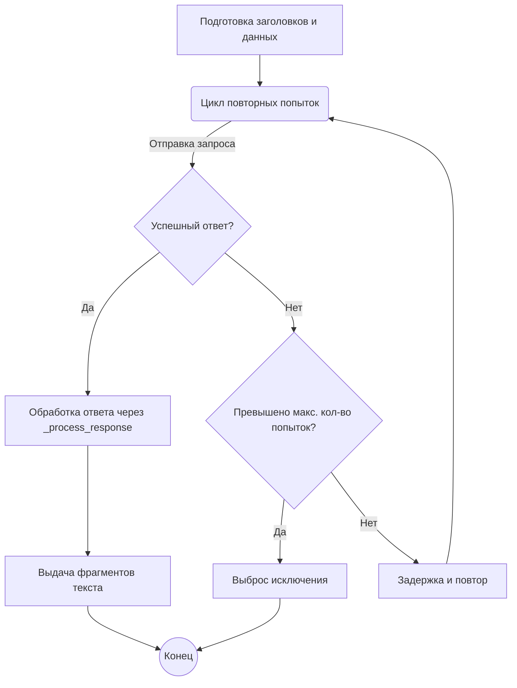

# Модуль FreeNetfly

## Обзор

Модуль `FreeNetfly` предоставляет асинхронный интерфейс для взаимодействия с API FreeNetfly. Он позволяет генерировать текст на основе предоставленных сообщений, используя модели, такие как `gpt-3.5-turbo` и `gpt-4`. Модуль поддерживает прокси и повторные попытки при сбоях соединения.

## Подробней

Модуль `FreeNetfly` является частью проекта `hypotez` и предназначен для работы с сервисом FreeNetfly. Он предоставляет асинхронные функции для отправки запросов к API и обработки ответов. Основной функциональностью модуля является генерация текста на основе заданных входных данных (`messages`) с использованием различных моделей (`gpt-3.5-turbo`, `gpt-4`). Модуль также обрабатывает возможные ошибки соединения и предоставляет механизм повторных попыток для обеспечения стабильности работы.

## Классы

### `FreeNetfly`

**Описание**: Класс `FreeNetfly` является асинхронным провайдером, предназначенным для взаимодействия с API FreeNetfly. Он реализует методы для создания асинхронных генераторов, отправки запросов и обработки ответов.

**Наследует**:
- `AsyncGeneratorProvider`: Обеспечивает базовую функциональность для асинхронных генераторов.
- `ProviderModelMixin`: Предоставляет миксин для работы с моделями.

**Атрибуты**:
- `url` (str): URL сервиса FreeNetfly (`https://free.netfly.top`).
- `api_endpoint` (str): Endpoint API для запросов (`/api/openai/v1/chat/completions`).
- `working` (bool): Флаг, указывающий на работоспособность провайдера (False).
- `default_model` (str): Модель, используемая по умолчанию (`gpt-3.5-turbo`).
- `models` (List[str]): Список поддерживаемых моделей (`gpt-3.5-turbo`, `gpt-4`).

**Методы**:
- `create_async_generator`: Создает асинхронный генератор для получения ответов от API.
- `_process_response`: Обрабатывает ответ от API и извлекает контент.

## Функции

### `create_async_generator`

```python
@classmethod
async def create_async_generator(
    cls,
    model: str,
    messages: Messages,
    proxy: str = None,
    **kwargs
) -> AsyncResult:
    """
    Создает асинхронный генератор для получения ответов от API FreeNetfly.

    Args:
        model (str): Название модели для использования (например, `gpt-3.5-turbo`).
        messages (Messages): Список сообщений для отправки в API.
        proxy (str, optional): URL прокси-сервера. По умолчанию `None`.
        **kwargs: Дополнительные аргументы.

    Returns:
        AsyncResult: Асинхронный генератор, выдающий текстовые фрагменты ответа.

    Raises:
        ClientError: Если происходит ошибка на стороне клиента при выполнении запроса.
        asyncio.TimeoutError: Если время ожидания ответа превышено.
    """
    ...
```

**Назначение**: Создает асинхронный генератор для взаимодействия с API FreeNetfly. Генератор отправляет сообщения, получает ответы и выдает их в виде фрагментов текста.

**Параметры**:
- `model` (str): Название модели для использования (например, `gpt-3.5-turbo`).
- `messages` (Messages): Список сообщений для отправки в API.
- `proxy` (str, optional): URL прокси-сервера. По умолчанию `None`.
- `**kwargs`: Дополнительные аргументы.

**Возвращает**:
- `AsyncResult`: Асинхронный генератор, выдающий текстовые фрагменты ответа.

**Вызывает исключения**:
- `ClientError`: Если происходит ошибка на стороне клиента при выполнении запроса.
- `asyncio.TimeoutError`: Если время ожидания ответа превышено.

**Как работает функция**:
1. **Подготовка заголовков**: Функция задает необходимые HTTP-заголовки для запроса, включая `accept`, `content-type`, `user-agent` и другие.
2. **Формирование данных**: Подготавливает данные для отправки в формате JSON, включая сообщения, модель, температуру и другие параметры.
3. **Повторные попытки**: Функция выполняет до 5 повторных попыток отправки запроса с экспоненциальной задержкой между ними. Это необходимо для обработки временных сбоев сети или сервера.
4. **Отправка запроса**: Использует `aiohttp.ClientSession` для отправки POST-запроса к API FreeNetfly.
5. **Обработка ответа**: Вызывает метод `_process_response` для обработки полученного ответа и выдачи фрагментов текста через генератор.



**Примеры**:
```python
# Пример использования create_async_generator
import asyncio
from typing import List, Dict, AsyncGenerator, Optional

async def main():
    model = "gpt-3.5-turbo"
    messages: List[Dict[str, str]] = [{"role": "user", "content": "Привет!"}]
    proxy: Optional[str] = None

    async def consume_generator(generator: AsyncGenerator[str, None]):
        async for chunk in generator:
            print(chunk, end="")

    generator = await FreeNetfly.create_async_generator(model=model, messages=messages, proxy=proxy)
    if generator:
        await consume_generator(generator)

if __name__ == "__main__":
    asyncio.run(main())
```

### `_process_response`

```python
@classmethod
async def _process_response(cls, response) -> AsyncGenerator[str, None]:
    """
    Обрабатывает ответ от API и извлекает контент из потока данных.

    Args:
        response: Объект ответа от API.

    Returns:
        AsyncGenerator[str, None]: Асинхронный генератор, выдающий текстовые фрагменты контента.
    """
    ...
```

**Назначение**: Обрабатывает ответ от API FreeNetfly, извлекает данные из потока и генерирует текстовые фрагменты контента.

**Параметры**:
- `response`: Объект ответа от API.

**Возвращает**:
- `AsyncGenerator[str, None]`: Асинхронный генератор, выдающий текстовые фрагменты контента.

**Как работает функция**:
1. **Инициализация буфера**: Функция инициализирует пустой буфер для хранения данных ответа.
2. **Чтение данных**: Асинхронно читает данные из ответа по строкам.
3. **Обработка строк**: Накапливает строки в буфере до тех пор, пока не встретит окончание блока (`\n\n`).
4. **Извлечение контента**: Разделяет буфер на подстроки и извлекает контент из JSON-структуры, если подстрока начинается с `data: `.
5. **Генерация фрагментов**: Выдает извлеченные фрагменты контента через генератор.
6. **Обработка остатка**: После завершения чтения из ответа, обрабатывает оставшиеся данные в буфере.

```mermaid
graph TD
    A[Инициализация буфера] --> B(Чтение данных из ответа);
    B --> C{Конец блока данных (\\n\\n)?};
    C -- Да --> D[Разделение буфера на подстроки];
    C -- Нет --> B;
    D --> E(Цикл по подстрокам);
    E -- data: --> F[Извлечение JSON и контента];
    F --> G[Выдача фрагмента контента];
    E -- Нет --> E;
    G --> E;
    E --> H{Обработка завершена?};
    H -- Да --> I[Обработка остатка в буфере];
    H -- Нет --> E;
    I --> J((Конец));
```

**Примеры**:
```python
# Пример использования _process_response
import asyncio
from aiohttp import ClientResponse
from typing import AsyncGenerator

async def mock_response(content: str) -> ClientResponse:
    """Создает mock-объект ClientResponse."""
    class MockStream:
        def __aiter__(self):
            self._data = content.splitlines()
            return self

        async def __anext__(self):
            if self._data:
                return self._data.pop(0).encode('utf-8')
            else:
                raise StopAsyncIteration

    response = ClientResponse(None, None)
    response.content = MockStream()
    return response

async def main():
    content = """data: {"choices": [{"delta": {"content": "Привет"}}]}\n\ndata: [DONE]\n\n"""
    response = await mock_response(content)
    
    async def consume_generator(generator: AsyncGenerator[str, None]):
        async for chunk in generator:
            print(chunk, end="")

    generator = FreeNetfly._process_response(response)
    await consume_generator(generator)

if __name__ == "__main__":
    asyncio.run(main())