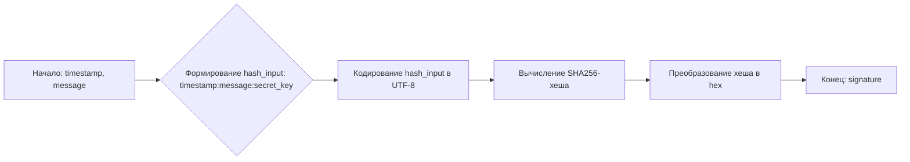

# Модуль GPROChat

## Обзор

Модуль `GPROChat` предназначен для взаимодействия с сервисом GPROChat, предоставляющим доступ к различным моделям, включая `gemini-1.5-pro`. Он реализует асинхронный генератор для обработки запросов к API GPROChat, обеспечивая потоковую передачу ответов.

## Подробней

Модуль использует `aiohttp` для выполнения асинхронных HTTP-запросов к API GPROChat. Он поддерживает потоковую передачу данных, что позволяет обрабатывать большие объемы информации более эффективно. Также, реализована функция для генерации подписи запроса, необходимой для аутентификации.

## Классы

### `GPROChat`

**Описание**: Класс `GPROChat` является провайдером для работы с GPROChat API. Он наследует функциональность от `AsyncGeneratorProvider` и `ProviderModelMixin`, что позволяет ему использовать асинхронные генераторы и предоставлять информацию о поддерживаемых моделях.

**Наследует**:
- `AsyncGeneratorProvider`: Обеспечивает асинхронную генерацию данных.
- `ProviderModelMixin`: Предоставляет функциональность для работы с моделями.

**Аттрибуты**:
- `url` (str): URL сервиса GPROChat.
- `api_endpoint` (str): URL API для генерации ответов.
- `working` (bool): Флаг, указывающий на работоспособность провайдера.
- `supports_stream` (bool): Флаг, указывающий на поддержку потоковой передачи данных.
- `supports_message_history` (bool): Флаг, указывающий на поддержку истории сообщений.
- `default_model` (str): Модель, используемая по умолчанию (`gemini-1.5-pro`).

**Методы**:
- `generate_signature(timestamp: int, message: str) -> str`: Генерирует подпись для запроса к API.
- `create_async_generator(model: str, messages: Messages, proxy: str = None, **kwargs) -> AsyncResult`: Создает асинхронный генератор для получения ответов от API.

## Функции

### `generate_signature`

```python
@staticmethod
def generate_signature(timestamp: int, message: str) -> str:
    """Генерирует подпись для запроса к API GPROChat.

    Args:
        timestamp (int): Временная метка запроса.
        message (str): Текст сообщения.

    Returns:
        str: Подпись запроса в виде SHA256-хеша.
    """
```

**Назначение**: Функция `generate_signature` генерирует подпись для запроса к API GPROChat. Подпись используется для аутентификации запроса и предотвращения несанкционированного доступа.

**Параметры**:
- `timestamp` (int): Временная метка запроса в миллисекундах.
- `message` (str): Текст сообщения, которое будет отправлено в запросе.

**Возвращает**:
- `str`: Подпись запроса в виде SHA256-хеша.

**Как работает функция**:
1. Функция принимает временную метку (`timestamp`) и сообщение (`message`) в качестве входных данных.
2. Определяется секретный ключ (`secret_key`).
3. Формируется строка `hash_input` путем конкатенации временной метки, сообщения и секретного ключа через двоеточие.
4. Строка `hash_input` кодируется в формат UTF-8.
5. Вычисляется SHA256-хеш от закодированной строки.
6. Хеш преобразуется в шестнадцатеричный формат и возвращается в качестве подписи.



**Примеры**:

```python
timestamp = int(time.time() * 1000)
message = "Hello, GPROChat!"
signature = GPROChat.generate_signature(timestamp, message)
print(f"Signature: {signature}")
```

### `create_async_generator`

```python
@classmethod
async def create_async_generator(
    cls,
    model: str,
    messages: Messages,
    proxy: str = None,
    **kwargs
) -> AsyncResult:
    """Создает асинхронный генератор для получения ответов от API GPROChat.

    Args:
        model (str): Название используемой модели.
        messages (Messages): Список сообщений для отправки.
        proxy (str, optional): URL прокси-сервера. По умолчанию `None`.
        **kwargs: Дополнительные параметры.

    Returns:
        AsyncResult: Асинхронный генератор, возвращающий части ответа от API.
    """
```

**Назначение**: Функция `create_async_generator` создает асинхронный генератор, который отправляет запросы к API GPROChat и возвращает ответы в потоковом режиме.

**Параметры**:
- `model` (str): Название используемой модели.
- `messages` (Messages): Список сообщений для отправки.
- `proxy` (str, optional): URL прокси-сервера. По умолчанию `None`.
- `**kwargs`: Дополнительные параметры.

**Возвращает**:
- `AsyncResult`: Асинхронный генератор, возвращающий части ответа от API.

**Как работает функция**:
1. Функция принимает название модели (`model`), список сообщений (`messages`) и опциональный URL прокси-сервера (`proxy`).
2. Получает модель, используя метод `cls.get_model(model)`.
3. Генерирует временную метку (`timestamp`).
4. Форматирует сообщения (`prompt`) для отправки в запросе.
5. Генерирует подпись (`sign`) для запроса, используя метод `cls.generate_signature(timestamp, prompt)`.
6. Определяет заголовки (`headers`) для HTTP-запроса.
7. Формирует данные (`data`) для отправки в формате JSON.
8. Создает асинхронную сессию с использованием `aiohttp.ClientSession`.
9. Отправляет POST-запрос к API GPROChat с использованием асинхронной сессии.
10. Итерирует по частям ответа (`chunk`) и декодирует их.
11. Возвращает декодированные части ответа через генератор.

```mermaid
graph LR
A[Начало: model, messages, proxy] --> B{Получение модели: cls.get_model(model)}
B --> C[Генерация timestamp]
C --> D[Форматирование prompt: format_prompt(messages)]
D --> E[Генерация подписи: cls.generate_signature(timestamp, prompt)]
E --> F[Определение headers]
F --> G[Формирование data]
G --> H{Создание ClientSession(headers)}
H --> I{POST-запрос к API: cls.api_endpoint, data, proxy}
I --> J{Итерация по chunk в response.content.iter_any()}
J -- Да --> K[Декодирование chunk]
K --> L[yield chunk.decode()]
J -- Нет --> M[Конец: AsyncResult]
```

**Примеры**:

```python
messages = [{"role": "user", "content": "Hello, GPROChat!"}]
async def main():
    async for chunk in GPROChat.create_async_generator(model="gemini-1.5-pro", messages=messages):
        print(chunk, end="")

import asyncio
asyncio.run(main())