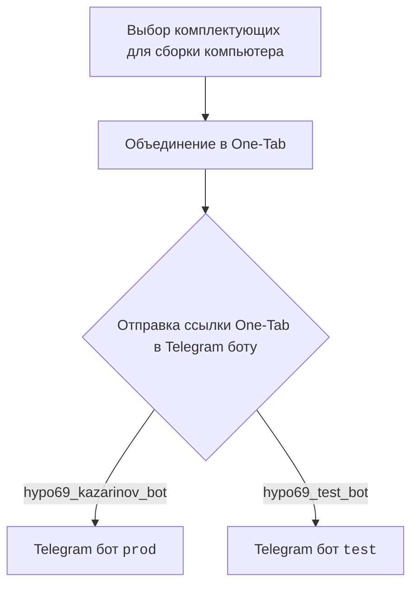
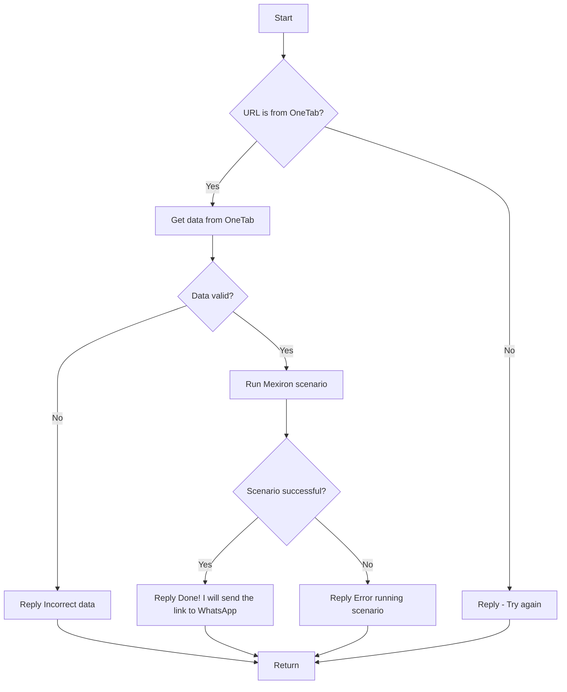

# Документация для модуля `src.endpoints.kazarinov`

## Обзор

Документация для модуля `src.endpoints.kazarinov`, который отвечает за создание PDF-документов Mexiron. 
Модуль включает в себя описание взаимодействия клиентской части (Kazarinov) с Telegram ботами `prod` и `test`, а также схемы работы с данными One-Tab.

## Оглавление

- [Обзор](#обзор)
- [Подробнее](#подробнее)
- [`KazarinovTelegramBot`](#kazarinovtelegrambot)
- [`BotHandler`](#bothandler)
- [Client side (Kazarinov)](#client-side-kazarinov)
- [Code side](#code-side)
- [Next](#next)

## Подробнее

Модуль предоставляет функциональность для работы с Telegram ботами и сценариями Mexiron, 
включая обработку данных из One-Tab и отправку сгенерированных ссылок в WhatsApp.

## `KazarinovTelegramBot`

Ссылки на ресурсы:
- https://one-tab.co.il
- https://morlevi.co.il
- https://grandavance.co.il
- https://ivory.co.il
- https://ksp.co.il

## `BotHandler`

Описание обработки ботов.

## Client side (Kazarinov)

### Схема взаимодействия клиентской части с Telegram ботами

## Code side

### Схема обработки данных и выполнения сценария

## Next

### Ссылки на связанные модули

- [Kazarinov bot](https://github.com/hypo69/hypo/blob/master/src/endpoints/kazarinov/kazarinov_bot.md)
- [Scenario Execution](https://github.com/hypo69/hypo/blob/master/src/endpoints/kazarinov/scenarios/README.MD)