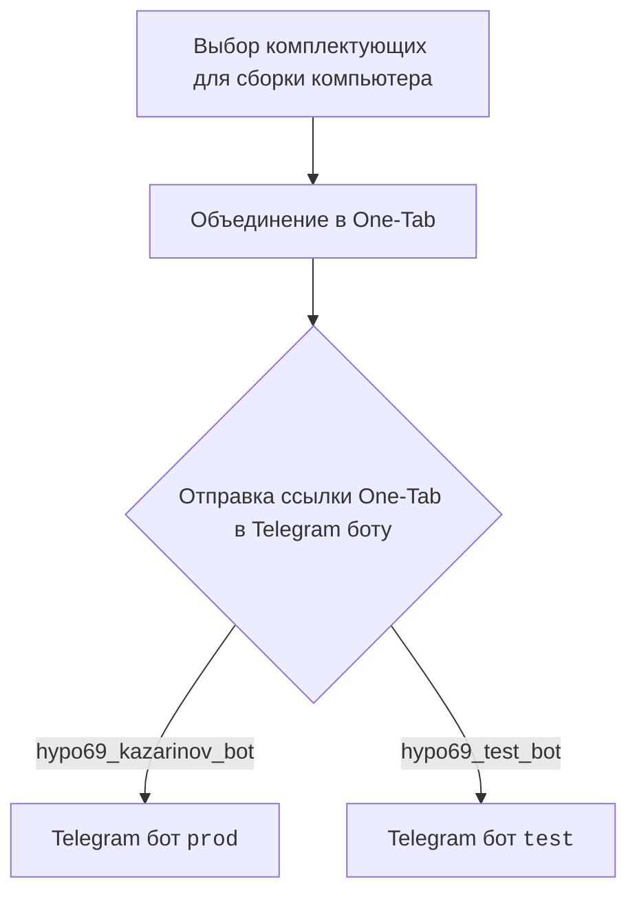
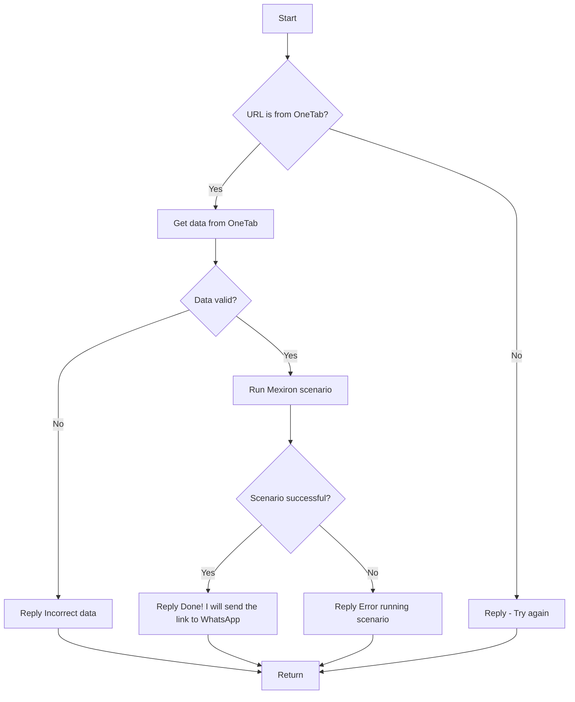

# Документация для модуля `src.endpoints.kazarinov`

## Обзор

Документация представляет собой обзор работы Telegram-ботов `KazarinovTelegramBot`, `BotHandler`, а также описание логики взаимодействия между клиентской и серверной частями.

## Подробней

Данный код описывает взаимодействие пользователя с Telegram-ботом для выбора комплектующих компьютера, объединения их в One-Tab и отправки ссылки боту для дальнейшей обработки и выполнения сценария Mexiron.

## Классы

В данном файле отсутствуют классы. Описаны только общая схема работы ботов и последовательность действий.

## Функции

В данном файле отсутствуют функции. Описаны только общая схема работы ботов и последовательность действий.

## Схема взаимодействия

### Клиентская часть (Kazarinov)

**Описание**: Пользователь выбирает комплектующие для сборки компьютера, объединяет их в One-Tab и отправляет ссылку Telegram-боту (`prod` или `test`).

### Серверная часть (Code side)

**Описание**: Схема описывает логику обработки URL, полученного от пользователя, проверку данных и запуск сценария Mexiron.

**Как работает схема**:

1.  **Start**: Начало процесса.
2.  **URL is from OneTab?**: Проверка, является ли URL ссылкой OneTab.
    *   Если **Да**: Переход к шагу **Get data from OneTab**.
    *   Если **Нет**: Ответ пользователю с просьбой повторить попытку (**Reply - Try again**).
3.  **Get data from OneTab**: Получение данных из OneTab.
4.  **Data valid?**: Проверка валидности полученных данных.
    *   Если **Нет**: Ответ пользователю о некорректных данных (**Reply Incorrect data**).
    *   Если **Да**: Запуск сценария Mexiron (**Run Mexiron scenario**).
5.  **Run Mexiron scenario**: Запуск сценария Mexiron.
6.  **Scenario successful?**: Проверка успешности выполнения сценария.
    *   Если **Да**: Ответ пользователю об успешном выполнении и отправке ссылки в WhatsApp (**Reply Done! I will send the link to WhatsApp**).
    *   Если **Нет**: Ответ пользователю об ошибке выполнения сценария (**Reply Error running scenario**).
7.  **Return**: Завершение процесса.

## Ссылки

-   [Kazarinov bot](https://github.com/hypo69/hypo/blob/master/src/endpoints/kazarinov/kazarinov_bot.md)
-   [Scenario Execution](https://github.com/hypo69/hypo/blob/master/src/endpoints/kazarinov/scenarios/README.MD)