# Документация для модуля `src.endpoints.kazarinov`

## Обзор

Документация предназначена для разработчиков, работающих с модулем `src.endpoints.kazarinov` в проекте `hypotez`. Этот модуль включает в себя функциональность для работы с Telegram-ботами, в частности, ботами `KazarinovTelegramBot`, и обработку сценариев, связанных с формированием PDF-документов через Mexiron.

## Подробней

Модуль `src.endpoints.kazarinov` используется для автоматизации процесса сборки компьютера путем объединения комплектующих в One-Tab, отправки ссылки в Telegram-бота (`prod` или `test`), проверки данных и запуска сценария Mexiron для генерации PDF-документа.

Взаимодействие между клиентской и серверной сторонами описано в диаграмме Mermaid. Сначала клиент выбирает комплектующие для сборки компьютера и объединяет их в One-Tab. Затем ссылка One-Tab отправляется в Telegram-бота. В зависимости от выбранного бота (`hypo69_kazarinov_bot` для `prod` или `hypo69_test_bot` для `test`), запрос обрабатывается соответствующим ботом.

На стороне кода происходит следующее:

1.  Проверяется, является ли URL ссылкой One-Tab.
2.  Если да, извлекаются данные из One-Tab.
3.  Проверяется валидность данных.
4.  Если данные валидны, запускается сценарий Mexiron.
5.  В зависимости от успешности выполнения сценария, бот отправляет сообщение об успехе или ошибке и ссылку для скачивания PDF через WhatsApp.

## Содержание

1.  [KazarinovTelegramBot](#kazarinovtelegrambot)
2.  [BotHandler](#bothandler)
3.  [Client Side](#client-side-kazarinov)
4.  [Code Side](#code-side)
5.  [Next](#next)

## KazarinovTelegramBot

Описание функциональности и назначения класса `KazarinovTelegramBot`.

## BotHandler

Описание функциональности и назначения класса `BotHandler`.

## Client Side (Kazarinov)

### Принцип работы

Клиент выбирает комплектующие для сборки компьютера, объединяет их в One-Tab и отправляет ссылку в Telegram-бота (`prod` или `test`).

### Схема взаимодействия

## Code Side

### Принцип работы

Бот обрабатывает URL, проверяет его валидность и запускает сценарий Mexiron для генерации PDF-документа.

### Схема работы

```mermaid
flowchart TD
    A[Start] --> B{URL is from OneTab?}
    B -->|Yes| C[Get data from OneTab]
    B -->|No| D[Reply - Try again]
    C --> E{Data valid?}
    E -->|No| F[Reply Incorrect data]
    E -->|Yes| G[Run Mexiron scenario]
    G --> H{Scenario successful?}
    H -->|Yes| I[Reply Done! I will send the link to WhatsApp]
    H -->|No| J[Reply Error running scenario]
    F --> K[Return]
    I --> K[Return]
    D --> K[Return]
    J --> K[Return]
```

**Как работает функция**:

1.  **Start**: Начало процесса.
2.  **URL is from OneTab?**: Проверка, является ли предоставленный URL ссылкой OneTab.
    *   Если **Yes**: Переход к извлечению данных из OneTab.
    *   Если **No**: Бот отправляет сообщение с просьбой попробовать еще раз.
3.  **Get data from OneTab**: Извлечение данных из OneTab по предоставленной ссылке.
4.  **Data valid?**: Проверка валидности полученных данных.
    *   Если **No**: Бот отправляет сообщение о некорректных данных.
    *   Если **Yes**: Запуск сценария Mexiron.
5.  **Run Mexiron scenario**: Запуск сценария Mexiron для генерации PDF-документа.
6.  **Scenario successful?**: Проверка успешности выполнения сценария.
    *   Если **Yes**: Бот отправляет сообщение об успешном завершении и ссылку для скачивания PDF через WhatsApp.
    *   Если **No**: Бот отправляет сообщение об ошибке выполнения сценария.
7.  **Reply Incorrect data**: Отправка сообщения о некорректных данных.
8.  **Reply Done! I will send the link to WhatsApp**: Отправка сообщения об успешном завершении и ссылки.
9.  **Reply - Try again**: Отправка сообщения с просьбой повторить попытку.
10. **Reply Error running scenario**: Отправка сообщения об ошибке выполнения сценария.
11. **Return**: Завершение процесса.

## Next

-   [Kazarinov bot](https://github.com/hypo69/hypo/blob/master/src/endpoints/kazarinov/kazarinov_bot.md)
-   [Scenario Execution](https://github.com/hypo69/hypo/blob/master/src/endpoints/kazarinov/scenarios/README.MD)