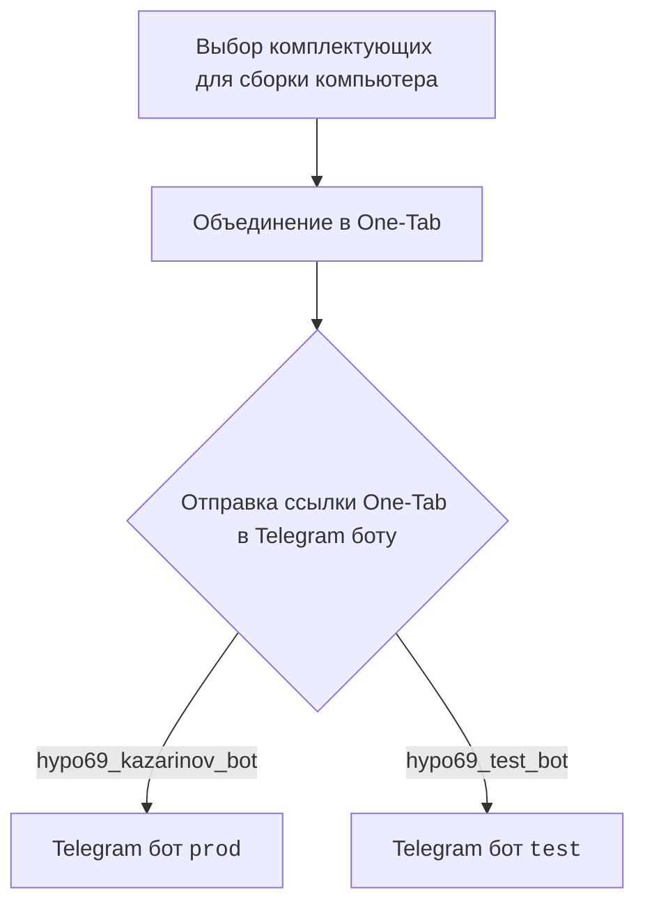
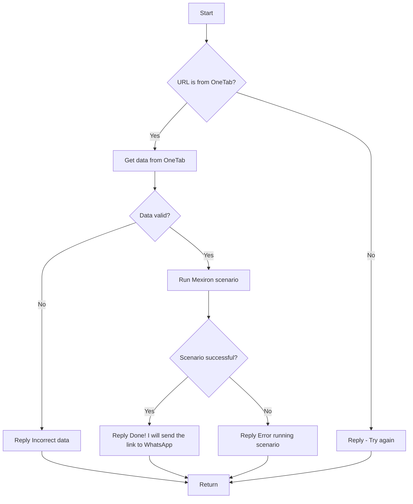

# Документация модуля src.endpoints.kazarinov

## Обзор

Данный модуль предназначен для создания прайс-листа для компании Казаринов. Он включает в себя функциональность для работы с Telegram ботами и обработки данных, полученных из One-Tab.

## Подробней

Модуль является частью проекта `hypotez` и отвечает за автоматизацию процесса создания прайс-листов на основе данных о комплектующих компьютера, собранных пользователем. Пользователь выбирает комплектующие и объединяет их в One-Tab, после чего отправляет ссылку на эту вкладку Telegram боту. Бот, в свою очередь, обрабатывает данные и запускает сценарий создания прайс-листа.

## Структура

### KazarinovTelegramBot

- Ссылки на ресурсы:
    - https://one-tab.co.il
    - https://morlevi.co.il
    - https://grandavance.co.il
    - https://ivory.co.il
    - https://ksp.co.il

### BotHandler

### Взаимодействие на стороне клиента

Пользователь выбирает комплектующие для сборки компьютера, объединяет их в One-Tab и отправляет ссылку Telegram боту (`prod` или `test`).

### Взаимодействие на стороне кода

- `kazarinov_bot.handle_message()` -> `kazarinov.scenarios.run_scenario()`:

**Как работает сценарий:**

1.  **Start (A)**: Начало обработки сообщения.
2.  **URL is from OneTab? (B)**: Проверка, является ли URL ссылкой на One-Tab.
    -   Если **Да**, то переход к шагу **Get data from OneTab (C)**.
    -   Если **Нет**, то переход к шагу **Reply - Try again (D)** и возврат.
3.  **Get data from OneTab (C)**: Получение данных из One-Tab.
4.  **Data valid? (E)**: Проверка валидности полученных данных.
    -   Если **Нет**, то переход к шагу **Reply Incorrect data (F)** и возврат.
    -   Если **Да**, то переход к шагу **Run Mexiron scenario (G)**.
5.  **Run Mexiron scenario (G)**: Запуск сценария Mexiron.
6.  **Scenario successful? (H)**: Проверка успешности выполнения сценария.
    -   Если **Да**, то переход к шагу **Reply Done! I will send the link to WhatsApp (I)** и возврат.
    -   Если **Нет**, то переход к шагу **Reply Error running scenario (J)** и возврат.

## Дальнейшие шаги

-   [Казаринов бот](https://github.com/hypo69/hypo/blob/master/src/endpoints/kazarinov/kazarinov_bot.ru.md)
-   [Исполнение сценария](https://github.com/hypo69/hypo/blob/master/src/endpoints/kazarinov/scenarios/readme.ru.md)