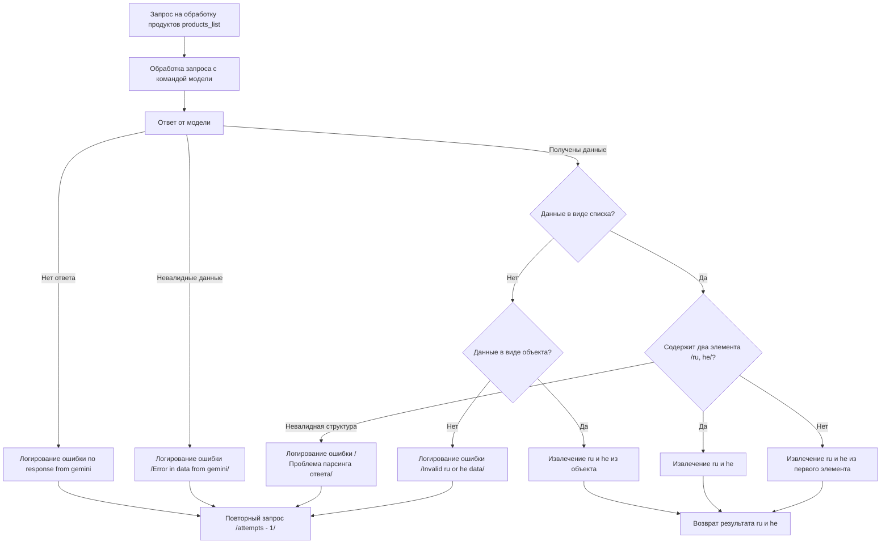

# Документация модуля обработки продуктов

## Обзор

Модуль обрабатывает запросы на перевод списка продуктов с использованием модели. Он включает в себя логику обработки ответов от модели, проверки данных и извлечения необходимых результатов. Основные этапы включают проверку на отсутствие ответа, валидность данных, форматирование полученных данных в список и извлечение перевода на русском и иврите.

## Оглавление

- [Обзор](#обзор)
- [Логика работы](#логика-работы)
- [Диаграмма состояний](#диаграмма-состояний)

## Логика работы

Модуль работает следующим образом:

1.  **Принимает запрос:** Получает список продуктов для перевода.
2.  **Отправляет запрос модели:** Отправляет запрос на перевод списка продуктов с использованием выбранной модели.
3.  **Получает ответ от модели:** Получает ответ от модели в виде данных.
4.  **Обрабатывает ответ:**
    *   Проверяет, был ли получен ответ от модели. Если нет, то логирует ошибку и повторяет запрос.
    *   Проверяет валидность данных ответа. Если данные невалидны, то логирует ошибку и повторяет запрос.
    *   Проверяет структуру данных и извлекает перевод на русский и иврит.
    *   Возвращает результат.
5.  **Возвращает результат:** Возвращает перевод на русский и иврит для каждого продукта.

## Диаграмма состояний

