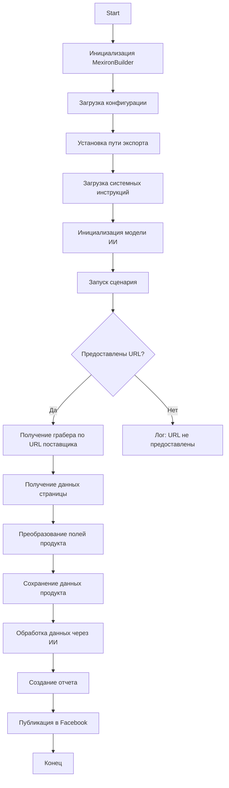

# Документация модуля сценариев для создания "мехирона" Сергея Казаринова

## Обзор

Этот скрипт, расположенный в директории `hypotez/src/endpoints/kazarinov/scenarios`, предназначен для автоматизации процесса создания "мехирона" для Сергея Казаринова. Скрипт извлекает, анализирует и обрабатывает данные о продуктах от различных поставщиков, подготавливает данные, обрабатывает их с помощью ИИ и интегрируется с Facebook для публикации продуктов.

## Основные функции

1. **Извлечение и анализ данных**: Извлекает и анализирует данные о продуктах от различных поставщиков.
2. **Обработка данных с помощью ИИ**: Обрабатывает извлеченные данные с помощью модели Google Generative AI.
3. **Хранение данных**: Сохраняет обработанные данные в файлы.
4. **Генерация отчетов**: Генерирует отчеты в формате HTML и PDF на основе обработанных данных.
5. **Публикация в Facebook**: Публикует обработанные данные в Facebook.

## Схема работы модуля



## Описание схемы

1. **Start**: Начало выполнения скрипта.
2. **InitMexironBuilder**: Инициализация класса `MexironBuilder`.
3. **LoadConfig**: Загрузка конфигурации из JSON-файла.
4. **SetExportPath**: Установка пути для экспорта данных.
5. **LoadSystemInstruction**: Загрузка системных инструкций для модели ИИ.
6. **InitModel**: Инициализация модели Google Generative AI.
7. **RunScenario**: Выполнение основного сценария.
8. **CheckURLs**: Проверка, предоставлены ли URL для анализа.
9. **GetGraber**: Получение соответствующего грабера для URL поставщика.
10. **GrabPage**: Извлечение данных страницы с помощью грабера.
11. **ConvertFields**: Преобразование полей продукта в словарь.
12. **SaveData**: Сохранение данных продукта в файл.
13. **ProcessAI**: Обработка данных продукта с помощью модели ИИ.
14. **CreateReport**: Создание отчетов в формате HTML и PDF на основе обработанных данных.
15. **PostFacebook**: Публикация обработанных данных в Facebook.
16. **End**: Конец выполнения скрипта.

## Классы

### `MexironBuilder`

**Описание**:
Класс `MexironBuilder` предназначен для автоматизации процесса создания "мехирона", включающего извлечение данных о продуктах, их обработку с использованием ИИ и последующую публикацию в Facebook.

**Как работает класс**:
Класс инициализируется с драйвером Selenium WebDriver и опциональным именем "мехирона". Он загружает конфигурацию, устанавливает путь для экспорта данных, инициализирует модель ИИ и запускает основной сценарий. В процессе работы используются различные граберы для извлечения данных с сайтов поставщиков, выполняется обработка данных с помощью ИИ и генерируются отчеты.

**Атрибуты**:

- `driver` (Driver): Экземпляр Selenium WebDriver для управления браузером.
- `export_path` (Path): Путь для экспорта данных.
- `mexiron_name` (str, optional): Пользовательское имя для процесса "мехирон". По умолчанию `None`.
- `price` (str, optional): Цена для обработки. По умолчанию `None`.
- `timestamp` (str): Временная метка для процесса.
- `products_list` (List[dict]): Список обработанных данных о продуктах.
- `model` (GeminiModel): Модель Google Generative AI.
- `config` (dict): Конфигурация, загруженная из JSON.

**Методы**:

#### `__init__(self, driver: Driver, mexiron_name: Optional[str] = None)`

```python
def __init__(self, driver: Driver, mexiron_name: Optional[str] = None):
    """Инициализирует класс `MexironBuilder` с необходимыми компонентами.

    Args:
        driver (Driver): Экземпляр Selenium WebDriver.
        mexiron_name (Optional[str], optional): Пользовательское имя для процесса "мехирон". По умолчанию `None`.
    """
```

#### `run_scenario(self, system_instruction: Optional[str] = None, price: Optional[str] = None, mexiron_name: Optional[str] = None, urls: Optional[str | List[str]] = None, bot = None) -> bool`

```python
def run_scenario(self, system_instruction: Optional[str] = None, price: Optional[str] = None, mexiron_name: Optional[str] = None, urls: Optional[str | List[str]] = None, bot = None) -> bool:
    """Выполняет сценарий: анализирует продукты, обрабатывает их с помощью ИИ и сохраняет данные.

    Args:
        system_instruction (Optional[str], optional): Системные инструкции для модели ИИ. По умолчанию `None`.
        price (Optional[str], optional): Цена для обработки. По умолчанию `None`.
        mexiron_name (Optional[str], optional): Пользовательское имя "мехирона". По умолчанию `None`.
        urls (Optional[str | List[str]], optional): URL страниц продуктов. По умолчанию `None`.

    Returns:
        bool: `True`, если сценарий выполнен успешно, иначе `False`.
    """
```

**Как работает функция**:

1. **Проверка источника URL (IsOneTab)**:
   - Если URL из OneTab, данные извлекаются из OneTab.
   - Если URL не из OneTab, пользователю отправляется сообщение "Попробуйте еще раз".

2. **Проверка валидности данных (IsDataValid)**:
   - Если данные невалидны, пользователю отправляется сообщение "Некорректные данные".
   - Если данные валидны, запускается сценарий Mexiron.

3. **Поиск грабера (IsGraberFound)**:
   - Если грабер найден, начинается разбор страницы.
   - Если грабер не найден, генерируется сообщение в лог о том, что для данного URL нет грабера.

4. **Разбор страницы (StartParsing)**:
   - Если разбор успешен, данные преобразуются в требуемый формат.
   - Если разбор не удался, в лог записывается ошибка.

5. **Преобразование данных (ConvertProductFields)**:
   - Если преобразование успешно, данные сохраняются.
   - Если преобразование не удалось, в лог записывается ошибка.

6. **Сохранение данных (SaveProductData)**:
   - Если данные сохранены, они добавляются в список продуктов.
   - Если данные не сохранены, в лог записывается ошибка.

7. **Обработка ИИ (ProcessAIHe, ProcessAIRu)**:
   - Данные обрабатываются ИИ для языков `he` (иврит) и `ru` (русский).

8. **Сохранение JSON (SaveHeJSON, SaveRuJSON)**:
   - Результаты обработки сохраняются в формате JSON для каждого языка.
   - Если сохранение не удается, в лог записывается ошибка.

9. **Генерация отчетов (GenerateReports)**:
    - Генерируются отчеты в формате HTML и PDF для каждого языка.
    - Если генерация отчетов не удается, в лог записывается ошибка.

10. **Отправка PDF через Telegram (SendPDF)**:
        - PDF-файлы отправляются через Telegram.
        - Если отправка не удается, в лог записывается ошибка.

11. **Завершение (ReturnTrue)**:
        - Сценарий завершается возвратом `True`.

#### `get_graber_by_supplier_url(self, url: str)`

```python
def get_graber_by_supplier_url(self, url: str):
    """Возвращает соответствующий грабер для данного URL поставщика.

    Args:
        url (str): URL страницы поставщика.

    Returns:
        Graber instance | None: Экземпляр грабера, если найден, иначе `None`.
    """
```

**Как работает функция**:
Функция `get_graber_by_supplier_url` принимает URL страницы поставщика в качестве аргумента и пытается определить соответствующий грабер для этого URL. Она итерируется по списку доступных граберов и проверяет, соответствует ли домен URL поставщика домену, поддерживаемому грабером. Если соответствие найдено, функция возвращает экземпляр этого грабера. Если ни один грабер не соответствует URL, функция возвращает `None`.

#### `convert_product_fields(self, f: ProductFields) -> dict`

```python
def convert_product_fields(self, f: ProductFields) -> dict:
    """Преобразует поля продукта в словарь.

    Args:
        f (ProductFields): Объект, содержащий разобранные данные о продукте.

    Returns:
        dict: Отформатированный словарь данных о продукте.
    """
```

**Как работает функция**:
Функция `convert_product_fields` принимает объект `ProductFields`, содержащий разобранные данные о продукте, и преобразует эти данные в словарь. Она извлекает значения из полей объекта `ProductFields` и присваивает их соответствующим ключам в словаре. Если какое-либо поле отсутствует или имеет значение `None`, оно пропускается. Функция возвращает отформатированный словарь данных о продукте.

#### `save_product_data(self, product_data: dict)`

```python
def save_product_data(self, product_data: dict):
    """Сохраняет данные продукта в файл.

    Args:
        product_data (dict): Отформатированные данные о продукте.
    """
```

**Как работает функция**:
Функция `save_product_data` принимает словарь `product_data`, содержащий отформатированные данные о продукте, и сохраняет эти данные в файл. Она формирует имя файла на основе текущей временной метки и имени "мехирона", а затем сохраняет данные в формате JSON. Если во время сохранения данных возникает ошибка, функция регистрирует эту ошибку с использованием модуля `logger`.

#### `process_ai(self, products_list: List[str], lang: str, attempts: int = 3) -> tuple | bool`

```python
def process_ai(self, products_list: List[str], lang: str, attempts: int = 3) -> tuple | bool:
    """Обрабатывает список продуктов с помощью модели ИИ.

    Args:
        products_list (List[str]): Список словарей данных о продуктах в виде строк.
        lang (str): Язык обработки.
        attempts (int, optional): Количество попыток повтора в случае неудачи. По умолчанию 3.

    Returns:
        tuple | bool: Обработанный ответ в форматах `ru` и `he`.
    """
```

**Как работает функция**:
Функция `process_ai` принимает список продуктов, язык и количество попыток для обработки данных с использованием модели ИИ. Она отправляет данные в модель Google Gemini для получения описаний продуктов на указанном языке. Функция обрабатывает возможные ошибки соединения или ошибки, возвращаемые моделью, и повторяет попытку запроса до указанного количества раз. Если все попытки заканчиваются неудачей, функция возвращает `False`. В случае успешной обработки функция возвращает кортеж с обработанными данными на языках `ru` и `he`.

#### `post_facebook(self, mexiron: SimpleNamespace) -> bool`

```python
def post_facebook(self, mexiron: SimpleNamespace) -> bool:
    """Выполняет сценарий публикации в Facebook.

    Args:
        mexiron (SimpleNamespace): Обработанные данные для публикации.

    Returns:
        bool: `True`, если публикация выполнена успешно, иначе `False`.
    """
```

**Как работает функция**:
Функция `post_facebook` принимает объект `mexiron` с обработанными данными и выполняет сценарий публикации этих данных в Facebook. Она использует модуль `src.endpoints.advertisement.facebook.scenarios` для взаимодействия с API Facebook и публикации данных. Функция обрабатывает возможные ошибки, возникающие в процессе публикации, и возвращает `True` в случае успеха и `False` в случае неудачи.

#### `create_report(self, data: dict, html_file: Path, pdf_file: Path)`

```python
def create_report(self, data: dict, html_file: Path, pdf_file: Path):
    """Генерирует отчеты в формате HTML и PDF на основе обработанных данных.

    Args:
        data (dict): Обработанные данные.
        html_file (Path): Путь для сохранения HTML-отчета.
        pdf_file (Path): Путь для сохранения PDF-отчета.
    """
```

**Как работает функция**:
Функция `create_report` принимает обработанные данные и пути для сохранения HTML и PDF-отчетов. Она использует модуль `weasyprint` для генерации PDF-отчета на основе HTML-шаблона. Функция создает HTML-файл с данными и стилями, а затем преобразует его в PDF-файл. Если во время создания отчетов возникает ошибка, функция регистрирует эту ошибку с использованием модуля `logger`.

## Использование

Для использования этого скрипта выполните следующие шаги:

1. **Инициализация драйвера**: Создайте экземпляр класса `Driver`.
2. **Инициализация MexironBuilder**: Создайте экземпляр класса `MexironBuilder` с драйвером.
3. **Запуск сценария**: Вызовите метод `run_scenario` с необходимыми параметрами.

### Пример

```python
from src.webdriver.driver import Driver
from src.endpoints.kazarinov.scenarios.scenario_pricelist import MexironBuilder

# Инициализация драйвера
driver = Driver(...)

# Инициализация MexironBuilder
mexiron_builder = MexironBuilder(driver)

# Запуск сценария
urls = ['https://example.com/product1', 'https://example.com/product2']
mexiron_builder.run_scenario(urls=urls)
```

## Зависимости

- `selenium`: Для автоматизации работы с веб-браузером.
- `asyncio`: Для асинхронных операций.
- `pathlib`: Для работы с путями к файлам.
- `types`: Для создания простых пространств имен.
- `typing`: Для аннотаций типов.
- `src.ai.gemini`: Для обработки данных с использованием ИИ.
- `src.suppliers.*.graber`: Для извлечения данных от различных поставщиков.
- `src.endpoints.advertisement.facebook.scenarios`: Для публикации в Facebook.

## Обработка ошибок

Скрипт включает надежную обработку ошибок, чтобы обеспечить непрерывное выполнение, даже если некоторые элементы не найдены или возникают проблемы с веб-страницей. Это особенно полезно для обработки динамических или нестабильных веб-страниц.

## Вклад

Приветствуются вклады в этот скрипт. Пожалуйста, убедитесь, что любые изменения хорошо документированы и включают соответствующие тесты.

## Лицензия

Этот скрипт распространяется под лицензией MIT. Подробности см. в файле `LICENSE`.