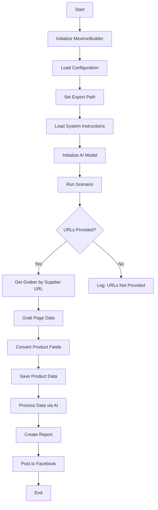
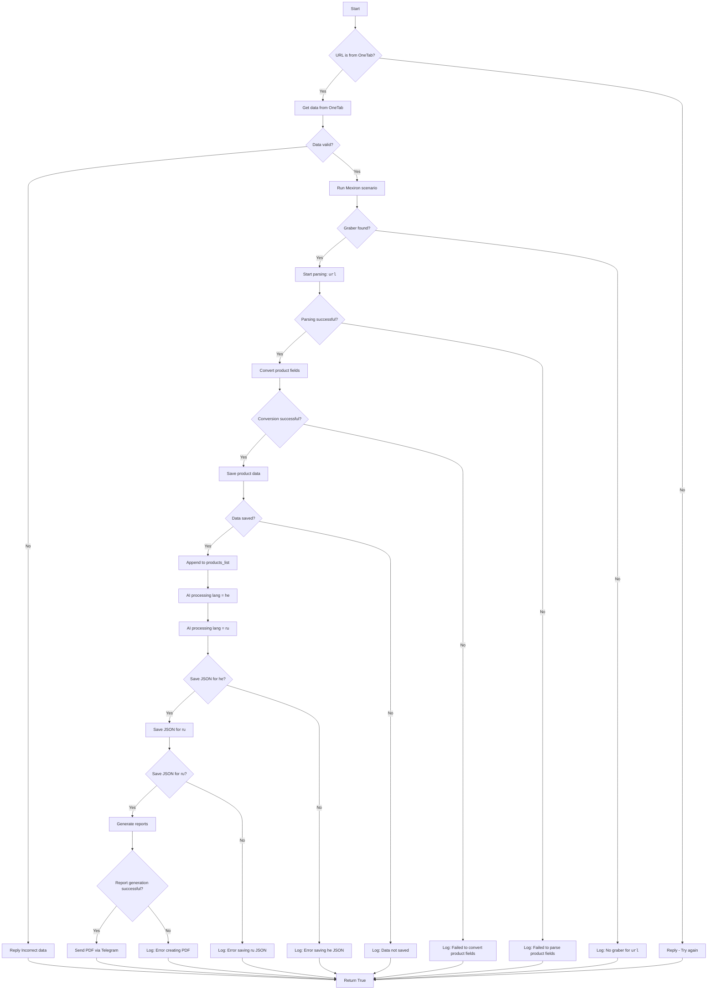

# Модуль `scenario`

## Обзор

Этот скрипт является частью директории `hypotez/src/endpoints/kazarinov/scenarios` и предназначен для автоматизации процесса создания "мехирона" для Сергея Казаринова. Скрипт извлекает, анализирует и обрабатывает данные о продуктах от различных поставщиков, подготавливает данные, обрабатывает их с помощью ИИ и интегрируется с Facebook для публикации продуктов.

## Подробнее

Скрипт автоматизирует процесс обработки и публикации данных о продуктах, полученных от различных поставщиков, используя возможности ИИ и интеграцию с Facebook. Основная цель - упростить и ускорить процесс создания "мехирона", обеспечивая эффективное управление данными и их публикацию.

## Основные функции

1.  **Извлечение и анализ данных**: Извлекает и анализирует данные о продуктах от различных поставщиков.
2.  **Обработка данных с помощью ИИ**: Обрабатывает извлеченные данные с помощью модели Google Generative AI.
3.  **Хранение данных**: Сохраняет обработанные данные в файлы.
4.  **Генерация отчетов**: Генерирует отчеты в формате HTML и PDF на основе обработанных данных.
5.  **Публикация в Facebook**: Публикует обработанные данные в Facebook.

## Блок-схема модуля



## Легенда

1.  **Start**: Начало выполнения скрипта.
2.  **InitMexironBuilder**: Инициализация класса `MexironBuilder`.
3.  **LoadConfig**: Загрузка конфигурации из JSON-файла.
4.  **SetExportPath**: Установка пути для экспорта данных.
5.  **LoadSystemInstruction**: Загрузка системных инструкций для модели ИИ.
6.  **InitModel**: Инициализация модели Google Generative AI.
7.  **RunScenario**: Выполнение основного сценария.
8.  **CheckURLs**: Проверка наличия предоставленных URL для анализа.
9.  **GetGraber**: Получение соответствующего грабера для URL поставщика.
10. **GrabPage**: Извлечение данных со страницы с использованием грабера.
11. **ConvertFields**: Преобразование полей продукта в словарь.
12. **SaveData**: Сохранение данных продукта в файл.
13. **ProcessAI**: Обработка данных продукта с помощью модели ИИ.
14. **CreateReport**: Создание отчетов в формате HTML и PDF на основе обработанных данных.
15. **PostFacebook**: Публикация обработанных данных в Facebook.
16. **End**: Конец выполнения скрипта.

-----------------------

## Классы

### `MexironBuilder`

**Описание**: Класс `MexironBuilder` предназначен для автоматизации процесса создания "мехирона", включая извлечение данных о продуктах, их обработку с помощью ИИ, сохранение и публикацию.

**Как работает класс**:
Класс `MexironBuilder` инициализируется с драйвером Selenium для автоматизации веб-браузера и опциональным именем для процесса "мехирон". Он выполняет сценарий, включающий загрузку конфигурации, извлечение данных о продуктах с веб-страниц, их обработку с использованием ИИ, сохранение обработанных данных и генерацию отчетов. Класс также предоставляет методы для получения соответствующего грабера для URL поставщика, преобразования полей продукта в словарь, сохранения данных продукта в файл, обработки списка продуктов с использованием ИИ и публикации данных в Facebook.

**Атрибуты**:

-   `driver`: Экземпляр Selenium WebDriver для автоматизации веб-браузера.
-   `export_path`: Путь для экспорта данных.
-   `mexiron_name`: Пользовательское имя для процесса "мехирон".
-   `price`: Цена за обработку.
-   `timestamp`: Временная метка для процесса.
-   `products_list`: Список обработанных данных о продуктах.
-   `model`: Модель Google Generative AI.
-   `config`: Конфигурация, загруженная из JSON.

**Методы**:

#### `__init__`

```python
def __init__(self, driver: Driver, mexiron_name: Optional[str] = None):
    """
    Инициализирует класс `MexironBuilder` с необходимыми компонентами.

    Args:
        driver (Driver): Экземпляр Selenium WebDriver.
        mexiron_name (Optional[str], optional): Пользовательское имя для процесса "мехирон". По умолчанию `None`.
    """
    ...
```

#### `run_scenario`

```python
def run_scenario(self, system_instruction: Optional[str] = None, price: Optional[str] = None, mexiron_name: Optional[str] = None, urls: Optional[str | List[str]] = None, bot = None) -> bool:
    """
    Выполняет сценарий: анализирует продукты, обрабатывает их с помощью ИИ и сохраняет данные.

    Args:
        system_instruction (Optional[str], optional): Системные инструкции для модели ИИ. По умолчанию `None`.
        price (Optional[str], optional): Цена за обработку. По умолчанию `None`.
        mexiron_name (Optional[str], optional): Пользовательское имя "мехирона". По умолчанию `None`.
        urls (Optional[str | List[str]], optional): URL-адреса страниц продуктов. По умолчанию `None`.
        bot (_type_, optional): Объект бота. По умолчанию `None`.

    Returns:
        bool: `True`, если сценарий выполнен успешно, иначе `False`.

    Как работает функция:
    1. Проверяет, предоставлен ли URL из OneTab.
    2. Извлекает данные из OneTab, если это необходимо.
    3. Проверяет валидность данных.
    4. Запускает сценарий Mexiron.
    5. Находит грабер для URL.
    6. Начинает разбор страницы.
    7. Преобразует поля продукта.
    8. Сохраняет данные продукта.
    9. Обрабатывает данные с использованием ИИ для языков `he` и `ru`.
    10. Сохраняет JSON для каждого языка.
    11. Генерирует отчеты.
    12. Отправляет PDF через Telegram.
    13. Возвращает `True`.

    Внутренние функции:
    Функция содержит внутренние логические блоки для обработки и преобразования данных,
    включая проверку URL, извлечение данных, обработку с использованием ИИ, сохранение данных и генерацию отчетов.
    Каждый блок отвечает за определенную часть сценария, обеспечивая модульность и управляемость процесса.
    """
    ...
```

**Блок-схема**:



**Легенда**:

1.  **Start**: Начало выполнения сценария.

2.  **URL Source Check (IsOneTab)**:

    *   Если URL из OneTab, данные извлекаются оттуда.
    *   Если нет, пользователю отправляется сообщение "Попробуйте снова".

3.  **Data Validity Check (IsDataValid)**:

    *   Если данные не валидны, пользователю отправляется сообщение "Некорректные данные".
    *   Если валидны, начинается сценарий Mexiron.

4.  **Grabber Search (IsGraberFound)**:

    *   Если граббер найден, начинается разбор страницы.
    *   Если нет, генерируется сообщение в лог об отсутствии граббера для данного URL.

5.  **Page Parsing (StartParsing)**:

    *   Если разбор успешен, данные преобразуются в нужный формат.
    *   Если нет, в лог записывается ошибка.

6.  **Data Conversion (ConvertProductFields)**:

    *   Если преобразование успешно, данные сохраняются.
    *   Если нет, в лог записывается ошибка.

7.  **Data Saving (SaveProductData)**:

    *   Если данные сохранены, они добавляются в список продуктов.
    *   Если нет, в лог записывается ошибка.

8.  **AI Processing (ProcessAIHe, ProcessAIRu)**:

    *   Данные обрабатываются ИИ для языков `he` (иврит) и `ru` (русский).

9.  **JSON Saving (SaveHeJSON, SaveRuJSON)**:

    *   Результаты обработки сохраняются в формате JSON для каждого языка.
    *   Если сохранение не удалось, в лог записывается ошибка.

10. **Report Generation (GenerateReports)**:

    *   Генерируются отчеты в формате HTML и PDF для каждого языка.
    *   Если генерация отчетов не удалась, в лог записывается ошибка.

11. **PDF Sending via Telegram (SendPDF)**:

    *   PDF-файлы отправляются через Telegram.
    *   Если отправка не удалась, в лог записывается ошибка.

12. **Completion (ReturnTrue)**:

    *   Сценарий завершается возвратом `True`.

**Error Logging**:

*   На каждом этапе, где могут возникнуть ошибки, предусмотрены узлы для регистрации ошибок (например, `LogNoGraber`, `LogParsingFailed`, `LogHeJSONError` и т.д.).

#### `get_graber_by_supplier_url`

```python
def get_graber_by_supplier_url(self, url: str):
    """
    Возвращает соответствующий грабер для заданного URL-адреса поставщика.

    Args:
        url (str): URL-адрес страницы поставщика.

    Returns:
        _type_: Экземпляр грабера, если найден, иначе `None`.

    Как работает функция:
    1.  Функция определяет поставщика на основе URL-адреса.
    2.  Возвращает соответствующий грабер для этого поставщика.
    3.  Если грабер не найден, возвращает `None`.
    """
    ...
```

#### `convert_product_fields`

```python
def convert_product_fields(self, f: ProductFields) -> dict:
    """
    Преобразует поля продукта в словарь.

    Args:
        f (ProductFields): Объект, содержащий разобранные данные продукта.

    Returns:
        dict: Отформатированный словарь данных продукта.

    Как работает функция:
    1.  Принимает объект `ProductFields`, содержащий разобранные данные продукта.
    2.  Преобразует эти данные в отформатированный словарь.
    3.  Возвращает словарь, содержащий данные продукта.
    """
    ...
```

#### `save_product_data`

```python
def save_product_data(self, product_data: dict):
    """
    Сохраняет данные продукта в файл.

    Args:
        product_data (dict): Отформатированные данные продукта.

    Как работает функция:
    1.  Принимает словарь с отформатированными данными продукта.
    2.  Сохраняет эти данные в файл в формате JSON.
    3.  Использует `export_path` для определения пути к файлу.
    """
    ...
```

#### `process_ai`

```python
def process_ai(self, products_list: List[str], lang: str, attempts: int = 3) -> tuple | bool:
    """
    Обрабатывает список продуктов через модель ИИ.

    Args:
        products_list (List[str]): Список словарей данных продукта в виде строк.
        lang (str): Язык для обработки.
        attempts (int, optional): Количество попыток повтора в случае неудачи. По умолчанию 3.

    Returns:
        tuple | bool: Обработанный ответ в форматах `ru` и `he`.

    Как работает функция:
    1.  Принимает список данных продукта в виде строк, язык и количество попыток.
    2.  Отправляет данные в модель ИИ для обработки.
    3.  Возвращает обработанный ответ в форматах `ru` и `he`.

    Внутренние функции:
    Функция использует внутренние механизмы для взаимодействия с моделью ИИ и обработки данных.
    """
    ...
```

#### `post_facebook`

```python
def post_facebook(self, mexiron: SimpleNamespace) -> bool:
    """
    Выполняет сценарий публикации в Facebook.

    Args:
        mexiron (SimpleNamespace): Обработанные данные для публикации.

    Returns:
        bool: `True`, если публикация прошла успешно, иначе `False`.

    Как работает функция:
    1.  Принимает обработанные данные для публикации в Facebook.
    2.  Выполняет сценарий публикации, используя предоставленные данные.
    3.  Возвращает `True`, если публикация прошла успешно, иначе `False`.
    """
    ...
```

#### `create_report`

```python
def create_report(self, data: dict, html_file: Path, pdf_file: Path):
    """
    Генерирует отчеты в формате HTML и PDF на основе обработанных данных.

    Args:
        data (dict): Обработанные данные.
        html_file (Path): Путь для сохранения HTML-отчета.
        pdf_file (Path): Путь для сохранения PDF-отчета.

    Как работает функция:
    1.  Принимает обработанные данные, пути для сохранения HTML и PDF-отчетов.
    2.  Генерирует отчеты в указанных форматах на основе предоставленных данных.
    3.  Сохраняет отчеты по указанным путям.
    """
    ...
```

## Использование

Для использования этого скрипта выполните следующие шаги:

1.  **Инициализация драйвера**: Создайте экземпляр класса `Driver`.
2.  **Инициализация MexironBuilder**: Создайте экземпляр класса `MexironBuilder` с драйвером.
3.  **Запуск сценария**: Вызовите метод `run_scenario` с необходимыми параметрами.

#### Пример

```python
from src.webdriver.driver import Driver
from src.endpoints.kazarinov.scenarios.scenario_pricelist import MexironBuilder

# Инициализация драйвера
driver = Driver(...)

# Инициализация MexironBuilder
mexiron_builder = MexironBuilder(driver)

# Запуск сценария
urls = ['https://example.com/product1', 'https://example.com/product2']
mexiron_builder.run_scenario(urls=urls)
```

## Зависимости

*   `selenium`: Для автоматизации веб-браузера.
*   `asyncio`: Для асинхронных операций.
*   `pathlib`: Для работы с путями к файлам.
*   `types`: Для создания простых пространств имен.
*   `typing`: Для аннотаций типов.
*   `src.ai.gemini`: Для обработки данных с помощью ИИ.
*   `src.suppliers.*.graber`: Для извлечения данных от различных поставщиков.
*   `src.endpoints.advertisement.facebook.scenarios`: Для публикации в Facebook.

## Обработка ошибок

Скрипт включает надежную обработку ошибок для обеспечения непрерывного выполнения, даже если некоторые элементы не найдены или есть проблемы с веб-страницей. Это особенно полезно для работы с динамическими или нестабильными веб-страницами.

## Вклад

Вклад в этот скрипт приветствуется. Убедитесь, что любые изменения хорошо задокументированы и включают соответствующие тесты.

## Лицензия

Этот скрипт лицензирован в соответствии с MIT License. Подробности см. в файле `LICENSE`.