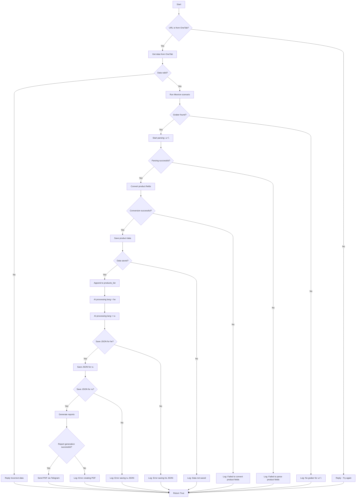

# Документация для модуля `scenario.ru.md`

## Обзор

Этот модуль, расположенный в `hypotez/src/endpoints/kazarinov/scenarios`, предназначен для автоматизации процесса создания "мехирона" для Сергея Казаринова. Он включает в себя извлечение, парсинг и обработку данных о продуктах от различных поставщиков, их обработку с использованием ИИ, сохранение данных, генерацию отчетов и публикацию в Facebook.

## Подробней

Этот модуль автоматизирует процесс создания "мехирона" для Сергея Казаринова, начиная с извлечения данных о продуктах и заканчивая их публикацией в Facebook. Он использует различные компоненты для парсинга веб-страниц, обработки данных с помощью ИИ и создания отчетов.

## Классы

### `MexironBuilder`

**Описание**: Класс `MexironBuilder` предназначен для автоматизации процесса создания "мехирона". Он включает в себя извлечение, парсинг, обработку данных о продуктах, генерацию отчетов и публикацию в Facebook.

**Принцип работы**:

Класс инициализируется с драйвером веб-браузера, именем "мехирона" и другими необходимыми параметрами. Он загружает конфигурацию из JSON, устанавливает путь для экспорта данных и инициализирует модель ИИ. Основной метод `run_scenario` выполняет весь процесс: от парсинга веб-страниц до публикации данных в Facebook.

**Аттрибуты**:

- `driver`: Экземпляр Selenium WebDriver для управления браузером.
- `export_path`: Путь для экспорта обработанных данных.
- `mexiron_name`: Пользовательское имя для процесса мехирона.
- `price`: Цена, используемая при обработке данных.
- `timestamp`: Временная метка, используемая для идентификации процесса.
- `products_list`: Список обработанных данных о продуктах.
- `model`: Модель Google Generative AI для обработки данных.
- `config`: Конфигурация, загруженная из JSON файла.

**Методы**:

- `__init__(self, driver: Driver, mexiron_name: Optional[str] = None)`: Инициализирует класс `MexironBuilder` с необходимыми компонентами.
- `run_scenario(self, system_instruction: Optional[str] = None, price: Optional[str] = None, mexiron_name: Optional[str] = None, urls: Optional[str | List[str]] = None, bot = None) -> bool`: Выполняет основной сценарий: парсит продукты, обрабатывает их через ИИ и сохраняет данные.
- `get_graber_by_supplier_url(self, url: str)`: Возвращает соответствующий грабер для данного URL поставщика.
- `convert_product_fields(self, f: ProductFields) -> dict`: Конвертирует поля продукта в словарь.
- `save_product_data(self, product_data: dict)`: Сохраняет данные о продукте в файл.
- `process_ai(self, products_list: List[str], lang: str, attempts: int = 3) -> tuple | bool`: Обрабатывает список продуктов через модель ИИ.
- `post_facebook(self, mexiron: SimpleNamespace) -> bool`: Выполняет сценарий публикации в Facebook.
- `create_report(self, data: dict, html_file: Path, pdf_file: Path)`: Генерирует HTML и PDF отчеты из обработанных данных.

## Функции

### `__init__`

```python
def __init__(self, driver: Driver, mexiron_name: Optional[str] = None):
    """
    Инициализирует класс `MexironBuilder` с необходимыми компонентами.

    Args:
        driver: Экземпляр Selenium WebDriver.
        mexiron_name: Пользовательское имя для процесса мехирона.
    """
    ...
```

**Назначение**: Инициализирует экземпляр класса `MexironBuilder`.

**Параметры**:

- `driver`: Экземпляр Selenium WebDriver, используемый для автоматизации браузера.
- `mexiron_name`: Необязательное имя для процесса мехирона. По умолчанию `None`.

**Как работает функция**:

1. Инициализирует экземпляр класса `MexironBuilder`, сохраняя переданный `driver` и `mexiron_name` в атрибуты экземпляра.
2. Загружает конфигурацию из JSON файла, устанавливает путь для экспорта данных, загружает системные инструкции для модели ИИ и инициализирует саму модель ИИ.
3. Если имя мехирона не предоставлено, генерирует его на основе текущей временной метки.

**Примеры**:

```python
from src.webdriver.driver import Driver
from src.endpoints.kazarinov.scenarios.scenario_pricelist import MexironBuilder

# Инициализация Driver
driver = Driver(...)

# Инициализация MexironBuilder
mexiron_builder = MexironBuilder(driver, mexiron_name="my_mexiron")
```

### `run_scenario`

```python
def run_scenario(self, system_instruction: Optional[str] = None, price: Optional[str] = None, mexiron_name: Optional[str] = None, urls: Optional[str | List[str]] = None, bot = None) -> bool:
    """
    Выполняет сценарий: парсит продукты, обрабатывает их через ИИ и сохраняет данные.

    Args:
        system_instruction: Системные инструкции для модели ИИ.
        price: Цена для обработки.
        mexiron_name: Пользовательское имя мехирона.
        urls: URLs страниц продуктов.

    Returns:
        True, если сценарий выполнен успешно, иначе False.
    """
    ...
```

**Назначение**: Выполняет основной сценарий: парсит данные о продуктах с веб-страниц, обрабатывает их с использованием ИИ и сохраняет полученные результаты.

**Параметры**:

- `system_instruction`: Системные инструкции для модели ИИ. По умолчанию `None`.
- `price`: Цена для обработки. По умолчанию `None`.
- `mexiron_name`: Пользовательское имя мехирона. По умолчанию `None`.
- `urls`: URL страниц продуктов для парсинга. Может быть строкой или списком строк. По умолчанию `None`.
- `bot`: Бот для отправки сообщений (предположительно Telegram бот). По умолчанию `None`.

**Возвращает**:
- `bool`: `True`, если сценарий выполнен успешно, иначе `False`.

**Как работает функция**:

1. **Проверка источника URL (IsOneTab)**:
   - Если URL из OneTab, данные извлекаются из OneTab.
   - Если URL не из OneTab, пользователю отправляется сообщение "Try again".

2. **Проверка валидности данных (IsDataValid)**:
   - Если данные не валидны, пользователю отправляется сообщение "Incorrect data".
   - Если данные валидны, запускается сценарий Mexiron.

3. **Поиск грабера (IsGraberFound)**:
   - Если грабер найден, начинается парсинг страницы.
   - Если грабер не найден, логируется сообщение о том, что грабер отсутствует для данного URL.

4. **Парсинг страницы (StartParsing)**:
   - Если парсинг успешен, данные преобразуются в нужный формат.
   - Если парсинг не удался, логируется ошибка.

5. **Преобразование данных (ConvertProductFields)**:
   - Если преобразование успешно, данные сохраняются.
   - Если преобразование не удалось, логируется ошибка.

6. **Сохранение данных (SaveProductData)**:
   - Если данные сохранены, они добавляются в список продуктов.
   - Если данные не сохранены, логируется ошибка.

7. **Обработка через AI (ProcessAIHe, ProcessAIRu)**:
   - Данные обрабатываются AI для языков `he` (иврит) и `ru` (русский).

8. **Сохранение JSON (SaveHeJSON, SaveRuJSON)**:
   - Результаты обработки сохраняются в формате JSON для каждого языка.
   - Если сохранение не удалось, логируется ошибка.

9. **Генерация отчетов (GenerateReports)**:
    - Создаются HTML и PDF отчеты для каждого языка.
    - Если создание отчета не удалось, логируется ошибка.

10. **Отправка PDF через Telegram (SendPDF)**:
    - PDF-файлы отправляются через Telegram.
    - Если отправка не удалась, логируется ошибка.

11. **Завершение (ReturnTrue)**:
    - Сценарий завершается, возвращая `True`.



#### Внутренние функции:

Внутри этой функции нет определения внутренних функций. Но описана логика работы.

**Примеры**:

```python
from src.webdriver.driver import Driver
from src.endpoints.kazarinov.scenarios.scenario_pricelist import MexironBuilder

# Инициализация Driver
driver = Driver(...)

# Инициализация MexironBuilder
mexiron_builder = MexironBuilder(driver)

# Запуск сценария
urls = ['https://example.com/product1', 'https://example.com/product2']
result = mexiron_builder.run_scenario(urls=urls)
```

### `get_graber_by_supplier_url`

```python
def get_graber_by_supplier_url(self, url: str):
    """
    Возвращает соответствующий грабер для данного URL поставщика.

    Args:
        url: URL страницы поставщика.

    Returns:
        Экземпляр грабера, если найден, иначе None.
    """
    ...
```

**Назначение**: Возвращает экземпляр грабера (scraper) для заданного URL поставщика.

**Параметры**:

- `url` (str): URL страницы поставщика.

**Возвращает**:

- Экземпляр грабера, если он найден для данного URL.
- `None`, если грабер не найден.

**Как работает функция**:

1. **Определение поставщика**: Извлекает доменное имя из URL, чтобы определить поставщика.
2. **Импорт грабера**: Пытается динамически импортировать модуль грабера, соответствующий поставщику.
3. **Обработка ошибок**: Если импорт не удался (т.е. грабер не найден), возвращает `None`.
4. **Возврат грабера**: Если импорт успешен, возвращает экземпляр класса грабера.

```
URL -> Извлечение домена -> Определение поставщика -> Попытка импорта грабера
                                                        |
                                                        Нет -> Возврат None
                                                        |
                                                        Да -> Возврат экземпляра грабера
```

**Примеры**:

```python
from src.webdriver.driver import Driver
from src.endpoints.kazarinov.scenarios.scenario_pricelist import MexironBuilder

# Инициализация Driver
driver = Driver(...)

# Инициализация MexironBuilder
mexiron_builder = MexironBuilder(driver)

# Получение грабера для URL поставщика
url = "https://example.com/product1"
graber = mexiron_builder.get_graber_by_supplier_url(url)

if graber:
    print("Грабер найден")
else:
    print("Грабер не найден")
```

### `convert_product_fields`

```python
def convert_product_fields(self, f: ProductFields) -> dict:
    """
    Конвертирует поля продукта в словарь.

    Args:
        f: Объект, содержащий парсированные данные о продукте.

    Returns:
        Форматированный словарь данных о продукте.
    """
    ...
```

**Назначение**: Преобразует объект с данными о продукте в словарь.

**Параметры**:

- `f` (ProductFields): Объект, содержащий извлеченные данные о продукте.

**Возвращает**:

- `dict`: Форматированный словарь, содержащий данные о продукте.

**Как работает функция**:

1. **Преобразование данных**: Функция преобразует данные из объекта `ProductFields` в словарь.
2. **Возврат словаря**: Возвращает полученный словарь с данными о продукте.

```
ProductFields -> Преобразование в словарь -> Возврат словаря
```

**Примеры**:

```python
from src.webdriver.driver import Driver
from src.endpoints.kazarinov.scenarios.scenario_pricelist import MexironBuilder

# Инициализация Driver
driver = Driver(...)

# Инициализация MexironBuilder
mexiron_builder = MexironBuilder(driver)

# Пример объекта ProductFields
class ProductFields:
    def __init__(self):
        self.name = "Example Product"
        self.price = "100"

product_fields = ProductFields()

# Преобразование данных о продукте в словарь
product_data = mexiron_builder.convert_product_fields(product_fields)
print(product_data)
```

### `save_product_data`

```python
def save_product_data(self, product_data: dict):
    """
    Сохраняет данные о продукте в файл.

    Args:
        product_data: Форматированные данные о продукте.
    """
    ...
```

**Назначение**: Сохраняет данные о продукте в файл.

**Параметры**:

- `product_data` (dict): Форматированные данные о продукте.

**Как работает функция**:

1. **Формирование имени файла**: Генерирует имя файла на основе имени мехирона и временной метки.
2. **Запись в файл**: Записывает данные о продукте в файл в формате JSON.

```
product_data -> Формирование имени файла -> Запись в файл (JSON)
```

**Примеры**:

```python
from src.webdriver.driver import Driver
from src.endpoints.kazarinov.scenarios.scenario_pricelist import MexironBuilder

# Инициализация Driver
driver = Driver(...)

# Инициализация MexironBuilder
mexiron_builder = MexironBuilder(driver)

# Пример данных о продукте
product_data = {"name": "Example Product", "price": "100"}

# Сохранение данных о продукте
mexiron_builder.save_product_data(product_data)
```

### `process_ai`

```python
def process_ai(self, products_list: List[str], lang: str, attempts: int = 3) -> tuple | bool:
    """
    Обрабатывает список продуктов через модель ИИ.

    Args:
        products_list: Список словарей данных о продуктах в виде строки.
        attempts: Количество попыток повторного запроса в случае неудачи.

    Returns:
        Обработанный ответ в форматах `ru` и `he`.
    """
    ...
```

**Назначение**: Обрабатывает список продуктов с использованием модели искусственного интеллекта (ИИ).

**Параметры**:

- `products_list` (List[str]): Список словарей данных о продуктах в виде строки.
- `lang` (str): Язык, на котором необходимо обработать данные.
- `attempts` (int): Количество попыток повторного запроса в случае неудачи. По умолчанию `3`.

**Возвращает**:

- `tuple`: Обработанный ответ в форматах `ru` и `he`.
- `bool`: `False` в случае неудачи после нескольких попыток.

**Как работает функция**:

1. **Подготовка данных**: Преобразует список продуктов в строку JSON.
2. **Отправка запроса в модель ИИ**: Отправляет данные в модель ИИ для обработки.
3. **Обработка ответа**: Получает обработанный ответ от модели ИИ.
4. **Повторные попытки**: Если запрос не удался, повторяет попытку несколько раз.
5. **Возврат результата**: Возвращает обработанный ответ или `False` в случае неудачи.

```
products_list -> Преобразование в строку JSON -> Отправка в модель ИИ
                                                  |
                                                  Успех -> Возврат обработанного ответа
                                                  |
                                                  Неудача -> Повторные попытки
                                                              |
                                                              После нескольких попыток -> Возврат False
```

**Примеры**:

```python
from src.webdriver.driver import Driver
from src.endpoints.kazarinov.scenarios.scenario_pricelist import MexironBuilder

# Инициализация Driver
driver = Driver(...)

# Инициализация MexironBuilder
mexiron_builder = MexironBuilder(driver)

# Пример списка продуктов
products_list = [{"name": "Example Product", "price": "100"}]

# Обработка данных через ИИ
lang = "ru"
result = mexiron_builder.process_ai(products_list, lang)

if result:
    print("Данные успешно обработаны")
else:
    print("Не удалось обработать данные")
```

### `post_facebook`

```python
def post_facebook(self, mexiron: SimpleNamespace) -> bool:
    """
    Выполняет сценарий публикации в Facebook.

    Args:
        mexiron: Обработанные данные для публикации.

    Returns:
        True, если публикация успешна, иначе False.
    """
    ...
```

**Назначение**: Выполняет сценарий публикации данных в Facebook.

**Параметры**:

- `mexiron` (SimpleNamespace): Обработанные данные для публикации.

**Возвращает**:

- `bool`: `True`, если публикация прошла успешно, иначе `False`.

**Как работает функция**:

1. **Вызов сценария публикации**: Вызывает функцию или метод, который отвечает за публикацию данных в Facebook.
2. **Обработка результата**: Возвращает `True`, если публикация прошла успешно, иначе `False`.

```
mexiron -> Вызов сценария публикации -> Успех: Возврат True
                                        |
                                        Неудача: Возврат False
```

**Примеры**:

```python
from src.webdriver.driver import Driver
from src.endpoints.kazarinov.scenarios.scenario_pricelist import MexironBuilder
from types import SimpleNamespace

# Инициализация Driver
driver = Driver(...)

# Инициализация MexironBuilder
mexiron_builder = MexironBuilder(driver)

# Пример данных для публикации
mexiron_data = SimpleNamespace()
mexiron_data.name = "Example Product"
mexiron_data.price = "100"

# Публикация в Facebook
result = mexiron_builder.post_facebook(mexiron_data)

if result:
    print("Публикация в Facebook прошла успешно")
else:
    print("Не удалось опубликовать данные в Facebook")
```

### `create_report`

```python
def create_report(self, data: dict, html_file: Path, pdf_file: Path):
    """
    Генерирует HTML и PDF отчеты из обработанных данных.

    Args:
        data: Обработанные данные.
        html_file: Путь для сохранения HTML отчета.
        pdf_file: Путь для сохранения PDF отчета.
    """
    ...
```

**Назначение**: Генерирует HTML и PDF отчеты из обработанных данных.

**Параметры**:

- `data` (dict): Обработанные данные, которые будут включены в отчет.
- `html_file` (Path): Путь для сохранения HTML-файла отчета.
- `pdf_file` (Path): Путь для сохранения PDF-файла отчета.

**Как работает функция**:

1. **Генерация HTML**: Создает HTML-файл с отчетом на основе предоставленных данных.
2. **Генерация PDF**: Создает PDF-файл из сгенерированного HTML-файла.

```
data -> Генерация HTML -> Сохранение HTML-файла
     |
     -> Генерация PDF -> Сохранение PDF-файла
```

**Примеры**:

```python
from src.webdriver.driver import Driver
from src.endpoints.kazarinov.scenarios.scenario_pricelist import MexironBuilder
from pathlib import Path

# Инициализация Driver
driver = Driver(...)

# Инициализация MexironBuilder
mexiron_builder = MexironBuilder(driver)

# Пример данных для отчета
report_data = {"name": "Example Product", "price": "100"}

# Пути для сохранения отчетов
html_file = Path("report.html")
pdf_file = Path("report.pdf")

# Создание отчета
mexiron_builder.create_report(report_data, html_file, pdf_file)