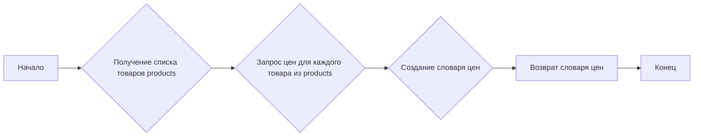
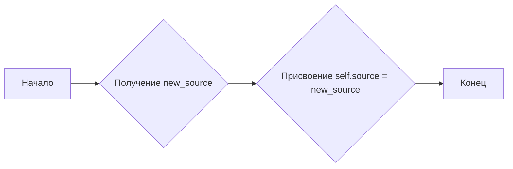
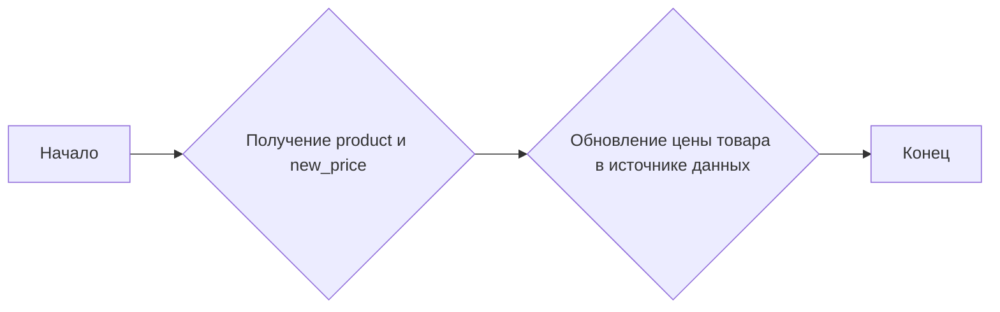

# Модуль `pricelist`

## Обзор

Модуль `pricelist` предназначен для работы с запросами списка цен в PrestaShop. Он предоставляет класс `PriceListRequester`, который позволяет запрашивать цены для указанных товаров, обновлять источник данных для запроса цен и модифицировать цены товаров.

## Подробнее

Модуль `pricelist` является частью системы для взаимодействия с API PrestaShop. Он использует класс `PrestaShop` из модуля `src.endpoints.prestashop.api` для выполнения запросов к API.

Модуль позволяет получать актуальные цены товаров из PrestaShop, что важно для поддержания актуальности информации о ценах в системе.

## Классы

### `PriceListRequester`

**Описание**: Класс для запроса списка цен в PrestaShop.

**Наследует**:
- `PrestaShop`: Базовый класс для работы с API PrestaShop.

**Методы**:
- `__init__`: Инициализирует объект класса `PriceListRequester`.
- `request_prices`: Запрашивает список цен для указанных товаров.
- `update_source`: Обновляет источник данных для запроса цен.
- `modify_product_price`: Модифицирует цену указанного товара.

#### `__init__`

```python
def __init__(self, api_credentials: Dict[str, str]) -> None:
    """
    Инициализирует объект класса PriceListRequester.

    Args:
        api_credentials (Dict[str, str]): Словарь с учетными данными для API,
            включая 'api_domain' и 'api_key'.

    Returns:
        None
    """
    ...
```

**Назначение**: Инициализация объекта класса `PriceListRequester`.

**Параметры**:
- `api_credentials` (Dict[str, str]): Словарь с учетными данными для API, включая `api_domain` и `api_key`.

**Возвращает**:
- `None`

**Как работает функция**:
1. Функция принимает словарь `api_credentials`, содержащий учетные данные для доступа к API PrestaShop.
2. Вызывает конструктор базового класса `PrestaShop`, передавая ему домен API (`api_domain`) и ключ API (`api_key`) из переданного словаря.

```mermaid
graph LR
    A[Начало] --> B{Получение api_credentials};
    B --> C{Вызов super().__init__(api_credentials['api_domain'], api_credentials['api_key'])};
    C --> D[Конец];
```

**Примеры**:
```python
api_credentials = {'api_domain': 'example.com', 'api_key': '12345'}
requester = PriceListRequester(api_credentials)
```

#### `request_prices`

```python
def request_prices(self, products: List[str]) -> Dict[str, float]:
    """
    Запрашивает список цен для указанных товаров.

    Args:
        products (List[str]): Список товаров, для которых требуется получить цены.

    Returns:
        Dict[str, float]: Словарь, где ключами являются товары, а значениями - их цены.
            Например: {'product1': 10.99, 'product2': 5.99}
    """
    # Здесь код для отправки запроса на получение цен из источника данных
    ...
    return {}
```

**Назначение**: Запрос списка цен для указанных товаров.

**Параметры**:
- `products` (List[str]): Список товаров, для которых требуется получить цены.

**Возвращает**:
- `Dict[str, float]`: Словарь, где ключами являются товары, а значениями - их цены. Возвращает пустой словарь `{}`.

**Как работает функция**:
1. Функция принимает список названий товаров `products`.
2. <логика получения цен из источника данных>.
3. Возвращает словарь, где ключами являются названия товаров, а значениями - их цены.



**Примеры**:
```python
api_credentials = {'api_domain': 'example.com', 'api_key': '12345'}
requester = PriceListRequester(api_credentials)
products = ['product1', 'product2', 'product3']
prices = requester.request_prices(products)
print(prices)  # {}
```

#### `update_source`

```python
def update_source(self, new_source: str) -> None:
    """
    Обновляет источник данных для запроса цен.

    Args:
        new_source (str): Новый источник данных.

    Returns:
        None
    """
    self.source = new_source
```

**Назначение**: Обновление источника данных для запроса цен.

**Параметры**:
- `new_source` (str): Новый источник данных.

**Возвращает**:
- `None`

**Как работает функция**:
1. Функция принимает новый источник данных `new_source` в виде строки.
2. Присваивает значение `new_source` атрибуту `source` экземпляра класса.



**Примеры**:
```python
api_credentials = {'api_domain': 'example.com', 'api_key': '12345'}
requester = PriceListRequester(api_credentials)
new_source = 'new_data_source'
requester.update_source(new_source)
```

#### `modify_product_price`

```python
def modify_product_price(self, product: str, new_price: float) -> None:
    """
    Модифицирует цену указанного товара.

    Args:
        product (str): Название товара.
        new_price (float): Новая цена товара.

    Returns:
        None
    """
    # Здесь код для изменения цены товара в источнике данных
    ...
```

**Назначение**: Модификация цены указанного товара.

**Параметры**:
- `product` (str): Название товара.
- `new_price` (float): Новая цена товара.

**Возвращает**:
- `None`

**Как работает функция**:
1. Функция принимает название товара `product` и новую цену `new_price`.
2. <Логика обновления цены товара в источнике данных>.



**Примеры**:
```python
api_credentials = {'api_domain': 'example.com', 'api_key': '12345'}
requester = PriceListRequester(api_credentials)
product = 'test_product'
new_price = 19.99
requester.modify_product_price(product, new_price)
```