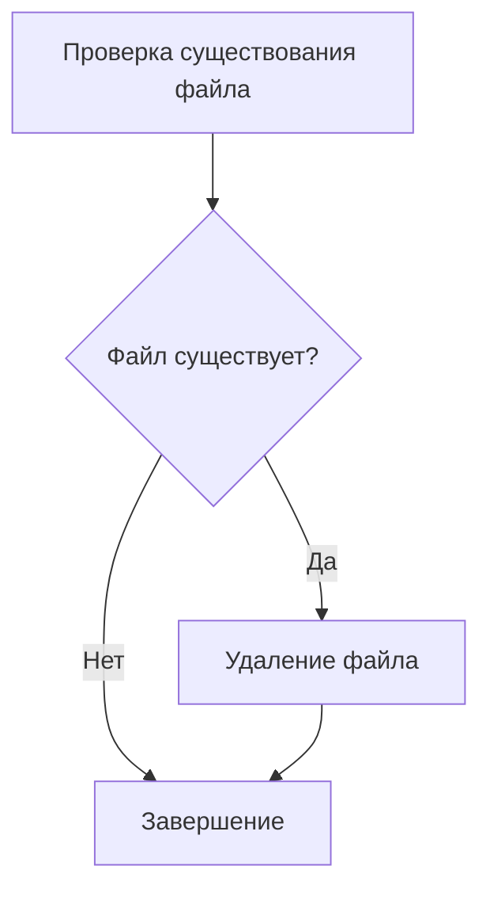
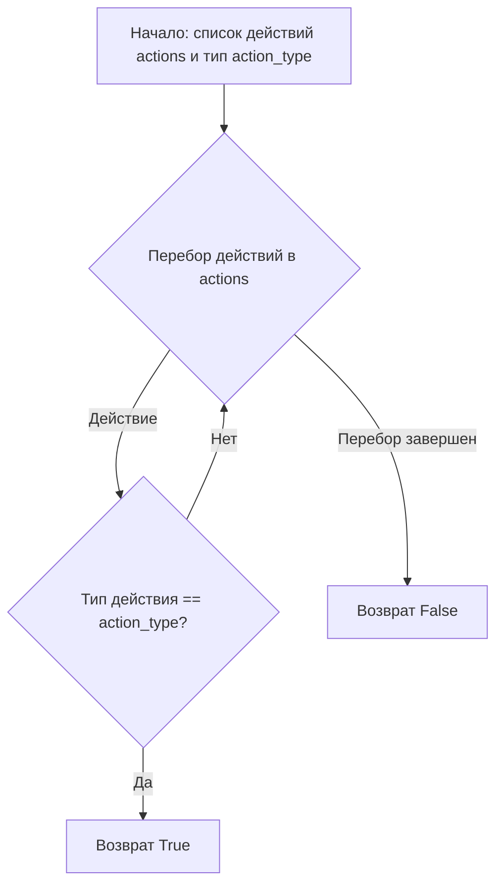
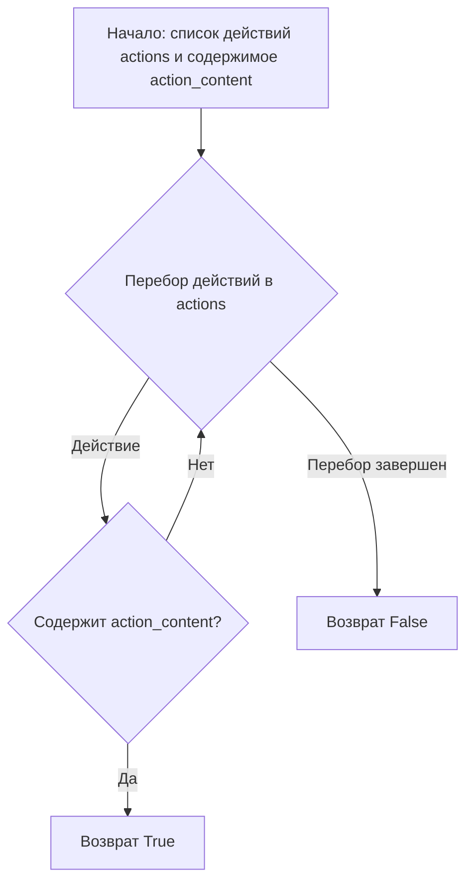
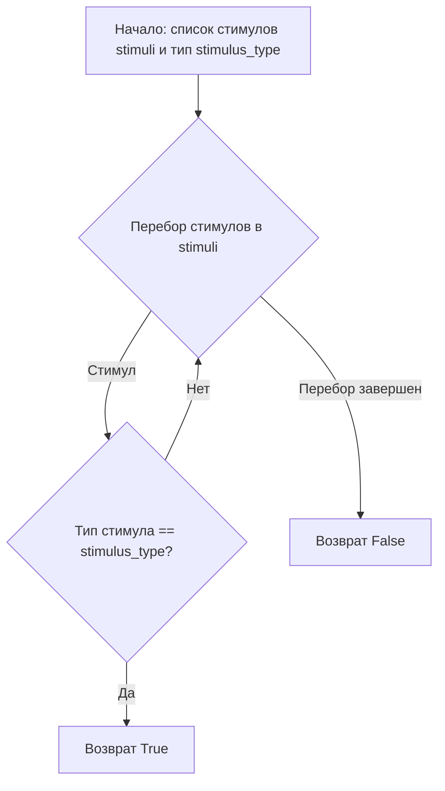
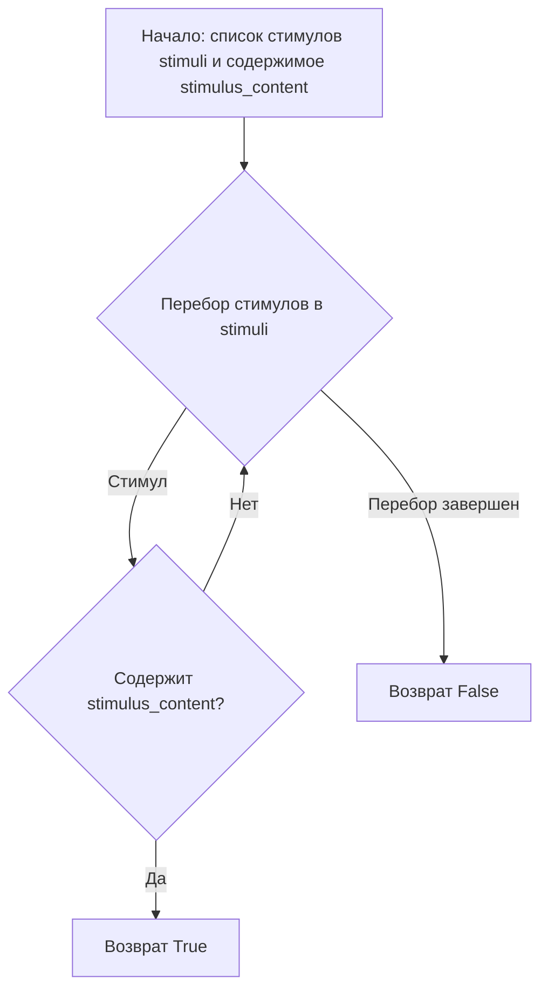
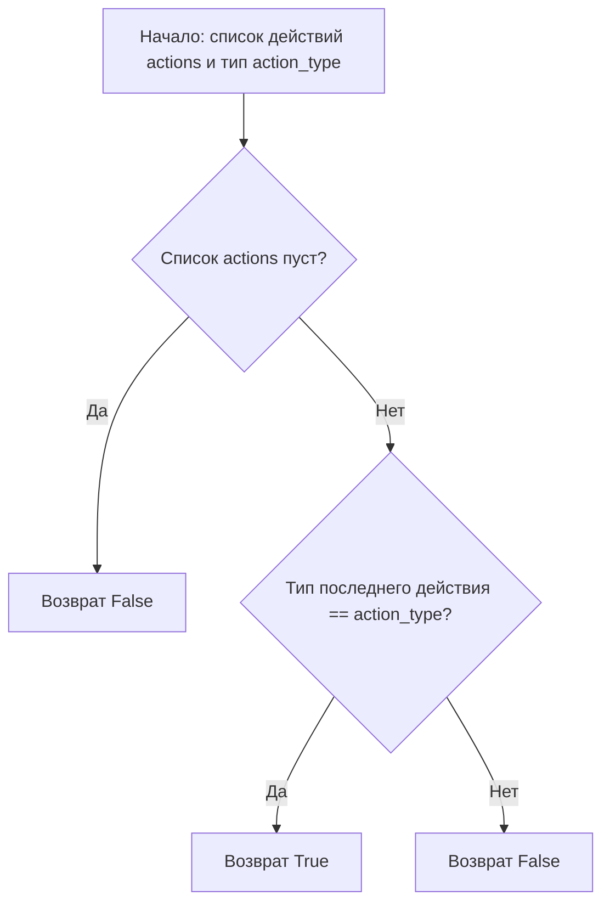
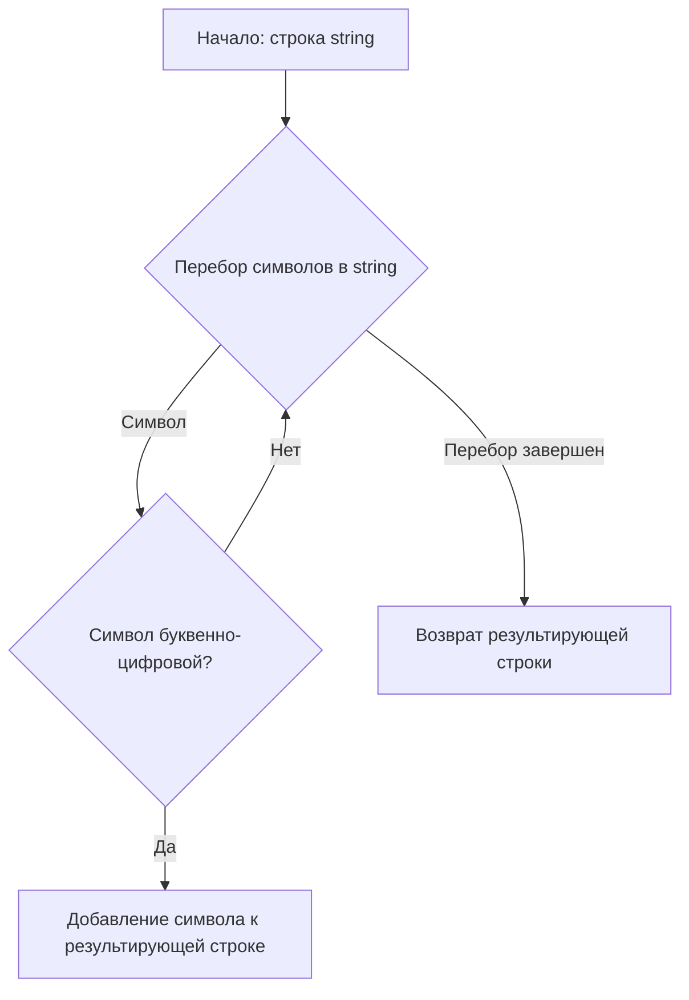
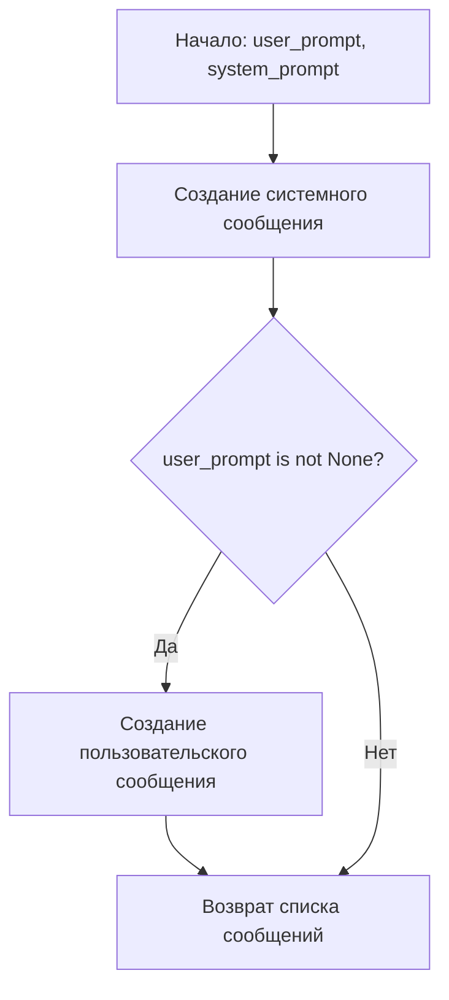
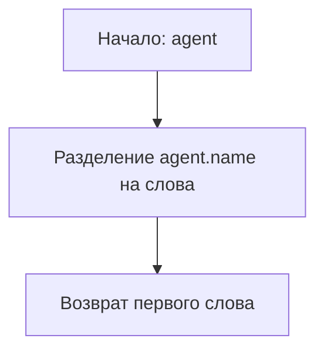
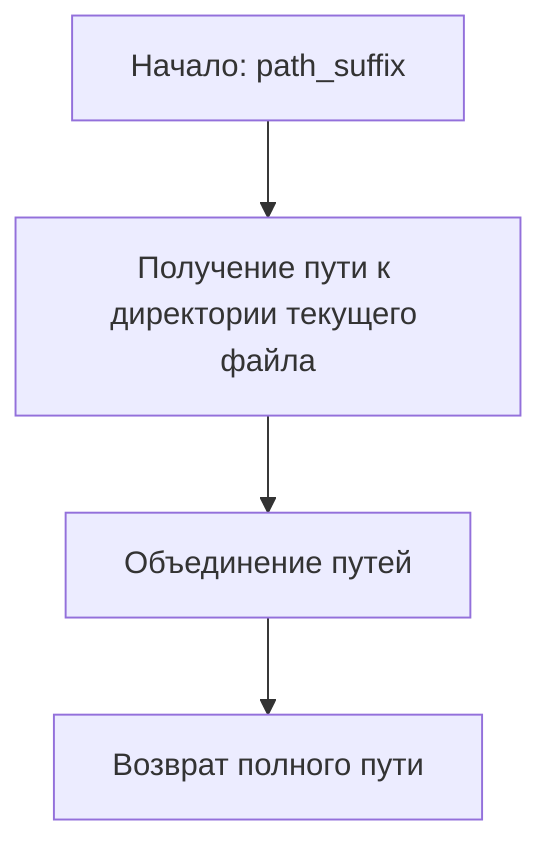

# Модуль тестирования утилит

## Обзор

Модуль `testing_utils.py` содержит набор вспомогательных функций и фикстур, используемых для тестирования в проекте `hypotez`. Он предоставляет инструменты для кэширования результатов API, управления файлами, проверки поведения симуляций и создания тестовых окружений.

## Подробнее

Этот модуль предназначен для упрощения и стандартизации процессов тестирования, обеспечивая повторное использование кода и упрощая настройку тестовых сценариев. Он включает функции для проверки результатов работы агентов, очистки тестовых данных и создания тестовых окружений с предопределенными агентами.

## Содержание

- [Константы](#константы)
- [Кэширование](#кэширование)
- [Управление файлами](#управление-файлами)
- [Проверка симуляций](#проверка-симуляций)
- [Проверка утверждений с помощью LLM](#проверка-утверждений-с-помощью-llm)
- [Создание сообщений для тестирования](#создание-сообщений-для-тестирования)
- [Сравнение агентов](#сравнение-агентов)
- [Вспомогательные функции ввода/вывода](#вспомогательные-функции-вводавывода)
- [Фикстуры](#фикстуры)

## Константы

### `CACHE_FILE_NAME`

```python
CACHE_FILE_NAME = "tests_cache.pickle"
```

Имя файла, используемого для кэширования результатов API.

### `EXPORT_BASE_FOLDER`

```python
EXPORT_BASE_FOLDER = os.path.join(os.path.dirname(__file__), "outputs/exports")
```

Путь к базовой папке для экспорта результатов тестов.

### `TEMP_SIMULATION_CACHE_FILE_NAME`

```python
TEMP_SIMULATION_CACHE_FILE_NAME = os.path.join(os.path.dirname(__file__), "simulation_test_case.cache.json")
```

Путь к файлу, используемому для временного кэширования результатов симуляций.

## Кэширование

В этом разделе описывается логика работы с кэшем для экономии запросов к API.

```python
if conftest.refresh_cache:
    # DELETE the cache file tests_cache.pickle
    os.remove(CACHE_FILE_NAME)

if conftest.use_cache:
    openai_utils.force_api_cache(True, CACHE_FILE_NAME)
else:
    openai_utils.force_api_cache(False, CACHE_FILE_NAME)
```

Код проверяет, нужно ли обновить кэш (удалить существующий файл кэша) или использовать его. Это позволяет экономить на использовании API во время тестов.

## Управление файлами

### `remove_file_if_exists`

```python
def remove_file_if_exists(file_path: str) -> None:
    """
    Removes the file at the given path if it exists.
    """
    if os.path.exists(file_path):
        os.remove(file_path)
```

**Назначение**: Удаляет файл по указанному пути, если он существует.

**Параметры**:

- `file_path` (str): Путь к файлу, который нужно удалить.

**Как работает функция**:

1.  **Проверка существования файла**: Проверяет, существует ли файл по указанному пути с помощью `os.path.exists(file_path)`.
2.  **Удаление файла**: Если файл существует, он удаляется с помощью `os.remove(file_path)`.



**Примеры**:

```python
remove_file_if_exists("temp_file.txt")
```

Удаляет файл `temp_file.txt`, если он существует.

## Проверка симуляций

### `contains_action_type`

```python
def contains_action_type(actions: list, action_type: str) -> bool:
    """
    Checks if the given list of actions contains an action of the given type.
    """
    for action in actions:
        if action["action"]["type"] == action_type:
            return True
    return False
```

**Назначение**: Проверяет, содержит ли список действий действие указанного типа.

**Параметры**:

- `actions` (list): Список действий для проверки.
- `action_type` (str): Тип действия, которое нужно найти.

**Возвращает**:

- `bool`: `True`, если список действий содержит действие указанного типа, иначе `False`.

**Как работает функция**:

1.  **Перебор действий**: Перебирает каждое действие в списке `actions`.
2.  **Проверка типа действия**: Для каждого действия проверяет, совпадает ли его тип (`action["action"]["type"]`) с заданным типом `action_type`.
3.  **Возврат результата**: Если найдено действие с совпадающим типом, функция возвращает `True`. Если перебор завершен и совпадений не найдено, функция возвращает `False`.



**Примеры**:

```python
actions = [{"action": {"type": "message", "content": "Hello"}}, {"action": {"type": "move", "content": "Left"}}]
contains_action_type(actions, "message")  # Возвращает True
contains_action_type(actions, "jump")     # Возвращает False
```

### `contains_action_content`

```python
def contains_action_content(actions: list, action_content: str) -> bool:
    """
    Checks if the given list of actions contains an action with the given content.
    """
    for action in actions:
        # checks whether the desired content is contained in the action content
        if action_content.lower() in action["action"]["content"].lower():
            return True
    return False
```

**Назначение**: Проверяет, содержит ли список действий действие с указанным содержимым.

**Параметры**:

- `actions` (list): Список действий для проверки.
- `action_content` (str): Содержимое, которое нужно найти в действиях.

**Возвращает**:

- `bool`: `True`, если список действий содержит действие с указанным содержимым, иначе `False`.

**Как работает функция**:

1.  **Перебор действий**: Перебирает каждое действие в списке `actions`.
2.  **Проверка содержимого действия**: Для каждого действия проверяет, содержит ли его содержимое (`action["action"]["content"]`) заданное содержимое `action_content` (без учета регистра).
3.  **Возврат результата**: Если найдено действие с совпадающим содержимым, функция возвращает `True`. Если перебор завершен и совпадений не найдено, функция возвращает `False`.



**Примеры**:

```python
actions = [{"action": {"type": "message", "content": "Hello World"}}, {"action": {"type": "move", "content": "Left"}}]
contains_action_content(actions, "hello")  # Возвращает True
contains_action_content(actions, "right")     # Возвращает False
```

### `contains_stimulus_type`

```python
def contains_stimulus_type(stimuli: list, stimulus_type: str) -> bool:
    """
    Checks if the given list of stimuli contains a stimulus of the given type.
    """
    for stimulus in stimuli:
        if stimulus["type"] == stimulus_type:
            return True
    return False
```

**Назначение**: Проверяет, содержит ли список стимулов стимул указанного типа.

**Параметры**:

- `stimuli` (list): Список стимулов для проверки.
- `stimulus_type` (str): Тип стимула, который нужно найти.

**Возвращает**:

- `bool`: `True`, если список стимулов содержит стимул указанного типа, иначе `False`.

**Как работает функция**:

1.  **Перебор стимулов**: Перебирает каждый стимул в списке `stimuli`.
2.  **Проверка типа стимула**: Для каждого стимула проверяет, совпадает ли его тип (`stimulus["type"]`) с заданным типом `stimulus_type`.
3.  **Возврат результата**: Если найден стимул с совпадающим типом, функция возвращает `True`. Если перебор завершен и совпадений не найдено, функция возвращает `False`.



**Примеры**:

```python
stimuli = [{"type": "message", "content": "Hello"}, {"type": "image", "content": "image.png"}]
contains_stimulus_type(stimuli, "message")  # Возвращает True
contains_stimulus_type(stimuli, "audio")     # Возвращает False
```

### `contains_stimulus_content`

```python
def contains_stimulus_content(stimuli: list, stimulus_content: str) -> bool:
    """
    Checks if the given list of stimuli contains a stimulus with the given content.
    """
    for stimulus in stimuli:
        # checks whether the desired content is contained in the stimulus content
        if stimulus_content.lower() in stimulus["content"].lower():
            return True
    return False
```

**Назначение**: Проверяет, содержит ли список стимулов стимул с указанным содержимым.

**Параметры**:

- `stimuli` (list): Список стимулов для проверки.
- `stimulus_content` (str): Содержимое, которое нужно найти в стимулах.

**Возвращает**:

- `bool`: `True`, если список стимулов содержит стимул с указанным содержимым, иначе `False`.

**Как работает функция**:

1.  **Перебор стимулов**: Перебирает каждый стимул в списке `stimuli`.
2.  **Проверка содержимого стимула**: Для каждого стимула проверяет, содержит ли его содержимое (`stimulus["content"]`) заданное содержимое `stimulus_content` (без учета регистра).
3.  **Возврат результата**: Если найден стимул с совпадающим содержимым, функция возвращает `True`. Если перебор завершен и совпадений не найдено, функция возвращает `False`.



**Примеры**:

```python
stimuli = [{"type": "message", "content": "Hello World"}, {"type": "image", "content": "image.png"}]
contains_stimulus_content(stimuli, "hello")  # Возвращает True
contains_stimulus_content(stimuli, "audio")     # Возвращает False
```

### `terminates_with_action_type`

```python
def terminates_with_action_type(actions: list, action_type: str) -> bool:
    """
    Checks if the given list of actions terminates with an action of the given type.
    """
    if len(actions) == 0:
        return False
    return actions[-1]["action"]["type"] == action_type
```

**Назначение**: Проверяет, заканчивается ли список действий действием указанного типа.

**Параметры**:

- `actions` (list): Список действий для проверки.
- `action_type` (str): Тип действия, которым должен заканчиваться список.

**Возвращает**:

- `bool`: `True`, если список действий заканчивается действием указанного типа, иначе `False`.

**Как работает функция**:

1.  **Проверка пустого списка**: Проверяет, является ли список `actions` пустым. Если да, возвращает `False`.
2.  **Проверка последнего действия**: Если список не пуст, проверяет, совпадает ли тип последнего действия (`actions[-1]["action"]["type"]`) с заданным типом `action_type`.
3.  **Возврат результата**: Возвращает `True`, если последнее действие имеет указанный тип, иначе `False`.



**Примеры**:

```python
actions = [{"action": {"type": "message", "content": "Hello"}}, {"action": {"type": "move", "content": "Left"}}]
terminates_with_action_type(actions, "move")     # Возвращает True
terminates_with_action_type(actions, "message")  # Возвращает False
```

## Проверка утверждений с помощью LLM

### `proposition_holds`

```python
def proposition_holds(proposition: str) -> bool:
    """
    Checks if the given proposition is true according to an LLM call.
    This can be used to check for text properties that are hard to
    verify mechanically, such as "the text contains some ideas for a product".
    """

    system_prompt = f"""
    Check whether the following proposition is true or false. If it is
    true, write "true", otherwise write "false". Don't write anything else!
    """

    user_prompt = f"""
    Proposition: {proposition}
    """

    messages = [{"role": "system", "content": system_prompt},
                {"role": "user", "content": user_prompt}]
    
    # call the LLM
    next_message = openai_utils.client().send_message(messages)

    # check the result
    cleaned_message = only_alphanumeric(next_message["content"])
    if cleaned_message.lower().startswith("true"):
        return True
    elif cleaned_message.lower().startswith("false"):
        return False
    else:
        raise Exception(f"LLM returned unexpected result: {cleaned_message}")
```

**Назначение**: Проверяет, является ли данное утверждение истинным, используя вызов LLM (Large Language Model). Это полезно для проверки текстовых свойств, которые трудно проверить механически, например, "текст содержит некоторые идеи для продукта".

**Параметры**:

- `proposition` (str): Утверждение, которое нужно проверить.

**Возвращает**:

- `bool`: `True`, если LLM считает утверждение истинным, `False` - если ложным.

**Вызывает исключения**:

- `Exception`: Если LLM возвращает неожиданный результат, который не начинается с "true" или "false".

**Как работает функция**:

1.  **Определение системного промпта**: Формирует системный промпт, который указывает LLM, что нужно проверить, является ли утверждение истинным или ложным, и вернуть только "true" или "false".
2.  **Определение пользовательского промпта**: Формирует пользовательский промпт, содержащий утверждение для проверки.
3.  **Создание списка сообщений**: Создает список сообщений, содержащий системный и пользовательский промпты.
4.  **Вызов LLM**: Отправляет сообщения в LLM с помощью `openai_utils.client().send_message(messages)` и получает ответ.
5.  **Очистка ответа**: Очищает ответ LLM, оставляя только буквенно-цифровые символы, с помощью функции `only_alphanumeric`.
6.  **Проверка результата**: Проверяет, начинается ли очищенный ответ с "true" или "false" (без учета регистра).
7.  **Возврат результата**: Возвращает `True`, если ответ начинается с "true", `False` - если с "false". Если ответ не начинается ни с "true", ни с "false", вызывает исключение.

```mermaid
graph TD
    A[Начало: утверждение proposition] --> B[Формирование системного промпта];
    B --> C[Формирование пользовательского промпта];
    C --> D[Создание списка сообщений];
    D --> E[Вызов LLM];
    E --> F[Очистка ответа];
    F --> G{Ответ начинается с "true"?};
    G -- Да --> H[Возврат True];
    G -- Нет --> I{Ответ начинается с "false"?};
    I -- Да --> J[Возврат False];
    I -- Нет --> K[Вызов исключения];
```

**Примеры**:

```python
proposition_holds("The text contains some ideas for a product")  # Возвращает True или False в зависимости от ответа LLM
```

### `only_alphanumeric`

```python
def only_alphanumeric(string: str) -> str:
    """
    Returns a string containing only alphanumeric characters.
    """
    return ''.join(c for c in string if c.isalnum())
```

**Назначение**: Возвращает строку, содержащую только буквенно-цифровые символы из исходной строки.

**Параметры**:

- `string` (str): Исходная строка.

**Возвращает**:

- `str`: Строка, содержащая только буквенно-цифровые символы.

**Как работает функция**:

1.  **Перебор символов**: Перебирает каждый символ в исходной строке `string`.
2.  **Проверка символа**: Для каждого символа проверяет, является ли он буквенно-цифровым с помощью `c.isalnum()`.
3.  **Объединение символов**: Если символ является буквенно-цифровым, он добавляется к результирующей строке.
4.  **Возврат результата**: Возвращает результирующую строку, содержащую только буквенно-цифровые символы.



**Примеры**:

```python
only_alphanumeric("Hello World!")  # Возвращает "HelloWorld"
only_alphanumeric("123 abc")      # Возвращает "123abc"
```

## Создание сообщений для тестирования

### `create_test_system_user_message`

```python
def create_test_system_user_message(user_prompt: str, system_prompt: str = "You are a helpful AI assistant.") -> list:
    """
    Creates a list containing one system message and one user message. 
    """
    
    messages = [{"role": "system", "content": system_prompt}]
    
    if user_prompt is not None:
        messages.append({"role": "user", "content": user_prompt})
    
    return messages
```

**Назначение**: Создает список, содержащий системное и пользовательское сообщения для тестирования.

**Параметры**:

- `user_prompt` (str): Пользовательский промпт.
- `system_prompt` (str, optional): Системный промпт. По умолчанию "You are a helpful AI assistant.".

**Возвращает**:

- `list`: Список, содержащий системное и пользовательское сообщения в формате, необходимом для взаимодействия с LLM.

**Как работает функция**:

1.  **Создание системного сообщения**: Создает системное сообщение с ролью "system" и содержимым, заданным в `system_prompt`.
2.  **Проверка наличия пользовательского промпта**: Проверяет, передан ли пользовательский промпт `user_prompt`.
3.  **Добавление пользовательского сообщения**: Если `user_prompt` не `None`, создает пользовательское сообщение с ролью "user" и содержимым, заданным в `user_prompt`, и добавляет его в список сообщений.
4.  **Возврат списка сообщений**: Возвращает список, содержащий системное и (если передан) пользовательское сообщения.



**Примеры**:

```python
create_test_system_user_message("Hello, how are you?", "You are a chatbot.")
# Возвращает:
# [{"role": "system", "content": "You are a chatbot."}, {"role": "user", "content": "Hello, how are you?"}]

create_test_system_user_message(None)
# Возвращает:
# [{"role": "system", "content": "You are a helpful AI assistant."}]
```

## Сравнение агентов

### `agents_personas_are_equal`

```python
def agents_personas_are_equal(agent1: TinyPerson, agent2: TinyPerson, ignore_name: bool = False) -> bool:
    """
    Checks if the configurations of two agents are equal.
    """

    ignore_keys = []
    if ignore_name:
        ignore_keys.append("name")
    
    for key in agent1._persona.keys():
        if key in ignore_keys:
            continue
        
        if agent1._persona[key] != agent2._persona[key]:
            return False
    
    return True
```

**Назначение**: Проверяет, идентичны ли конфигурации (персоны) двух агентов.

**Параметры**:

- `agent1` (TinyPerson): Первый агент для сравнения.
- `agent2` (TinyPerson): Второй агент для сравнения.
- `ignore_name` (bool, optional): Если `True`, имя агента игнорируется при сравнении. По умолчанию `False`.

**Возвращает**:

- `bool`: `True`, если конфигурации агентов идентичны (с учетом `ignore_name`), иначе `False`.

**Как работает функция**:

1.  **Определение игнорируемых ключей**: Создает список ключей, которые нужно игнорировать при сравнении. Если `ignore_name` равно `True`, в список добавляется ключ "name".
2.  **Перебор ключей персоны первого агента**: Перебирает ключи в словаре `_persona` первого агента `agent1`.
3.  **Проверка игнорируемого ключа**: Для каждого ключа проверяет, находится ли он в списке игнорируемых ключей. Если да, переходит к следующему ключу.
4.  **Сравнение значений**: Если ключ не игнорируется, сравнивает значение этого ключа в `_persona` первого агента `agent1` со значением этого же ключа в `_persona` второго агента `agent2`.
5.  **Возврат результата**: Если найдено несовпадение значений, функция возвращает `False`. Если перебор завершен и несовпадений не найдено, функция возвращает `True`.

```mermaid
graph TD
    A[Начало: agent1, agent2, ignore_name] --> B{ignore_name is True?};
    B -- Да --> C[Добавление "name" в список игнорируемых ключей];
    B -- Нет --> D[Перебор ключей в _persona agent1];
    D -- Ключ --> E{Ключ в списке игнорируемых ключей?};
    E -- Да --> D;
    E -- Нет --> F{agent1._persona[key] == agent2._persona[key]?};
    F -- Да --> D;
    F -- Нет --> G[Возврат False];
    D -- Перебор завершен --> H[Возврат True];
```

**Примеры**:

```python
agent1 = TinyPerson(name="Alice", age=25)
agent2 = TinyPerson(name="Bob", age=25)
agents_personas_are_equal(agent1, agent2)           # Возвращает False
agents_personas_are_equal(agent1, agent2, ignore_name=True)  # Возвращает True
```

### `agent_first_name`

```python
def agent_first_name(agent: TinyPerson) -> str:
    """
    Returns the first name of the agent.
    """
    return agent.name.split()[0]
```

**Назначение**: Возвращает имя агента.

**Параметры**:

- `agent` (TinyPerson): Агент, имя которого нужно получить.

**Возвращает**:

- `str`: Имя агента.

**Как работает функция**:

1.  **Разделение имени**: Разделяет полное имя агента `agent.name` на отдельные слова, используя пробел в качестве разделителя.
2.  **Возврат имени**: Возвращает первый элемент полученного списка, который соответствует имени агента.



**Примеры**:

```python
agent = TinyPerson(name="Alice Smith", age=25)
agent_first_name(agent)  # Возвращает "Alice"
```

## Вспомогательные функции ввода/вывода

### `get_relative_to_test_path`

```python
def get_relative_to_test_path(path_suffix: str) -> str:
    """
    Returns the path to the test file with the given suffix.
    """
    
    return os.path.join(os.path.dirname(__file__), path_suffix)
```

**Назначение**: Возвращает путь к тестовому файлу с указанным суффиксом относительно текущего файла.

**Параметры**:

- `path_suffix` (str): Суффикс пути к файлу.

**Возвращает**:

- `str`: Полный путь к тестовому файлу.

**Как работает функция**:

1.  **Получение пути к директории текущего файла**: Использует `os.path.dirname(__file__)` для получения пути к директории, в которой находится текущий файл.
2.  **Объединение путей**: Использует `os.path.join()` для объединения пути к директории текущего файла с указанным суффиксом `path_suffix`, создавая полный путь к тестовому файлу.
3.  **Возврат полного пути**: Возвращает полный путь к тестовому файлу.



**Примеры**:

```python
get_relative_to_test_path("data/test_file.txt")
# Возвращает:
# "/path/to/current/file/data/test_file.txt" (где /path/to/current/file/ - путь к текущему файлу)
```

## Фикстуры

### `focus_group_world`

```python
@pytest.fixture(scope="function")
def focus_group_world():
    import tinytroupe.examples as examples   
    
    world = TinyWorld("Focus group", [examples.create_lisa_the_data_scientist(), examples.create_oscar_the_architect(), examples.create_marcos_the_physician()])
    return world
```

**Назначение**: Создает фикстуру `focus_group_world`, представляющую собой тестовый мир с предопределенными агентами.

**Возвращает**:

- `TinyWorld`: Объект `TinyWorld`, содержащий агентов: `lisa_the_data_scientist`, `oscar_the_architect` и `marcos_the_physician`.

**Как работает фикстура**:

1.  **Импорт модуля examples**: Импортирует модуль `tinytroupe.examples`, содержащий функции для создания тестовых агентов.
2.  **Создание агентов**: Вызывает функции `examples.create_lisa_the_data_scientist()`, `examples.create_oscar_the_architect()` и `examples.create_marcos_the_physician()` для создания экземпляров агентов.
3.  **Создание мира**: Создает экземпляр `TinyWorld` с именем "Focus group" и списком созданных агентов.
4.  **Возврат мира**: Возвращает созданный объект `TinyWorld`.

**Примеры**:

```python
def test_focus_group_world(focus_group_world):
    assert len(focus_group_world.agents) == 3
    assert focus_group_world.name == "Focus group"
```

### `setup`

```python
@pytest.fixture(scope="function")
def setup():
    TinyPerson.clear_agents()
    TinyWorld.clear_environments()

    yield
```

**Назначение**: Создает фикстуру `setup`, которая очищает списки агентов и сред перед каждым тестом.

**Как работает фикстура**:

1.  **Очистка агентов**: Вызывает метод `TinyPerson.clear_agents()` для удаления всех существующих агентов.
2.  **Очистка сред**: Вызывает метод `TinyWorld.clear_environments()` для удаления всех существующих сред.
3.  **Yield**: Использует `yield`, чтобы фикстура выполнялась перед каждым тестом и после его завершения.

**Примеры**:

```python
def test_example(setup):
    # Здесь код теста, который будет выполнен после очистки агентов и сред
    pass