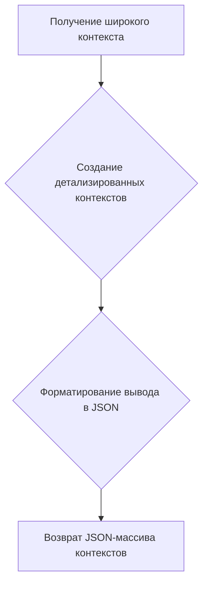

# Документация для генерации контекстов персонажей

## Обзор

Этот документ описывает структуру и формат запросов к системе для генерации контекстов персонажей. Задача системы - создание множества контекстов, которые будут использоваться в качестве основы для генерации списка персонажей.
Идея состоит в том, чтобы получить широкий контекст с некоторыми деталями о персонажах, которых мы хотим сгенерировать, такими как демографические параметры, физические характеристики, поведение, убеждения и т.д., а затем создать множество других контекстов, более специфичных, но производных от более общего.

## Подробней

Этот модуль используется для создания описаний персонажей на основе заданных контекстов. Он принимает общие параметры и генерирует на их основе более конкретные контексты для дальнейшего использования. 
Код анализирует входящие запросы и преобразует их в JSON-массив контекстов, каждый из которых содержит детализированное описание персонажа.
Эти контексты используются в других частях проекта `hypotez` для генерации разнообразных и уникальных персонажей.

## Функции

### `Генерация контекста персонажа`

```python
  Ваша задача - создать множество контекстов, которые будут использоваться в качестве базы для генерации списка персонажей.
  Идея состоит в том, чтобы получить широкий контекст, с некоторыми деталями о персонажах, которых мы хотим сгенерировать, например, демографические параметры, физические характеристики, поведение, убеждения и т.д.; а затем создать много других контекстов, более конкретных, но производных от более общего.
  Ваш ответ должен быть массивом в формате JSON. Каждый элемент массива должен быть контекстом, который будет использоваться для генерации описания человека.

  Пример:
    - INPUT:
      Пожалуйста, сгенерируйте описание 3 человек на основе следующего широкого контекста: Латиноамериканцы, в возрасте от 20 до 40 лет, экономический статус может варьироваться от бедного до богатого, может быть религиозным или нет, может быть женат или нет, может иметь детей или нет, может быть профессионалом или нет, может быть работником или нет.
    - OUTPUT:
      ["Мексиканец, получивший образование юриста, но сейчас работающий в другой области, холост, любит спорт и кино", "Создать бразильца, который является врачом, любит домашних животных и природу, а также любит хэви-метал.", "Создать колумбийца, который является юристом, любит читать и пить кофе и женат, имеет 2 детей."]
```

**Как работает функция**:

1.  **Получение широкого контекста**: Функция принимает на вход запрос, содержащий общее описание персонажей (например, "Латиноамериканцы, возраст от 20 до 40 лет, различный экономический статус").
2.  **Создание детализированных контекстов**: На основе этого общего описания функция генерирует несколько более конкретных контекстов. Каждый из этих контекстов содержит детализированное описание отдельного персонажа (например, "Мексиканец, получивший образование юриста, но сейчас работающий в другой области, холост, любит спорт и кино").
3.  **Форматирование вывода**: Функция формирует массив JSON, где каждый элемент этого массива представляет собой один из сгенерированных контекстов персонажа.



**Примеры**:

```json
  {
    "INPUT": "Please, generate 3 person(s) description(s) based on the following broad context: Latin American, age between 20 and 40 years old, economic status can vary between poor and rich, it can be religious or not, it can be married or not, it can have children or not, it can be a professional or not, it can be a worker or not",
    "OUTPUT": ["Mexican person that has formed as lawyer but now works in other are, is single, like sports and movies", "Create a Brazilian person that is a doctor, like pets and the nature and love heavy metal.", "Create a Colombian person that is a lawyer, like to read and drink coffee and is married with 2 children."]
  }