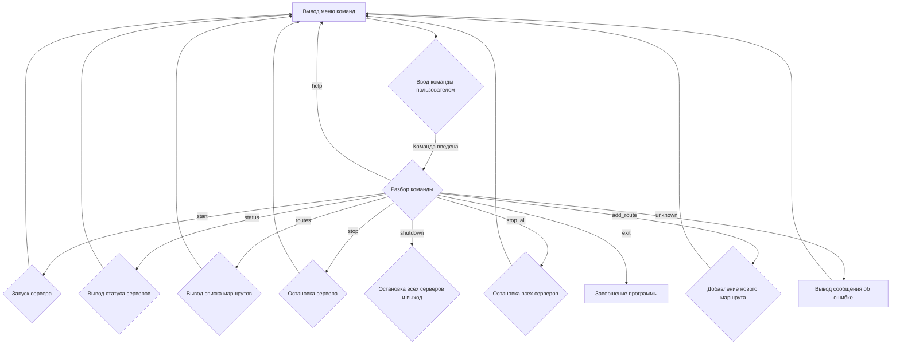

# Модуль управления Fast API сервером

## Обзор

Модуль `main.py` предоставляет интерфейс командной строки для управления Fast API сервером. Он позволяет запускать, останавливать, просматривать статус и добавлять новые маршруты к серверу.

## Подробнее

Этот модуль является точкой входа для управления сервером Fast API. Он предоставляет пользователю меню с различными командами, которые позволяют взаимодействовать с сервером. Модуль использует класс `CommandHandler` из модуля `src.fast_api.fast_api` для выполнения команд.

## Функции

### `display_menu`

```python
def display_menu():
    """Выводит меню с доступными командами."""
    print("\nAvailable commands:")
    print("  start <port>        - Start server on the specified port")
    print("  status              - Show all served ports status")
    print("  routes              - Show all registered routes")
    print("  stop <port>         - Stop server on the specified port")
    print("  stop_all            - Stop all servers")
    print("  add_route <path>    - Add a new route to the server")
    print("  shutdown            - Stop all servers and exit")
    print("  help                - Show this help menu")
    print("  exit                - Exit the program")
```

**Назначение**: Выводит на экран список доступных команд для управления сервером.

**Параметры**: Отсутствуют.

**Возвращает**: Ничего (None).

**Вызывает исключения**: Отсутствуют.

**Как работает функция**:
1. Функция `display_menu` выводит на экран список доступных команд и их описание.
2. Каждая строка представляет собой команду и краткое описание ее назначения.

```
Вывод меню с командами
↓
Завершение
```

**Примеры**:

```python
display_menu()
# Вывод:
# Available commands:
#   start <port>        - Start server on the specified port
#   status              - Show all served ports status
#   routes              - Show all registered routes
#   stop <port>         - Stop server on the specified port
#   stop_all            - Stop all servers
#   add_route <path>    - Add a new route to the server
#   shutdown            - Stop all servers and exit
#   help                - Show this help menu
#   exit                - Exit the program
```

### `main`

```python
def main():
    """Основная функция управления сервером."""
    command_handler = CommandHandler()
    while True:
        display_menu()
        try:
            command_line = input("Enter command: ").strip().lower()
            if not command_line:
                continue

            parts = command_line.split()
            command = parts[0]

            if command == "start":
                if len(parts) != 2:
                    print("Usage: start <port>")
                    continue
                try:
                    port = int(parts[1])
                    host = input("Enter host address (default: 127.0.0.1): ").strip() or "127.0.0.1"
                    command_handler.start_server(port=port, host=host)
                except ValueError:
                    print("Invalid port number.")
                except Exception as ex:
                  logger.error(f"An error occurred:", ex, exc_info=True)

            elif command == "status":
                command_handler.status_servers()

            elif command == "routes":
                command_handler.get_routes()
            
            elif command == "stop":
               if len(parts) != 2:
                   print("Usage: stop <port>")
                   continue
               try:
                    port = int(parts[1])
                    command_handler.stop_server(port=port)
               except ValueError:
                   print("Invalid port number.")
               except Exception as ex:
                  logger.error(f"An error occurred:", ex, exc_info=True)
            
            elif command == "stop_all":
               command_handler.stop_all_servers()
            
            elif command == "add_route":
                if len(parts) != 2:
                    print("Usage: add_route <path>")
                    continue
                path = parts[1]
                methods = input("Enter HTTP methods (comma-separated, default: GET): ").strip().upper() or "GET"
                methods = [method.strip() for method in methods.split(",")]
                command_handler.add_new_route(path=path, func="lambda: {\\"message\\": \\"Hello from the new route\\"}", methods=methods)


            elif command == "shutdown":
                command_handler.stop_all_servers()
                print("Shutting down all servers.")
                sys.exit(0)

            elif command == "help":
                display_menu()

            elif command == "exit":
                print("Exiting the program.")
                sys.exit(0)
            
            else:
                print("Unknown command. Type \'help\' to see the list of available commands")

        except Exception as ex:
            logger.error(f"An error occurred:", ex, exc_info=True)


if __name__ == "__main__":
    main()
```

**Назначение**: Основная функция управления сервером. Организует взаимодействие с пользователем через командную строку и выполняет соответствующие команды.

**Параметры**: Отсутствуют.

**Возвращает**: Ничего (None).

**Вызывает исключения**:
- `ValueError`: Если введен некорректный номер порта.
- `Exception`: При возникновении других ошибок в процессе выполнения команд.

**Как работает функция**:

1.  **Инициализация обработчика команд**: Создается экземпляр класса `CommandHandler`, который отвечает за выполнение команд управления сервером.
2.  **Главный цикл**:
    *   Выводится меню доступных команд с помощью функции `display_menu()`.
    *   Пользователю предлагается ввести команду.
    *   Введенная команда приводится к нижнему регистру и удаляются лишние пробелы.
    *   Если команда не введена, цикл начинается заново.
    *   Команда разбивается на части по пробелам.
    *   В зависимости от введенной команды выполняется соответствующее действие:
        *   `start`: Запускает сервер на указанном порту. Запрашивает у пользователя адрес хоста (по умолчанию "127.0.0.1").
        *   `status`: Выводит статус всех серверов.
        *   `routes`: Выводит список всех зарегистрированных маршрутов.
        *   `stop`: Останавливает сервер на указанном порту.
        *   `stop_all`: Останавливает все серверы.
        *   `add_route`: Добавляет новый маршрут к серверу. Запрашивает у пользователя HTTP методы (по умолчанию "GET").
        *   `shutdown`: Останавливает все серверы и завершает программу.
        *   `help`: Выводит меню доступных команд.
        *   `exit`: Завершает программу.
        *   Если команда не распознана, выводится сообщение об ошибке.
3.  **Обработка исключений**: Если в процессе выполнения команд возникает исключение, оно логируется с помощью `logger.error`.



**Примеры**:

```python
# Запуск сервера на порту 8000
main()
# Ввод в консоли: start 8000
# Ввод адреса хоста (по умолчанию 127.0.0.1):
# ...

# Просмотр статуса серверов
main()
# Ввод в консоли: status
# ...

# Остановка сервера на порту 8000
main()
# Ввод в консоли: stop 8000
# ...

# Завершение программы
main()
# Ввод в консоли: exit
# ...