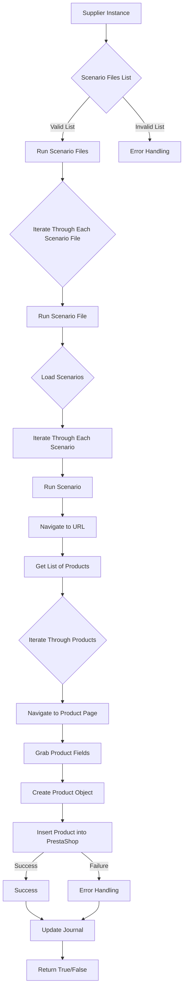

# Модуль `src.scenario`

## Обзор

Модуль `src.scenario` предназначен для автоматизации взаимодействия с поставщиками с использованием сценариев, описанных в файлах JSON. Он оптимизирует процесс извлечения и обработки данных о продуктах с веб-сайтов поставщиков и синхронизации этой информации с базой данных (например, PrestaShop). Модуль включает в себя функциональность для чтения сценариев, взаимодействия с веб-сайтами, обработки данных, ведения журналов выполнения и организации всего рабочего процесса.

## Содержание

* [Модуль `src.scenario`](#модуль-srcscenario)
* [Обзор](#обзор)
* [Основные функции модуля](#основные-функции-модуля)
* [Основные компоненты модуля](#основные-компоненты-модуля)
    * [`run_scenario_files(s, scenario_files_list)`](#run_scenario_files-s-scenario_files_list)
    * [`run_scenario_file(s, scenario_file)`](#run_scenario_file-s-scenario_file)
    * [`run_scenario(s, scenario)`](#run_scenario-s-scenario)
    * [`dump_journal(s, journal)`](#dump_journal-s-journal)
    * [`main()`](#main)
* [Пример сценария](#пример-сценария)
* [Как это работает](#как-это-работает)

## Основные функции модуля

1. **Чтение сценариев**: Загрузка сценариев из файлов JSON, содержащих информацию о продуктах и URL-адреса на веб-сайте поставщика.
2. **Взаимодействие с веб-сайтами**: Обработка URL-адресов из сценариев для извлечения данных о продуктах.
3. **Обработка данных**: Преобразование извлеченных данных в формат, подходящий для базы данных, и их сохранение.
4. **Ведение журнала выполнения**: Ведение журналов с подробностями выполнения сценариев и результатами для отслеживания прогресса и выявления ошибок.



## Основные компоненты модуля

### `run_scenario_files(s, scenario_files_list)`

**Описание**: Принимает список файлов сценариев и выполняет их последовательно, вызывая функцию `run_scenario_file` для каждого файла.

**Параметры**:
- `s`: Объект настроек (например, для подключения к базе данных).
- `scenario_files_list` (list): Список путей к файлам сценариев.

**Возвращает**:
- `None`

**Вызывает исключения**:
- `FileNotFoundError`: Если файл сценария не найден.
- `JSONDecodeError`: Если файл сценария содержит неверный JSON.

**Как работает функция**:

Функция `run_scenario_files` предназначена для запуска группы файлов сценариев, указанных в переданном списке. Она последовательно перебирает каждый файл из списка `scenario_files_list` и вызывает функцию `run_scenario_file` для его обработки. Если список файлов сценариев недействителен, происходит обработка ошибок.

```ascii
Начало -> Проверка списка файлов сценариев
|
Да -> Перебор файлов сценариев
|
Вызов run_scenario_file для каждого файла -> Конец
|
Нет -> Обработка ошибок
```

**Примеры**:

Предположим, у нас есть список файлов сценариев `['scenario1.json', 'scenario2.json']`.
```python
scenario_files = ['scenario1.json', 'scenario2.json']
run_scenario_files(settings, scenario_files)
```

### `run_scenario_file(s, scenario_file)`

**Описание**: Загружает сценарии из указанного файла и вызывает `run_scenario` для каждого сценария в файле.

**Параметры**:
- `s`: Объект настроек.
- `scenario_file` (str): Путь к файлу сценария.

**Возвращает**:
- `None`

**Вызывает исключения**:
- `FileNotFoundError`: Если файл сценария не найден.
- `JSONDecodeError`: Если файл сценария содержит неверный JSON.
- `Exception`: При любых других проблемах во время выполнения сценария.

**Как работает функция**:

Функция `run_scenario_file` отвечает за чтение сценариев из указанного файла и их последующий запуск. Сначала она пытается открыть и загрузить содержимое файла как JSON. Затем для каждого сценария, загруженного из файла, вызывается функция `run_scenario`, которая выполняет действия, определенные в сценарии.

```ascii
Начало -> Загрузка сценариев из файла
|
Перебор сценариев
|
Вызов run_scenario для каждого сценария -> Конец
|
Обработка ошибок при загрузке файла
```

**Примеры**:

Вызов функции с путем к файлу сценария:
```python
run_scenario_file(settings, 'example_scenario.json')
```

### `run_scenario(s, scenario)`

**Описание**: Обрабатывает отдельный сценарий, переходя по URL-адресу, извлекая данные о продукте и сохраняя их в базу данных.

**Параметры**:
- `s`: Объект настроек.
- `scenario` (dict): Словарь, содержащий сценарий (например, с URL-адресом и категориями).

**Возвращает**:
- `None`

**Вызывает исключения**:
- `requests.exceptions.RequestException`: Если есть проблемы с запросом к веб-сайту.
- `Exception`: При любых других проблемах во время обработки сценария.

**Как работает функция**:

Функция `run_scenario` выполняет основные действия, определенные в переданном словаре сценария. Она включает в себя навигацию по URL-адресу, указанному в сценарии, извлечение данных о продукте с веб-страницы и сохранение этих данных в базу данных.

```ascii
Начало -> Навигация по URL-адресу
|
Извлечение данных о продукте
|
Сохранение данных в базу данных -> Конец
|
Обработка ошибок на любом этапе
```

**Примеры**:

Вызов функции со словарем, содержащим URL-адрес и категории:
```python
scenario = {
    'url': 'https://example.com/product/123',
    'categories': ['Кремы', 'Минералы']
}
run_scenario(settings, scenario)
```

### `dump_journal(s, journal)`

**Описание**: Сохраняет журнал выполнения в файл для последующего анализа.

**Параметры**:
- `s`: Объект настроек.
- `journal` (list): Список записей журнала выполнения.

**Возвращает**:
- `None`

**Вызывает исключения**:
- `Exception`: Если есть проблемы с записью в файл.

**Как работает функция**:

Функция `dump_journal` отвечает за сохранение журнала выполнения, который представляет собой список записей о действиях и событиях, произошедших во время выполнения сценариев. Журнал сохраняется в файл, чтобы его можно было проанализировать позже.

```ascii
Начало -> Сохранение журнала выполнения в файл -> Конец
|
Обработка ошибок при записи в файл
```

**Примеры**:

Вызов функции со списком записей журнала:
```python
journal = [
    {'timestamp': '2024-01-01 10:00:00', 'message': 'Сценарий выполнен успешно'},
    {'timestamp': '2024-01-01 10:05:00', 'message': 'Данные о продукте сохранены'}
]
dump_journal(settings, journal)
```

### `main()`

**Описание**: Главная функция для запуска модуля.

**Параметры**:
- `None`

**Возвращает**:
- `None`

**Вызывает исключения**:
- `Exception`: При любых критических ошибках во время выполнения.

**Как работает функция**:

Функция `main` является точкой входа в модуль. Она отвечает за инициализацию и запуск основных процессов, таких как чтение файлов сценариев и запуск сценариев.

```ascii
Начало -> Инициализация модуля
|
Чтение файлов сценариев
|
Запуск сценариев -> Конец
|
Обработка критических ошибок
```

**Примеры**:

Вызов функции `main`:
```python
main()
```

## Пример сценария

Пример сценария JSON описывает взаимодействие с категориями продуктов на веб-сайте. Он включает в себя URL-адрес, название категории и идентификаторы категории в базе данных PrestaShop.

```json
{
    "scenarios": {
        "mineral+creams": {
            "url": "https://example.com/category/mineral-creams/",
            "name": "mineral+creams",
            "presta_categories": {
                "default_category": 12345,
                "additional_categories": [12346, 12347]
            }
        }
    }
}
```

## Как это работает

Модуль `src.scenario` автоматизирует взаимодействие с веб-сайтами поставщиков, чтобы извлекать данные о продуктах и синхронизировать их с базой данных. Сценарии, описанные в файлах JSON, определяют, какие действия необходимо выполнить на веб-сайте, какие данные следует извлечь и как их следует преобразовать для сохранения в базе данных. Модуль использует функции для чтения сценариев, навигации по веб-сайтам, извлечения данных, обработки данных и ведения журналов выполнения.