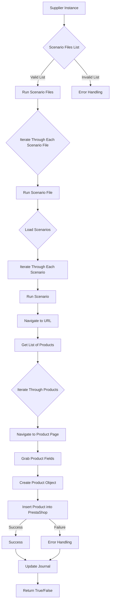

# Модуль `src.scenario`

## Обзор

Модуль `src.scenario` предназначен для автоматизации взаимодействия с поставщиками, используя сценарии, описанные в JSON-файлах. Он адаптирует процесс извлечения и обработки данных о продуктах с веб-сайтов поставщиков и синхронизирует эту информацию с базой данных (например, PrestaShop).  Модуль включает чтение сценариев, взаимодействие с веб-сайтами, обработку данных, запись журнала выполнения и организацию всего процесса.

## Подорбней

Модуль `src.scenario` автоматизирует процесс сбора данных о товарах с веб-сайтов поставщиков и их интеграцию с базой данных PrestaShop. Это позволяет упростить и ускорить обновление информации о товарах, снизить вероятность ошибок и повысить эффективность работы с поставщиками. Модуль использует JSON-файлы для описания сценариев взаимодействия, что позволяет гибко настраивать процесс для различных поставщиков и категорий товаров.

## Оглавление

* [Модуль `src.scenario`](#модуль-src-scenario)
* [Обзор](#обзор)
* [Основные функции модуля](#основные-функции-модуля)
* [Основные компоненты модуля](#основные-компоненты-модуля)
    * [`run_scenario_files(s, scenario_files_list)`](#run_scenario_files-s-scenario_files_list)
    * [`run_scenario_file(s, scenario_file)`](#run_scenario_file-s-scenario_file)
    * [`run_scenario(s, scenario)`](#run_scenario-s-scenario)
    * [`dump_journal(s, journal)`](#dump_journal-s-journal)
    * [`main()`](#main)
* [Пример сценария](#пример-сценария)
* [Как это работает](#как-это-работает)


## Основные функции модуля

1. **Чтение сценариев**: Загрузка сценариев из JSON-файлов, содержащих информацию о продуктах и их URL на сайте поставщика.
2. **Взаимодействие с веб-сайтами**:  Обработка URL-адресов из сценариев для извлечения данных о продуктах.
3. **Обработка данных**: Преобразование извлечённых данных в формат, подходящий для базы данных, и сохранение в неё.
4. **Запись журнала выполнения**: Ведение журнала с деталями выполнения сценариев и результатами работы для отслеживания процесса и выявления ошибок.



## Функции

### `run_scenario_files(s, scenario_files_list)`

**Назначение**: Функция принимает список файлов сценариев и последовательно выполняет каждый из них, вызывая функцию `run_scenario_file` для каждого файла.

**Параметры**:
- `s`: Объект настроек (например, для соединения с базой данных).
- `scenario_files_list` (list): Список путей к файлам сценариев.

**Возвращает**:
- `None`: Функция ничего не возвращает.

**Вызывает исключения**:
- `FileNotFoundError`: Если файл сценария не найден.
- `JSONDecodeError`: Если файл сценария содержит невалидный JSON.

**Как работает функция**:

Функция `run_scenario_files` выполняет итерацию по списку файлов сценариев, переданных в качестве аргумента `scenario_files_list`. Для каждого файла она вызывает функцию `run_scenario_file`, передавая ей объект настроек `s` и путь к файлу сценария. Если в процессе выполнения возникают исключения, такие как `FileNotFoundError` или `JSONDecodeError`, функция перехватывает их и выполняет обработку ошибок.

```
Начало --> Проверка списка файлов сценариев
Проверка списка файлов сценариев -- Список валидный --> Вызов run_scenario_file
Проверка списка файлов сценариев -- Список невалидный --> Обработка ошибок
Вызов run_scenario_file --> Завершение
```

**Примеры**:

```python
# Пример вызова функции run_scenario_files
settings = {}  #  <инструкция для модели gemini:Объект с настройками>
scenario_files = ['scenario1.json', 'scenario2.json']
run_scenario_files(settings, scenario_files)
```

### `run_scenario_file(s, scenario_file)`

**Назначение**: Функция загружает сценарии из указанного файла и вызывает функцию `run_scenario` для каждого сценария в файле.

**Параметры**:
- `s`: Объект настроек.
- `scenario_file` (str): Путь к файлу сценария.

**Возвращает**:
- `None`: Функция ничего не возвращает.

**Вызывает исключения**:
- `FileNotFoundError`: Если файл сценария не найден.
- `JSONDecodeError`: Если файл сценария содержит невалидный JSON.
- `Exception`: При любых других проблемах при работе со сценариями.

**Как работает функция**:

Функция `run_scenario_file` сначала пытается открыть и прочитать файл сценария, путь к которому передан в аргументе `scenario_file`. Если файл не найден или содержит невалидный JSON, функция выбрасывает соответствующие исключения. В случае успешного чтения файла, функция выполняет итерацию по сценариям, загруженным из файла, и для каждого сценария вызывает функцию `run_scenario`, передавая ей объект настроек `s` и текущий сценарий.

```
Начало --> Открытие файла сценария
Открытие файла сценария -- Файл найден --> Чтение сценариев из файла
Открытие файла сценария -- Файл не найден --> Обработка FileNotFoundError
Чтение сценариев из файла -- Сценарии прочитаны --> Итерация по сценариям
Чтение сценариев из файла -- JSON невалиден --> Обработка JSONDecodeError
Итерация по сценариям --> Вызов run_scenario для каждого сценария
Вызов run_scenario для каждого сценария --> Завершение
```

**Примеры**:

```python
# Пример вызова функции run_scenario_file
settings = {}  #  <инструкция для модели gemini:Объект с настройками>
scenario_file = 'scenario.json'
run_scenario_file(settings, scenario_file)
```

### `run_scenario(s, scenario)`

**Назначение**: Функция обрабатывает отдельный сценарий. Она переходит по URL, извлекает данные о продуктах и сохраняет их в базе данных.

**Параметры**:
- `s`: Объект настроек.
- `scenario` (dict): Словарь, содержащий сценарий (например, с URL, категориями).

**Возвращает**:
- `None`: Функция ничего не возвращает.

**Вызывает исключения**:
- `requests.exceptions.RequestException`: Если есть проблемы с запросом к веб-сайту.
- `Exception`: При любых других проблемах в процессе обработки сценария.

**Как работает функция**:

Функция `run_scenario` принимает объект настроек `s` и словарь `scenario`, содержащий информацию о сценарии. Она выполняет следующие шаги:
1.  Извлекает URL из сценария.
2.  Переходит по указанному URL, используя библиотеку `requests`.
3.  Извлекает данные о продуктах с веб-страницы.
4.  Преобразует извлечённые данные в формат, подходящий для базы данных.
5.  Сохраняет данные в базе данных.

Если в процессе выполнения возникают какие-либо проблемы, функция выбрасывает соответствующие исключения.

```
Начало --> Извлечение URL из сценария
Извлечение URL из сценария --> Переход по URL
Переход по URL -- Успешно --> Извлечение данных о продуктах
Переход по URL -- Ошибка --> Обработка requests.exceptions.RequestException
Извлечение данных о продуктах --> Преобразование данных в формат БД
Преобразование данных в формат БД --> Сохранение данных в БД
Сохранение данных в БД -- Успешно --> Завершение
Сохранение данных в БД -- Ошибка --> Обработка Exception
```

**Примеры**:

```python
# Пример вызова функции run_scenario
settings = {}  #  <инструкция для модели gemini:Объект с настройками>
scenario = {
    "url": "https://example.com/category/mineral-creams/",
    "name": "минеральные+кремы",
    "presta_categories": {
        "default_category": 12345,
        "additional_categories": [12346, 12347]
    }
}
run_scenario(settings, scenario)
```

### `dump_journal(s, journal)`

**Назначение**: Функция сохраняет журнал выполнения сценариев в файл для последующего анализа.

**Параметры**:
- `s`: Объект настроек.
- `journal` (list): Список записей журнала выполнения.

**Возвращает**:
- `None`: Функция ничего не возвращает.

**Вызывает исключения**:
- `Exception`: При проблемах с записью в файл.

**Как работает функция**:

Функция `dump_journal` принимает объект настроек `s` и список записей журнала выполнения `journal`. Она открывает файл для записи (имя файла может быть определено в настройках) и записывает в него содержимое журнала в формате JSON. Если в процессе записи возникают какие-либо проблемы, функция выбрасывает исключение `Exception`.

```
Начало --> Открытие файла для записи журнала
Открытие файла для записи журнала -- Успешно --> Запись журнала в файл
Открытие файла для записи журнала -- Ошибка --> Обработка Exception
Запись журнала в файл --> Завершение
```

**Примеры**:

```python
# Пример вызова функции dump_journal
settings = {}  #  <инструкция для модели gemini:Объект с настройками>
journal = [
    {"scenario": "scenario1", "status": "success"},
    {"scenario": "scenario2", "status": "failure"}
]
dump_journal(settings, journal)
```

### `main()`

**Назначение**: Основная функция для запуска модуля.

**Параметры**:
- `None`: Функция не принимает аргументов.

**Возвращает**:
- `None`: Функция ничего не возвращает.

**Вызывает исключения**:
- `Exception`: При любых критических ошибках во время выполнения.

**Как работает функция**:

Функция `main` является точкой входа в модуль. Она выполняет следующие действия:
1.  Инициализирует объект настроек `s`.
2.  Определяет список файлов сценариев для выполнения.
3.  Вызывает функцию `run_scenario_files` для выполнения сценариев.
4.  Обрабатывает возможные исключения, возникающие в процессе выполнения.

```
Начало --> Инициализация объекта настроек
Инициализация объекта настроек --> Определение списка файлов сценариев
Определение списка файлов сценариев --> Вызов run_scenario_files
Вызов run_scenario_files -- Успешно --> Завершение
Вызов run_scenario_files -- Ошибка --> Обработка Exception
```

**Примеры**:

```python
# Пример вызова функции main
main()
```

## Пример сценария

Пример сценария JSON описывает взаимодействие с категориями продуктов на веб-сайте. Он содержит URL, имя категории и идентификаторы категорий в базе данных PrestaShop.

```json
{
    "scenarios": {
        "минеральные+кремы": {
            "url": "https://example.com/category/mineral-creams/",
            "name": "минеральные+кремы",
            "presta_categories": {
                "default_category": 12345,
                "additional_categories": [12346, 12347]
            }
        }
    }
}
```

## Как это работает

Модуль загружает сценарии, извлекает данные с веб-сайтов, обрабатывает их и сохраняет в базе данных.  Он ведёт журнал выполнения для отслеживания процесса и выявления ошибок.  В целом, модуль автоматизирует взаимодействие с поставщиками, улучшая эффективность и надежность процесса.